# 1. 结论摘要

本报告完成了在 fr1 / fr2 / fr3 三个场景、clean / flashlight / lightswitch 三种光照条件上的完整 C2F 配对验证。核心判断不是跨数据集直接平均原始 ATE，而是每个 C2F 在**同一完整序列**上是否低于其 fine 与 coarse direct parent 中表现较好的一个（better parent）。

- **U-Net：C2F 在所选网格中表现出可复现但非普遍的增益。** 全部 441/441 个合并 cells PASS；A/B 两个 variant 分别有 112/180（62.2%）和 110/180（61.1%）次优于 better parent。严格要求 clean、flashlight、lightswitch 三者都胜出的组合，在 fr1/fr2/fr3 分别为 2/21/14 个。
- **ResNet：C2F-B 明显优于 C2F-A，但跨 fr3 三光照的稳健收益不足。** 594/639 个合并 cells PASS，其中 C2F 本身有 43 个 tracking-NaN failure；A/B 的 better-parent 胜率仅为 46/247（18.6%）和 100/250（40.0%）。在 fr3 没有任何 ResNet C2F 组合能同时胜出三种光照。
- **没有一个 C2F 组合能在 fr1、fr2、fr3 的九个完整序列上全部优于其 better parent。** 因而 C2F 的正确结论是“特定通道组合与金字塔 routing 可带来条件性互补”，而不是保证性的架构升级。

# 2. 实验设置与比较规则

| 项目 | 固定设置 |
|---|---|
| U-Net grid | Enc0 fine Top-5 × Enc1 coarse Top-4 × C2F-A/B = 40 C2F pairs；另含 9 个 direct parents |
| ResNet grid | Conv1 fine Top-6 × Layer2 coarse Top-5 × C2F-A/B = 60 C2F pairs；另含 11 个 direct parents |
| 数据 | fr1/desk、fr2/desk、fr3/long_office_household × clean / flashlight / lightswitch = 9 条完整序列 |
| Mapping | 固定 gray + sensor depth；仅 tracking feature mode / selected channels 改变 |
| C2F-A | coarse 使用较浅 pyramid levels；fine 使用更深 level |
| C2F-B | coarse 使用最浅 level；fine 使用其余两个 level |
| 主指标 | historical keyframe evo_ape translation ATE mean（--align --correct_scale），单位 cm |
| 可比较定义 | C2F、direct fine、direct coarse 都 PASS，且 C2F ATE < min(fine ATE, coarse ATE) |
| 运行规范 | 每个 cell 1 次；timeout = 500 s；Step-Q 既有记录只读复用、不重跑 |

# 3. 总体统计：按 scene 与按 lighting condition

下列两图都使用同一个配对判定：只有 C2F、fine direct、coarse direct 都 PASS，且 C2F ATE 低于两个 direct parent 中较好的一个，才记作一次胜出。柱顶的 `胜出/可比较` 明确显示 ResNet tracking failure 所造成的有效分母变化。

## 3.1 按 scene 汇总

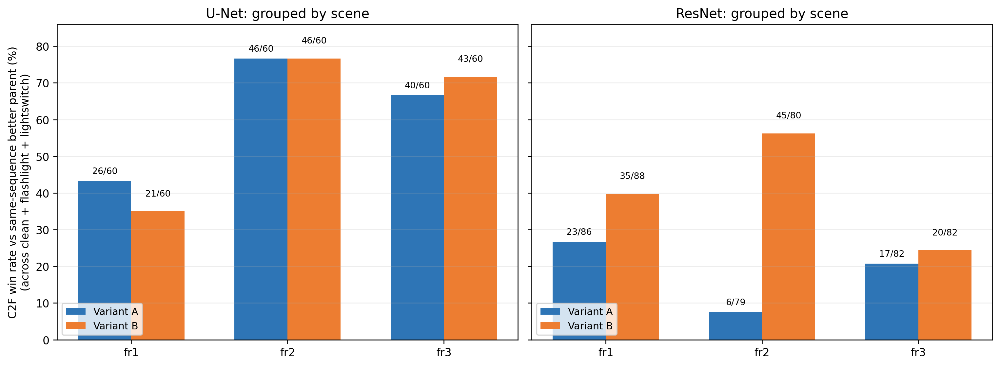{ width=95% }

**读图。** U-Net 的明显优势集中在 fr2 与 fr3；U-Net 的 fr2 最强，fr1 最弱。fr1 上 U-Net-A 仍高于两个 ResNet variant，但 U-Net-B（21/60）略低于 ResNet-B（35/88），因此不能把“U-Net 更好”理解成每个 routing、每个 scene 都绝对占优。ResNet-B 虽优于 A，但 fr3 的胜率仍低，显示其 C2F 增益没有稳定迁移到 long-office household 场景。

## 3.2 按 lighting condition 汇总

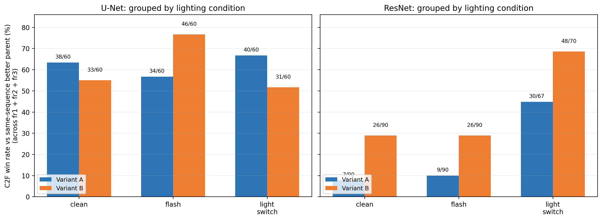{ width=95% }

**读图。** U-Net 的两种 routing 在 clean / flashlight / lightswitch 下均维持约六成的配对胜率；ResNet B 在 lightswitch 上相对更有利，但 clean 与 flashlight 中仍缺乏一致收益。

## 3.3 严格的三光照稳健性

若要求同一 F×C×variant 在某个 scene family 的 clean、flashlight、lightswitch 三条完整序列都优于 better parent，统计如下。这是最直接的“跨三种光照是否稳定有效”答案。

| 架构 | variant | 候选 pairs | fr1 三光照 | fr2 三光照 | fr3 三光照 | 至少一个 family | 三个 family 都满足 |
|---|---|---|---|---|---|---|---|
| U-Net | A | 20 | 2/20 | 12/20 | 8/20 | 14/20 | 0/20 |
| U-Net | B | 20 | 0/20 | 9/20 | 6/20 | 13/20 | 0/20 |
| ResNet | A | 30 | 2/30 | 0/30 | 0/30 | 2/30 | 0/30 |
| ResNet | B | 30 | 1/30 | 4/30 | 0/30 | 4/30 | 0/30 |

没有一个配置达到 9/9（即三个 family 的三种光照都胜出）。U-Net 的严格收益集中在 fr2 和 fr3；ResNet 在 fr3 为零。

# 4. C2F variant 的影响

| 架构 | variant | C2F PASS | 优于 better parent | 同 F×C 原始 ATE 对决 | 胜出 cells | 胜出 pair-median |
|---|---|---|---|---|---|---|
| U-Net | A | 180/180 | 112/180 (62.2%) | A lower | 109/180 | 13/20 |
| U-Net | B | 180/180 | 110/180 (61.1%) | B lower | 71/180 | 7/20 |
| ResNet | A | 247/270 | 46/247 (18.6%) | A lower | 32/246 | 7/30 |
| ResNet | B | 250/270 | 100/250 (40.0%) | B lower | 214/246 | 23/30 |

“同 F×C 原始 ATE 对决”只比较 A/B 都 PASS 的相同 fine subset、coarse subset、同一序列；此时 direct parents 完全相同，因此可直接比较两种 routing。pair-median 是每个 F×C 跨可用序列的中位 ATE 后再作比较。

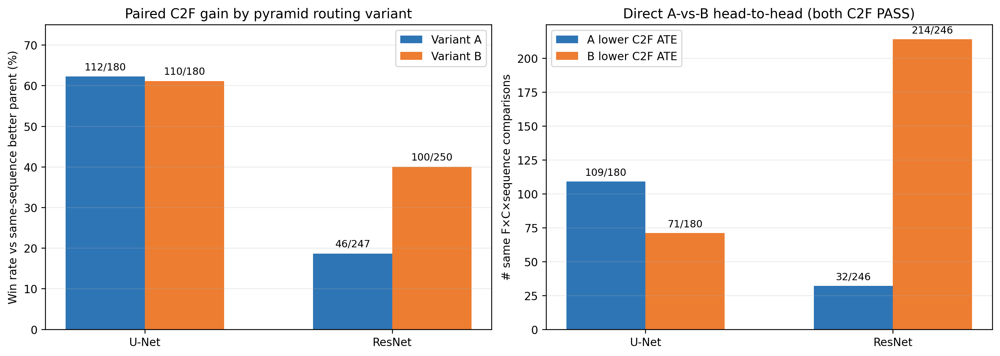{ width=95% }

- **U-Net：A/B 的 parent 胜率接近**（62.2% vs 61.1%），但在 180 个直接 A/B cell 对决中 A 以 109:71 更常得到较低 ATE，在 20 个 F×C 的 sequence-median 比较中也以 13:7 占优。因此 U-Net 的默认优先级应为 C2F-A，但 B 仍有少数高质量组合（例如 F5+C4），不应被整体平均掩盖。
- **ResNet：B 是明显较可靠的 routing。** 在 246 个双方 PASS 的 A/B cell 对决中，B 以 214:32 占优，并在 30 个 F×C 的 median 比较中以 23:7 占优。但 B 的 40.0% better-parent 胜率和 fr3 的零个三光照解表明：routing 修正了 A 的问题，却没有使 ResNet C2F 成为跨场景默认策略。

# 5. 具体结果：每个架构的 Top-5 F×C pairs

每个架构均提供 **6 张表**：第 1 张是 Top-5 unique F×C pair 的排名概览；随后 5 张逐 pair 结果表分别列出 fine-only、coarse-only、C2F-A 与 C2F-B。pair 排名按：九序列中优于 better parent 的次数 → 满足三光照的 scene family 数 → median paired delta。

## 5.1 U-Net

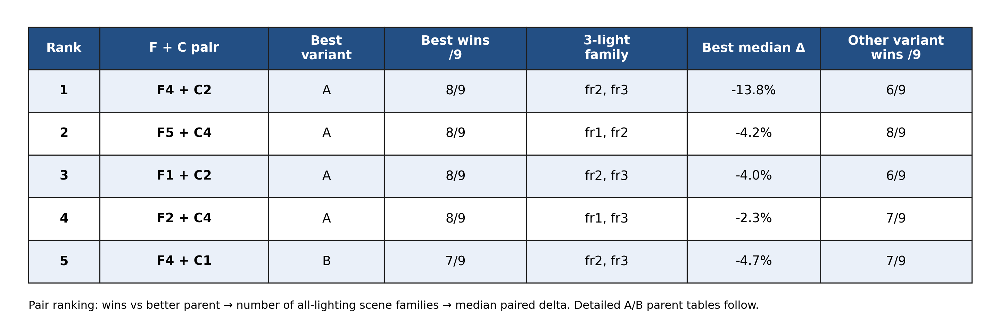{ width=96% }

### Top-1: F4 + C2（best routing: A；8/9）

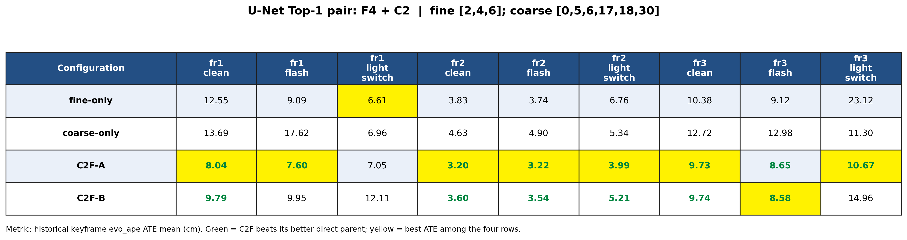{ width=100% }

### Top-2: F5 + C4（best routing: A；8/9）

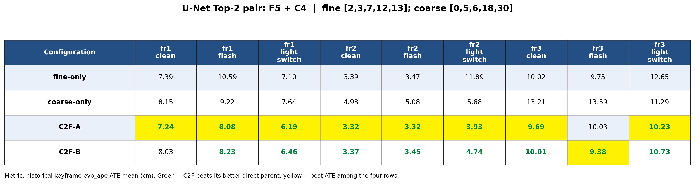{ width=100% }

### Top-3: F1 + C2（best routing: A；8/9）

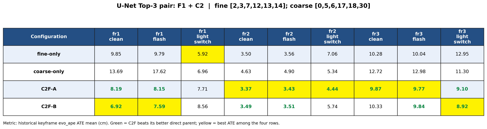{ width=100% }

### Top-4: F2 + C4（best routing: A；8/9）

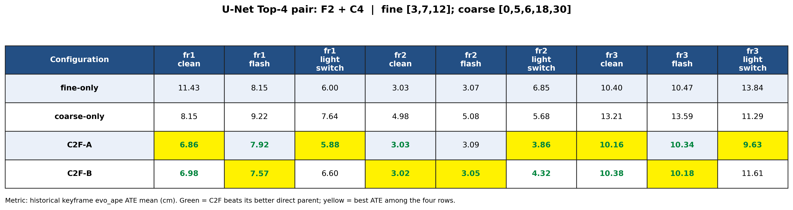{ width=100% }

### Top-5: F4 + C1（best routing: B；7/9）

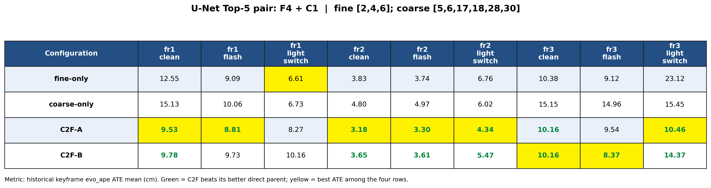{ width=100% }

## 5.2 ResNet

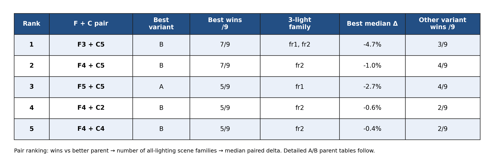{ width=96% }

### Top-1: F3 + C5（best routing: B；7/9）

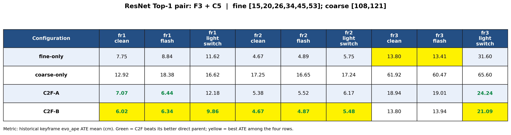{ width=100% }

### Top-2: F4 + C5（best routing: B；7/9）

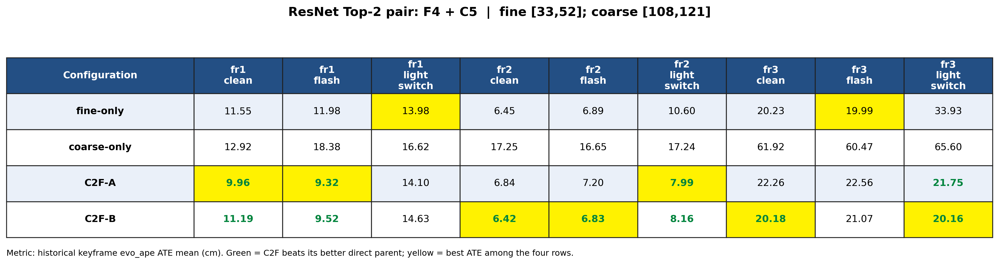{ width=100% }

### Top-3: F5 + C5（best routing: A；5/9）

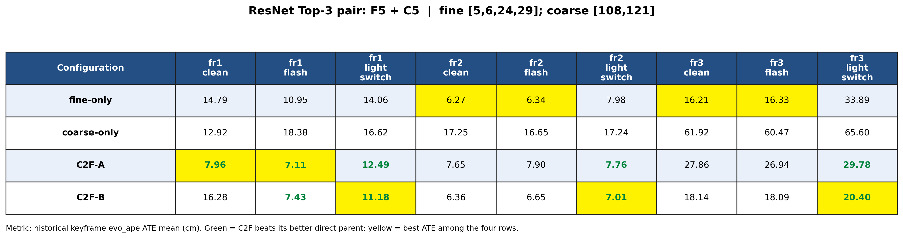{ width=100% }

### Top-4: F4 + C2（best routing: B；5/9）

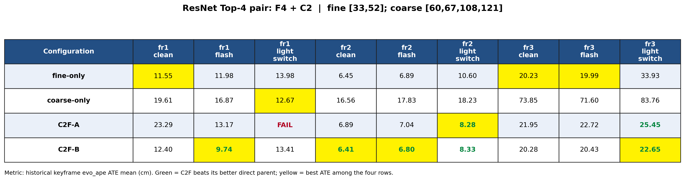{ width=100% }

### Top-5: F4 + C4（best routing: B；5/9）

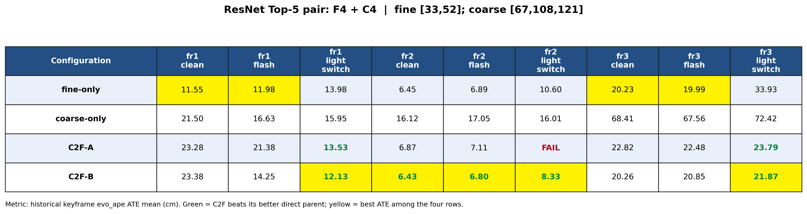{ width=100% }

绿色数值表示该 C2F variant 优于此列的 better direct parent；黄色底色表示四行中 ATE 最低。这样可以同时看出：C2F 是否超过 parent，以及若两种 C2F 都成功，哪一种 routing 的绝对 ATE 更低。

# 6. 关键发现

1. **U-Net 形成了最清晰的 C2F 互补证据。** U-A F4+C2 为总体最强 added-value 配置（8/9、median Δ −13.8%），U-A F5+C4、U-A F1+C2、U-B F5+C4 与 U-A F2+C4 均为 8/9。它们说明浅层 Enc0 的 selected local structures 在加入 Enc1 coarse context 后，可在多个光照变化下获得稳定的配对改善。
2. **不是所有 direct-best parent 都需要 C2F。** 所有 Top-5 pair 仍存在黑色 cell，且 0 个组合达到 9/9。因此更合理的实际策略是：把 C2F 视为根据 scene/condition 选择的候选 tracking representation，而不是取代最强 direct parent 的固定默认。
3. **ResNet 的 C2F-B 比 A 更好，但仍不具跨场景稳健性。** B 的 parent win-rate 为 40.0%，超过 A 的 18.6%；R-B F3+C5 在 fr1、fr2 的三光照均有正结果。然而 ResNet 在 fr3 不存在三光照稳健组合，显示 Conv1+Layer2 的 current fusion/routing 仍容易受到 scene geometry 与 illumination distribution 改变的影响。
4. **必须保留负例。** ResNet A 的低胜率、ResNet fr3 的严格胜出为零、以及 U-Net 的 0 个 9/9 pair 都应与最佳单元格同时报告；它们使结论从“发现了一个低 ATE”提升为关于 C2F 条件性有效范围的可检验结论。

# 7. 局限性与下一步

- 每个 configuration×sequence 为单次完整运行，因此当前表展示的是跨序列趋势，不能估计每一格的运行间方差；最终 shortlist 应对关键 lightswitch sequences 做重复运行。
- 候选 fine/coarse subsets 来自 fr1/desk_lightswitch 的前序 direct search；该训练式选择会使 fr1 结果带有选择偏差。真正的外部证据主要来自余下 fr2/fr3 与另外两种光照。
- 主指标遵循项目一贯的 keyframe Sim(3)-aligned ATE mean。所有 all-frame metric-scale SE(3) ATE/RPE、coverage 和 diagnostic logs 仍保存在 Step-R 原始 SQLite/CSV 中，最终固定配置前应一并审阅。
- 下一步建议：以 U-A F4+C2、U-A F5+C4、U-A F2+C4 为优先 shortlist，保留 R-B F3+C5 作为 ResNet 的正对照；再在新增序列/退化条件上验证，而不是继续在同九序列上扩张 grid。

# 附：可复核数据

- 原始合并 pairwise 表：`/home/melody/code/individual_project/channel_selection_results/step_r_c2f_grid_completion/{unet,resnet}/merged_pairwise_comparison.csv`
- 本报告的全量 C2F effect 概览：`/home/melody/code/individual_project/channel_selection_results/reports/c2f_complete_grid_multi_dataset/all_c2f_effect_overview.csv`
- 本报告每个架构 Top-5 pair 的机器可读表：`/home/melody/code/individual_project/channel_selection_results/reports/c2f_complete_grid_multi_dataset/top5_c2f_pairs_by_architecture.csv`

