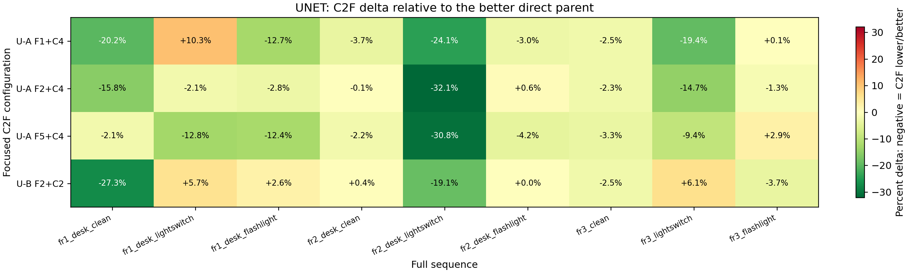
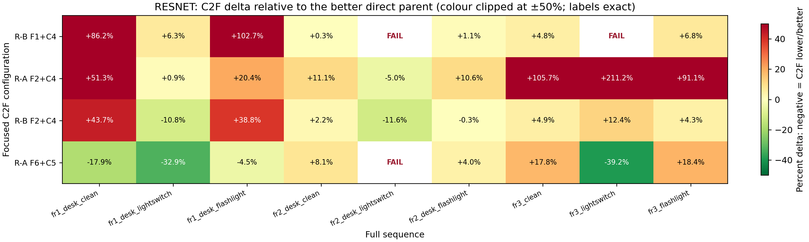
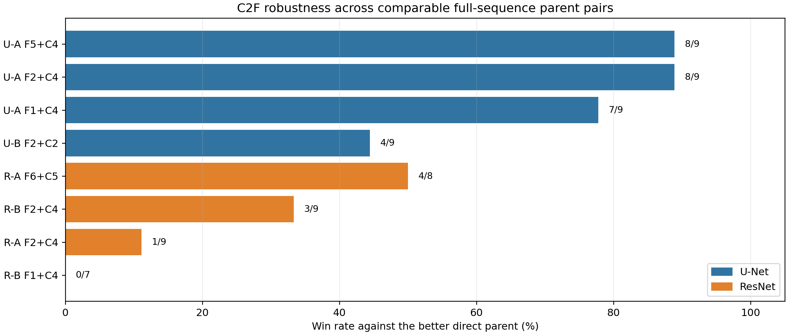

# C2F 九数据集 Direct-parent 对照评估（U-Net 与 ResNet）

## 1. 结论摘要

这不是新的 channel search，而是对已经在 fr1/desk_lightswitch 上选出的 direct subsets 与重点 C2F pair 的外部验证。每个 C2F 结果只和**同一数据集**上的两个 direct parents 比较；因此结论来自配对增益/退化，不把 fr1、fr2、fr3 的原始 ATE 直接平均。

**U-Net 的 C2F-A 显示出稳定的正贡献。** 36 个 U-Net C2F cell 全部完成；三个 C2F-A pair 在 27 个可比较 parent pairs 中有 **23/27** 次优于更强 direct parent（85.2%）。其中 U-A F2+C4（fr1 lightswitch C2F 全局最优）和 U-A F5+C4（原先的强 synergy case）均为 **8/9**，而 U-A F1+C4 也为 **7/9**。

**U-Net 的 variant B 不具同等稳健性。** U-B F2+C2 只有 **4/9** 次优于更强 parent，说明 multi-scale channel complementarity 不仅取决于通道，还取决于 coarse/fine 在 pyramid 中的分配方式。

**ResNet 的 fr1-lightswitch C2F 收益没有稳定迁移。** ResNet 仅有 **8/33** 个可比较 C2F cell 优于更强 parent。最初在 fr1 lightswitch 表现最好的 B F2+C4 虽在 fr1/fr2 lightswitch 仍优于 direct F2，但跨九序列只有 3/9 胜出，在 clean、flashlight 和 fr3 条件中多次退化。

在本次各自 10 个重点配置的比较集合中，U-Net 的最优值在 9 个序列中有 8 个低于 ResNet 的最优值；唯一例外为 fr1 flashlight。该比较支持 U-Net C2F-A 作为当前更有希望进行后续多序列扩展验证的路线，但不等同于所有 U-Net/ResNet 配置之间的穷尽架构比较。

## 2. 实验目的与固定协议

| 项目 | 固定设置 |
|---|---|
| 问题 | C2F 是否能在同一完整序列上优于构成它的 direct fine/coarse parents？ |
| 数据 | fr1/desk、fr2/desk、fr3/long_office_household × clean / lightswitch / flashlight = 9 条完整 TUM 序列 |
| 每架构配置 | 10：gray baseline + 5 个 direct parents + 4 个重点 C2F cases；每格 1 次 |
| Mapping | 固定 gray + sensor/GT depth；只改变 tracking feature configuration |
| C2F-A | coarse at L0/L1，fine at L2 |
| C2F-B | coarse at L0，fine at L1/L2 |
| 主指标 | historical keyframe evo_ape translation ATE mean（--align --correct_scale），单位 cm |
| 完整性 | 500 s timeout；coverage >= 90% 且轨迹达到结尾；保留 all-frame SE(3)、RPE、诊断日志 |

## 3. 完成度与失败

| 架构 | 计划 cells | PASS | FAIL_TRACKING_NAN | C2F PASS | Direct PASS | Gray PASS |
|---|---|---|---|---|---|---|
| U-Net | 90 | 88 | 2 | 36/36 | 45/45 | 7/9 |
| ResNet | 90 | 83 | 7 | 33/36 | 43/45 | 7/9 |

两架构中 gray 均在 fr1 lightswitch 与 fr3 lightswitch 出现非有限 affine/pose diagnostics，因此没有作为这些序列的竞争性可行方案。ResNet 另有 2 个 direct F1 和 3 个 C2F 运行失败，均发生在 lightswitch 条件；U-Net 所有 selected direct/C2F 组合均完成。

## 4. C2F 的配对效应：核心证据

下图显示每个 C2F 相对同一数据集上**更强的 direct parent**的 ATE 百分比变化：负值（绿色）表示 C2F 更好；红色表示退化。

ResNet 热图的颜色在 ±50% 处截断以保证中等退化仍可辨认；单元格数字始终为未截断的精确百分比。

| C2F | Variant | C2F PASS | 可比较 pairs | 优于 fine | 优于更强 parent | median Δ vs stronger parent |
|---|---|---|---|---|---|---|
| U-A F5+C4 | A | 9/9 | 9 | 8/9 | 8/9 | -4.22% |
| U-A F2+C4 | A | 9/9 | 9 | 8/9 | 8/9 | -2.33% |
| U-A F1+C4 | A | 9/9 | 9 | 7/9 | 7/9 | -3.73% |
| U-B F2+C2 | B | 9/9 | 9 | 5/9 | 4/9 | +0.01% |
| R-A F6+C5 | A | 8/9 | 8 | 4/8 | 4/8 | -0.27% |
| R-B F2+C4 | B | 9/9 | 9 | 3/9 | 3/9 | +4.30% |
| R-A F2+C4 | A | 9/9 | 9 | 1/9 | 1/9 | +20.39% |
| R-B F1+C4 | B | 7/9 | 7 | 0/7 | 0/7 | +6.32% |

### 4.1 U-Net：C2F-A 的增益模式

U-A F2+C4 是最均衡的配置：在 fr1 lightswitch 保留 5.8765 cm 的原始最优结果，并在 clean/flashlight/fr2/fr3 中保持 8/9 次配对胜出。U-A F5+C4 同样 8/9 胜出，尤其在 fr2 lightswitch 从 direct F5 的 11.8873 cm 降至 3.9342 cm（相对更强 parent 改善 30.8%）。U-A F1+C4 的命名来自 fr1 lightswitch 上曾劣于 global direct F1 的负对照，但跨九序列反而达到 7/9 胜出，说明该单点负结果并非普遍规律。

### 4.2 ResNet：局部 lightswitch 收益与跨分布退化

R-B F2+C4 在 fr1 和 fr2 lightswitch 分别比 direct F2 低 10.8% 和 11.6%，但在 fr1 clean、fr1 flashlight、fr3 clean、fr3 lightswitch、fr3 flashlight 都更差；其 median Δ 为 +4.30%，因此不能作为跨条件的默认 C2F 配置。R-A F6+C5 曾在 fr1 lightswitch 改善 32.9%，但只在 4/8 可比较序列胜出，并在 fr3 flash/clean 显著退化；它更适合作为“C2F 可产生强局部协同”的机制案例，而不是稳健推荐。

## 5. 每个数据集的最优结果（重点比较集合内）

| 数据集 | U-Net 最优 | ATE | ResNet 最优 | ATE | 较低者 |
|---|---|---|---|---|---|
| fr1_desk_clean | U-A F1+C4 | 6.50 | Gray | 7.38 | U-Net |
| fr1_desk_lightswitch | U-A F2+C4 | 5.88 | R-B F2+C4 | 9.33 | U-Net |
| fr1_desk_flashlight | U-A F2+C4 | 7.92 | R-F1 direct | 6.36 | ResNet |
| fr2_desk_clean | U-A F2+C4 | 3.03 | R-F1 direct | 4.53 | U-Net |
| fr2_desk_lightswitch | U-A F2+C4 | 3.86 | R-B F2+C4 | 6.60 | U-Net |
| fr2_desk_flashlight | U-F2 direct | 3.07 | Gray | 4.65 | U-Net |
| fr3_long_office_household_clean | U-A F5+C4 | 9.69 | Gray | 11.26 | U-Net |
| fr3_long_office_household_lightswitch | U-A F1+C4 | 9.10 | R-F2 direct | 10.22 | U-Net |
| fr3_long_office_household_flashlight | U-F5 direct | 9.75 | Gray | 10.59 | U-Net |

## 6. 完整 ATE 结果

单位：cm；为主指标 historical keyframe ATE mean。每张表只比较一个 dataset family 下的三种光照条件，避免九列表在 Word 中不可读。

### U-Net

#### fr1_desk

| 配置 | Tracking feature | clean | lightswitch | flashlight |
|---|---|---|---|---|
| Gray | gray photometric baseline | 7.38 | FAIL (NaN) | 9.38 |
| U-C4 direct | enc1 [0,5,6,18,30] | 8.15 | 7.64 | 9.22 |
| U-C2 direct | enc1 [0,5,6,17,18,30] | 13.69 | 6.96 | 17.62 |
| U-F1 direct | enc0 [2,3,7,12,13,14] | 9.85 | 5.92 | 9.79 |
| U-F2 direct | enc0 [3,7,12] | 11.43 | 6.00 | 8.15 |
| U-F5 direct | enc0 [2,3,7,12,13] | 7.39 | 7.10 | 10.59 |
| U-A F1+C4 | C2F-A: fine enc0 [2,3,7,12,13,14]; coarse enc1 [0,5,6,18,30] | 6.50 | 6.53 | 8.05 |
| U-A F2+C4 | C2F-A: fine enc0 [3,7,12]; coarse enc1 [0,5,6,18,30] | 6.86 | 5.88 | 7.92 |
| U-A F5+C4 | C2F-A: fine enc0 [2,3,7,12,13]; coarse enc1 [0,5,6,18,30] | 7.24 | 6.19 | 8.08 |
| U-B F2+C2 | C2F-B: fine enc0 [3,7,12]; coarse enc1 [0,5,6,17,18,30] | 8.31 | 6.35 | 8.36 |

#### fr2_desk

| 配置 | Tracking feature | clean | lightswitch | flashlight |
|---|---|---|---|---|
| Gray | gray photometric baseline | 4.55 | 8.46 | 4.65 |
| U-C4 direct | enc1 [0,5,6,18,30] | 4.98 | 5.68 | 5.08 |
| U-C2 direct | enc1 [0,5,6,17,18,30] | 4.63 | 5.34 | 4.90 |
| U-F1 direct | enc0 [2,3,7,12,13,14] | 3.50 | 7.06 | 3.56 |
| U-F2 direct | enc0 [3,7,12] | 3.03 | 6.85 | 3.07 |
| U-F5 direct | enc0 [2,3,7,12,13] | 3.39 | 11.89 | 3.47 |
| U-A F1+C4 | C2F-A: fine enc0 [2,3,7,12,13,14]; coarse enc1 [0,5,6,18,30] | 3.37 | 4.31 | 3.45 |
| U-A F2+C4 | C2F-A: fine enc0 [3,7,12]; coarse enc1 [0,5,6,18,30] | 3.03 | 3.86 | 3.09 |
| U-A F5+C4 | C2F-A: fine enc0 [2,3,7,12,13]; coarse enc1 [0,5,6,18,30] | 3.32 | 3.93 | 3.32 |
| U-B F2+C2 | C2F-B: fine enc0 [3,7,12]; coarse enc1 [0,5,6,17,18,30] | 3.04 | 4.32 | 3.07 |

#### fr3_long_office_household

| 配置 | Tracking feature | clean | lightswitch | flashlight |
|---|---|---|---|---|
| Gray | gray photometric baseline | 11.26 | FAIL (NaN) | 10.59 |
| U-C4 direct | enc1 [0,5,6,18,30] | 13.21 | 11.29 | 13.59 |
| U-C2 direct | enc1 [0,5,6,17,18,30] | 12.72 | 11.30 | 12.98 |
| U-F1 direct | enc0 [2,3,7,12,13,14] | 10.28 | 12.95 | 10.04 |
| U-F2 direct | enc0 [3,7,12] | 10.40 | 13.84 | 10.47 |
| U-F5 direct | enc0 [2,3,7,12,13] | 10.02 | 12.65 | 9.75 |
| U-A F1+C4 | C2F-A: fine enc0 [2,3,7,12,13,14]; coarse enc1 [0,5,6,18,30] | 10.02 | 9.10 | 10.05 |
| U-A F2+C4 | C2F-A: fine enc0 [3,7,12]; coarse enc1 [0,5,6,18,30] | 10.16 | 9.63 | 10.34 |
| U-A F5+C4 | C2F-A: fine enc0 [2,3,7,12,13]; coarse enc1 [0,5,6,18,30] | 9.69 | 10.23 | 10.03 |
| U-B F2+C2 | C2F-B: fine enc0 [3,7,12]; coarse enc1 [0,5,6,17,18,30] | 10.15 | 12.00 | 10.08 |

### ResNet

#### fr1_desk

| 配置 | Tracking feature | clean | lightswitch | flashlight |
|---|---|---|---|---|
| Gray | gray photometric baseline | 7.38 | FAIL (NaN) | 9.38 |
| R-C4 direct | layer2 [67,108,121] | 21.50 | 15.95 | 16.63 |
| R-C5 direct | layer2 [108,121] | 12.92 | 16.62 | 18.38 |
| R-F1 direct | conv1 [15,20,26,34] | 10.44 | 10.38 | 6.36 |
| R-F2 direct | conv1 [23,24,26,51,63] | 10.98 | 10.45 | 12.24 |
| R-F6 direct | conv1 [29,33,52] | 9.79 | 14.67 | 10.42 |
| R-B F1+C4 | C2F-B: fine conv1 [15,20,26,34]; coarse layer2 [67,108,121] | 19.44 | 11.03 | 12.90 |
| R-A F2+C4 | C2F-A: fine conv1 [23,24,26,51,63]; coarse layer2 [67,108,121] | 16.61 | 10.55 | 14.73 |
| R-B F2+C4 | C2F-B: fine conv1 [23,24,26,51,63]; coarse layer2 [67,108,121] | 15.78 | 9.33 | 16.99 |
| R-A F6+C5 | C2F-A: fine conv1 [29,33,52]; coarse layer2 [108,121] | 8.03 | 9.85 | 9.95 |

#### fr2_desk

| 配置 | Tracking feature | clean | lightswitch | flashlight |
|---|---|---|---|---|
| Gray | gray photometric baseline | 4.55 | 8.46 | 4.65 |
| R-C4 direct | layer2 [67,108,121] | 16.12 | 16.01 | 17.05 |
| R-C5 direct | layer2 [108,121] | 17.25 | 17.24 | 16.65 |
| R-F1 direct | conv1 [15,20,26,34] | 4.53 | FAIL (NaN) | 4.65 |
| R-F2 direct | conv1 [23,24,26,51,63] | 5.62 | 7.47 | 5.88 |
| R-F6 direct | conv1 [29,33,52] | 5.96 | 25.87 | 6.14 |
| R-B F1+C4 | C2F-B: fine conv1 [15,20,26,34]; coarse layer2 [67,108,121] | 4.55 | FAIL (NaN) | 4.70 |
| R-A F2+C4 | C2F-A: fine conv1 [23,24,26,51,63]; coarse layer2 [67,108,121] | 6.24 | 7.09 | 6.51 |
| R-B F2+C4 | C2F-B: fine conv1 [23,24,26,51,63]; coarse layer2 [67,108,121] | 5.74 | 6.60 | 5.87 |
| R-A F6+C5 | C2F-A: fine conv1 [29,33,52]; coarse layer2 [108,121] | 6.44 | FAIL (NaN) | 6.38 |

#### fr3_long_office_household

| 配置 | Tracking feature | clean | lightswitch | flashlight |
|---|---|---|---|---|
| Gray | gray photometric baseline | 11.26 | FAIL (NaN) | 10.59 |
| R-C4 direct | layer2 [67,108,121] | 68.41 | 72.42 | 67.56 |
| R-C5 direct | layer2 [108,121] | 61.92 | 65.60 | 60.47 |
| R-F1 direct | conv1 [15,20,26,34] | 12.11 | FAIL (NaN) | 11.63 |
| R-F2 direct | conv1 [23,24,26,51,63] | 11.94 | 10.22 | 11.88 |
| R-F6 direct | conv1 [29,33,52] | 15.88 | 32.38 | 16.15 |
| R-B F1+C4 | C2F-B: fine conv1 [15,20,26,34]; coarse layer2 [67,108,121] | 12.69 | FAIL (NaN) | 12.42 |
| R-A F2+C4 | C2F-A: fine conv1 [23,24,26,51,63]; coarse layer2 [67,108,121] | 24.57 | 31.79 | 22.70 |
| R-B F2+C4 | C2F-B: fine conv1 [23,24,26,51,63]; coarse layer2 [67,108,121] | 12.53 | 11.48 | 12.39 |
| R-A F6+C5 | C2F-A: fine conv1 [29,33,52]; coarse layer2 [108,121] | 18.71 | 19.70 | 19.13 |

## 7. 解释与下一步

1. **C2F 的作用是条件性的 feature complementarity，而非 guaranteed improvement。** U-Net 证明 C2F-A 能在多场景条件下稳定地给 shallow Enc0 增添 coarse context；ResNet 则说明在某个 MVS/lighting episode 上的最优配对并不足以保证跨分布迁移。
2. **Variant selection 是模型设计的一部分。** 同为 U-Net F2，A+C4 为 8/9，B+C2 为 4/9；ResNet F2+C4 中 B 在 fr1 lightswitch 上显著优于 A，但在多序列总体仍不足。故以后不能只报告“用了 C2F”，必须固定并报告 pyramid routing variant。
3. **后续推荐。** 若目标是可泛化 C2F，优先以 U-Net C2F-A（特别是 F2+C4 和 F5+C4）进入新的序列/退化验证；ResNet B F2+C4 可保留为 lightswitch-specialist 对照，R-A F6+C5 可作为机制案例，不应直接作为 default configuration。
4. **报告呈现。** 最终主表应同时列出 direct fine parent、direct coarse parent、C2F A/B 和它们的 sequence-wise delta；不要只展示 fr1 lightswitch 的 global best，必须保留 ResNet 的 clean/flashlight 退化与 U-Net B 的负/近零案例。

## 8. 局限性

- 每个 configuration×sequence 只运行 1 次；虽然之前多次重复显示较稳定，这里不能估计运行间方差。
- 重点集合是由 fr1/desk_lightswitch 的 direct greedy 与 C2F grid 预先筛选出来的，因此该序列上的结果不能视为完全独立 test。真正的泛化证据来自余下 8 条序列及其配对趋势。
- 本文的跨架构‘较低者’仅在已选的 10 个重点配置集合内成立；它不是全通道模型或所有候选配置的穷尽比较。
- 主指标含 trajectory alignment 与 scale correction，以保持与现有项目评估一致；all-frame metric-scale 指标和 diagnostics 已保留在原始 SQLite/CSV 中，应在选定最终配置后一并复核。
