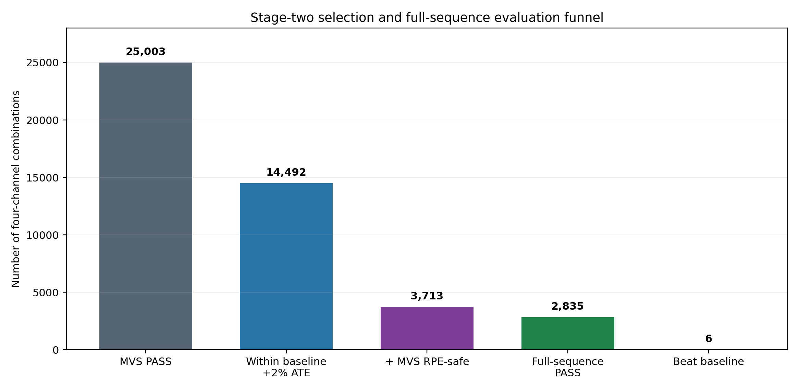
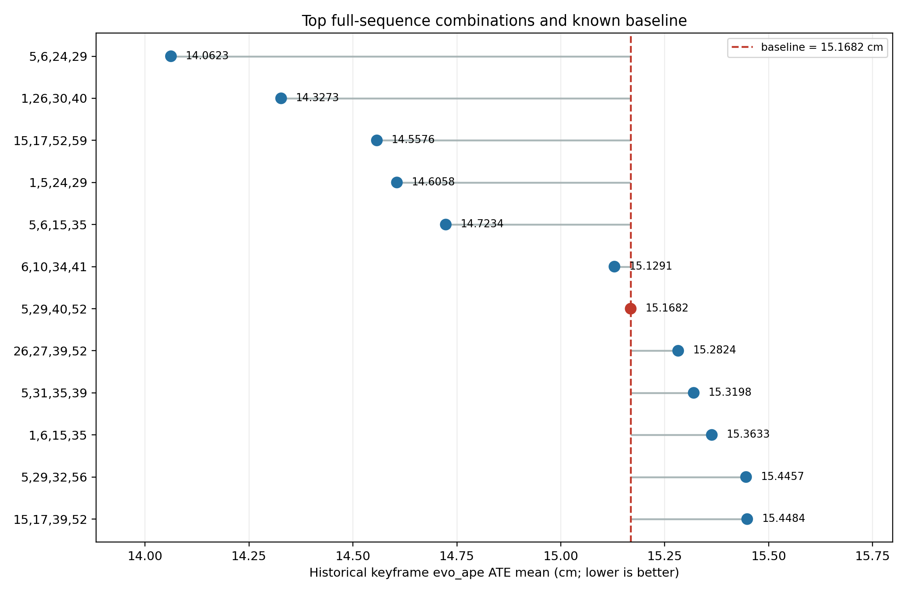
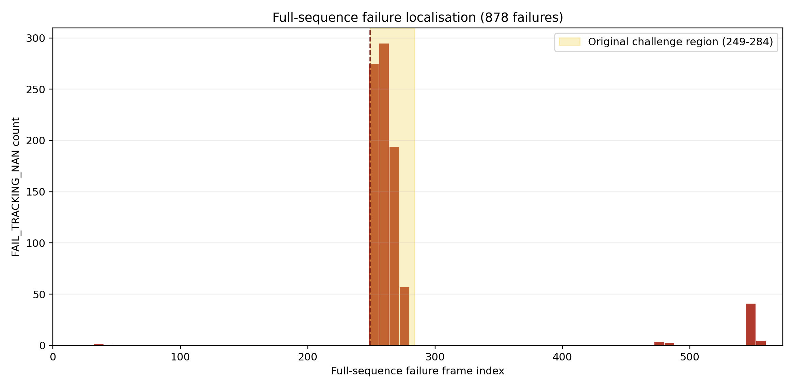
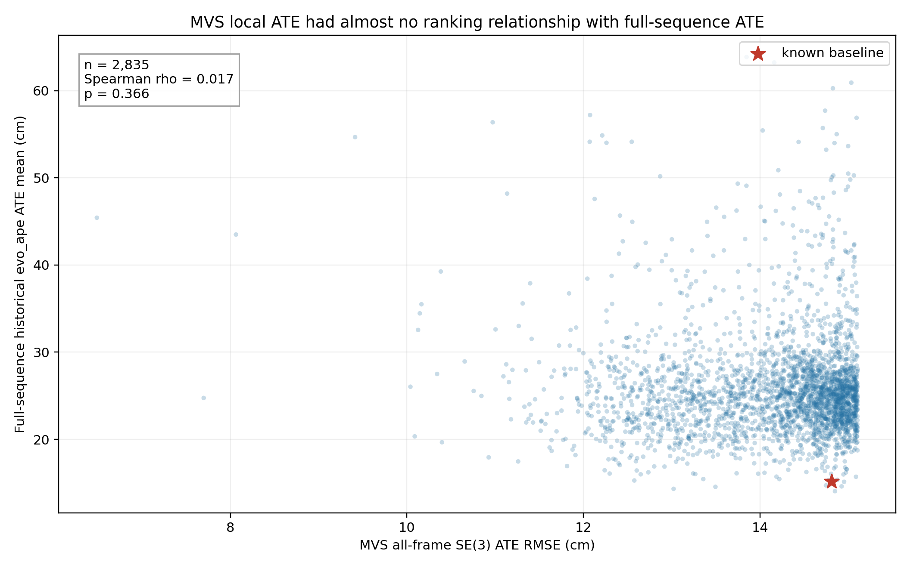

::: {custom-style="Title"}
第二阶段：MVS资格门后的完整序列通道组合评估
:::

::: {custom-style="Subtitle"}
3,713个Conv1四通道组合的full-sequence排序、失效分析与最终候选  
MSc Project 阶段性汇报材料 · 2026年8月10日
:::

# 执行摘要

第一阶段证明，50帧 Minimum Viable Sequence（MVS）能够有效复现 lightswitch 光照突变导致的 tracking failure，并从55,554个合法组合中排除30,551个直接失败组合。然而，最初9项 full-sequence 回测也显示：MVS局部ATE最低的组合不一定在完整序列上表现最好，甚至可能在其他时段失败。

第二阶段因此重新定义了MVS的角色：**MVS只作为fail-fast资格门，不再负责最终精细排名**。在25,003个MVS PASS组合中，以已知baseline `[5,29,40,52]` 的MVS SE(3) ATE RMSE为参考，加入+2%容差，并保留第一阶段的MVS RPE safety条件，最终冻结3,713个候选。所有候选随后在完整573-frame `fr1/desk_lightswitch` 上运行，最终排名严格采用与历史 `run_random_channel_search.sh` 相同的 keyframe `evo_ape --align --correct_scale` ATE mean。

核心结果如下：

- 3,713/3,713全部完成评估，数据库完整；2,835个PASS，878个full-sequence tracking NaN，无timeout或基础设施错误。
- 已知baseline的历史ATE mean为15.1682 cm，在2,835个PASS中排第7；共有6个组合的主指标低于baseline。
- 主指标冠军为 `[5,6,24,29]`，ATE mean 14.0623 cm，比baseline改善7.29%，但两项RPE max均略差于baseline。
- `[1,5,24,29]` 是最稳健综合候选：ATE mean 14.6058 cm，并且是唯一同时改善历史ATE mean、all-frame SE(3) RMSE、translation RPE max和rotation RPE max的组合。
- 878个full-sequence失败中，821个（93.51%）仍集中在原始frame 249--284光照挑战区，说明MVS抓住了主要故障机制；但23.65%的MVS合格候选仍无法完成完整序列。
- 在2,835个full PASS组合中，MVS SE(3) ATE RMSE与最终历史ATE mean几乎没有排序关系（Spearman ρ=0.017，p=0.366）。这验证了“用MVS筛失败、用full sequence定最终排名”的第二阶段设计。

# 1. 第二阶段目的

第二阶段针对第一阶段暴露的局部过拟合问题，回答以下问题：

1. 在不重新测试全部55,554个组合的前提下，如何安全地缩小full-sequence候选空间？
2. MVS上能够存活且局部误差不明显差于baseline的组合，在完整序列上有多少仍会失败？
3. 是否存在完整序列ATE优于已知baseline `[5,29,40,52]` 的四通道组合？
4. “主ATE最低”与“轨迹整体更稳定”是否指向同一个组合？
5. MVS局部ATE能否继续作为full-sequence精度的代理指标？

本阶段不再尝试从MVS Top-20直接推断最终最优，而是将full-sequence evaluation扩大到一个可在约两天内完成的资格集合。

# 2. 候选空间构建

## 2.1 Baseline参考

已知baseline `[5,29,40,52]` 在第一阶段40-frame scored MVS上的指标为：

| MVS指标 | Baseline结果 |
|---|---:|
| SE(3) ATE RMSE | 14.8128 cm |
| SE(3) ATE mean | 13.6422 cm |
| Translation RPE max | 4.205 cm |
| Rotation RPE max | 4.082° |
| ATE RMSE排名 | 11,985 / 25,003 PASS |

Baseline在MVS上接近中间位置，却在最初full-sequence回测中最好。因此，第二阶段没有只保留MVS最低ATE的Top-N，而是采用“baseline附近的宽松资格门”。

## 2.2 +2%容差与RPE门

候选必须同时满足：

1. 第一阶段 `bruteforce`, replicate 0，状态为PASS；
2. MVS scored window具有完整40个关联位姿；
3. MVS SE(3) ATE RMSE不超过baseline的102%，即不超过15.1091 cm；
4. MVS translation RPE max不超过6 cm；
5. MVS rotation RPE max不超过5°。

+2%容差用于避免在baseline边界附近因局部片段偏置或微小数值差异误删候选。不同容差对应的候选规模如下：

| MVS ATE资格线 | 仅满足ATE的PASS | 同时满足MVS RPE safety |
|---|---:|---:|
| 不高于baseline | 11,985 | 2,826 |
| baseline +1% | 13,261 | 3,257 |
| **baseline +2%** | **14,492** | **3,713** |
| baseline +3% | 15,915 | 4,243 |
| baseline +5% | 18,626 | 5,159 |

最终选择3,713组，使预计运行时间保持在2--3天范围，同时保留轻微高于baseline的MVS候选。

{width=92%}

# 3. Full-sequence实验设置

## 3.1 数据与模型配置

| 项目 | 设置 |
|---|---|
| 数据集 | 完整 `rgbd_dataset_freiburg1_desk_lightswitch` |
| Matched timestamps | 573 |
| Tracking输入 | CNN Conv1，四个指定channels |
| Mapping输入 | gray |
| 候选数量 | 3,713，每组1次主运行 |
| 每组timeout | 300秒 |
| 运行顺序 | 按第一阶段MVS ATE顺序冻结；因全部完成，顺序不影响最终排名 |
| 结果存储 | SQLite WAL + `synchronous=FULL`，每组完成后立即保存 |
| 可恢复性 | 重启后跳过已保存组合，从首个未评估组合续跑 |

## 3.2 成功与失败标准

以下情况即时fail-fast：

- KF affine、pose或关键tracking diagnostics出现NaN/Inf；
- 已知empty-AABB/Open3D runtime exception；
- 单组超过300秒；
- 输出轨迹缺失或无效。

若进程正常结束，仍需满足：

- all-frame轨迹至少覆盖90%的573个matched timestamp；
- 最终轨迹timestamp到达序列末端容差范围；
- 尾部轨迹没有冻结；
- all-frame trajectory能够与ground truth有效关联。

实际所有PASS组合均关联571/573个位姿，coverage为99.65%。

## 3.3 主指标：与历史搜索完全一致

最终排名必须能与早期 `run_random_channel_search.sh` 和历史baseline结果直接比较。因此对COMO输出的keyframe trajectory `results/data_tum.txt`运行：

`evo_ape tum groundtruth.txt data_tum.txt --align --correct_scale`

并以输出的translation ATE **mean** 作为主排名。该指标使用Sim(3) alignment，包括scale correction。

## 3.4 辅助诊断指标

| 指标 | 作用 |
|---|---|
| Historical keyframe evo_ape ATE RMSE | 补充主ATE mean的误差分布 |
| All-frame metric-scale SE(3) ATE RMSE/mean/max | 观察完整tracking trajectory的累计漂移，不拟合自由尺度 |
| Translation RPE RMSE/max | 观察局部平移jump |
| Rotation RPE RMSE/max | 观察局部旋转jump |
| Coverage与最终timestamp | 排除截断或未完成轨迹 |
| Photo MSE、valid ratio、Hessian condition、non-finite counts | 数值优化诊断 |
| Failure frame index | 定位full-sequence失效发生在哪个时段 |

第一阶段的6 cm/5° RPE门只用于40-frame MVS资格筛选，不能机械地作为573-frame full-sequence硬门。完整序列中出现极值的机会更多，因此full RPE主要与同一完整序列上的baseline相对比较。

# 4. 总体结果

## 4.1 完整性与运行结果

| 项目 | 结果 |
|---|---:|
| 计划候选 | 3,713 |
| 已评估 | 3,713（100%） |
| PASS | 2,835（76.35%） |
| FAIL_TRACKING_NAN | 878（23.65%） |
| Timeout/其他error/incomplete | 0 |
| PASS coverage | 571/573（99.65%） |
| 平均运行时间 | 41.94秒/组合 |
| 累计运行时间 | 43.26小时 |
| 数据库integrity check | `ok` |

第一阶段中这3,713组全部通过MVS；回到完整序列后仍有近四分之一失败，说明MVS存活是必要条件，但不是full-sequence存活的充分条件。

## 4.2 Full-sequence主排名

| Full rank | Channels | Historical ATE mean (cm) | 相对baseline | Evo ATE RMSE (cm) | All-frame SE(3) RMSE (cm) | Trans. RPE max (cm) | Rot. RPE max (°) |
|---:|---|---:|---:|---:|---:|---:|---:|
| 1 | `[5,6,24,29]` | **14.0623** | **-7.29%** | 15.7050 | 18.4657 | 14.175 | 9.532 |
| 2 | `[1,26,30,40]` | **14.3273** | **-5.54%** | 15.2672 | **17.3931** | 10.884 | 9.256 |
| 3 | `[15,17,52,59]` | **14.5576** | **-4.03%** | 16.1840 | 17.9380 | 9.331 | 10.725 |
| 4 | `[1,5,24,29]` | **14.6058** | **-3.71%** | 15.7263 | 18.1468 | **6.607** | **8.337** |
| 5 | `[5,6,15,35]` | **14.7234** | **-2.93%** | 16.0549 | 19.3756 | 18.913 | 10.385 |
| 6 | `[6,10,34,41]` | **15.1291** | **-0.26%** | 16.7460 | 18.5001 | 20.016 | 14.609 |
| 7 | baseline `[5,29,40,52]` | **15.1682** | reference | 16.9747 | 19.9359 | 13.557 | 8.468 |

共有6个组合的历史ATE mean低于baseline。第6名只改善0.26%，且局部jump明显更大，不应仅凭主指标认定为实质改善。

{width=92%}

## 4.3 结果分布

2,835个PASS组合的历史ATE mean分布较宽：

| 位置 | Historical ATE mean |
|---|---:|
| 最小值 | 14.062 cm |
| 前5%边界 | 19.052 cm |
| 前10%边界 | 20.336 cm |
| 中位数 | 24.948 cm |
| 75%位置 | 27.628 cm |
| 90%位置 | 32.125 cm |
| 99%位置 | 49.328 cm |
| 最大值 | 63.847 cm |

仅有6/2,835个PASS组合超过baseline，比例约0.21%。这说明baseline本身已经很强，full-sequence搜索的有效改进区域非常窄。

# 5. 结果解读

## 5.1 主指标冠军：`[5,6,24,29]`

该组合的historical ATE mean为14.0623 cm，比baseline低7.29%，是本阶段主指标明确的第一名；all-frame SE(3) RMSE也从baseline的19.9359 cm改善到18.4657 cm。

但是其translation RPE max为14.175 cm、rotation RPE max为9.532°，都略高于baseline的13.557 cm和8.468°。因此它适合作为“最低历史ATE”的首要候选，但不是所有稳定性指标上的严格优势组合。

## 5.2 综合稳健候选：`[1,5,24,29]`

该组合虽然主指标排名第4，但表现更均衡：

| 指标 | `[1,5,24,29]` | Baseline `[5,29,40,52]` | 改善方向 |
|---|---:|---:|---|
| Historical ATE mean | 14.6058 cm | 15.1682 cm | 更低 |
| All-frame SE(3) RMSE | 18.1468 cm | 19.9359 cm | 更低 |
| Translation RPE max | 6.607 cm | 13.557 cm | 明显更低 |
| Rotation RPE max | 8.337° | 8.468° | 略低 |
| Coverage | 571/573 | 571/573 | 相同 |

它是全部2,835个PASS组合中，唯一同时在上述四项误差指标上严格优于baseline的组合。因此，如果最终目标不仅是最低keyframe ATE，还包括避免局部jump，`[1,5,24,29]` 是更有解释力的综合推荐。

## 5.3 其他值得保留的候选

- `[1,26,30,40]`：历史ATE第二名，同时all-frame SE(3) RMSE第二名；translation jump优于baseline，rotation max略差。
- `[15,17,52,59]`：历史ATE第三名，translation max较低，但rotation max为10.725°。
- `[15,17,39,52]`：历史ATE mean 15.4484 cm，未超过baseline；但all-frame SE(3) RMSE为全体最低17.3523 cm，rotation RPE max仅5.392°。它适合作为metric-disagreement诊断候选，而不是主指标冠军。
- `[5,6,15,35]` 与 `[6,10,34,41]`：主ATE略优于baseline，但RPE max明显恶化，优先级应低于前四名。

# 6. Full-sequence失败分析

878个失败全部为 `FAIL_TRACKING_NAN`，没有timeout或未识别runtime错误。失败位置为：

| 区域 | 失败数 | 占全部失败 |
|---|---:|---:|
| Frame 249--284：原始光照challenge区域 | 821 | 93.51% |
| Frame 500以后 | 46 | 5.24% |
| Frame 400--499 | 7 | 0.80% |
| Frame 249之前 | 4 | 0.46% |

最高失败峰值位于frame 256（113组）、254（104组）、255（84组）和253（62组）。这与原MVS选择的亮度饱和时段一致。

{width=92%}

该结果同时支持两个结论：

1. MVS确实捕获了完整序列的主要失败机制；
2. 50-frame MVS没有包含完整初始化与此前轨迹历史，同一组合在局部片段能存活，并不保证从完整序列起点运行时也能通过相同事件。

# 7. MVS与full-sequence指标关系

在2,835个full-sequence PASS组合中，将第一阶段MVS SE(3) ATE RMSE与第二阶段historical ATE mean配对：

- Spearman ρ = 0.0170，p = 0.366；
- Pearson r = -0.0181，p = 0.335。

两者均接近零，MVS局部ATE对最终full-sequence排序几乎没有预测力。

{width=90%}

需要注意，该相关性是在已经经过MVS ATE与RPE资格门的restricted range中计算，因此不能推断所有55,554组上的全局关系。但它足以说明：在最终候选区间内，继续按MVS ATE细排没有价值。

# 8. 主要发现

1. **第二阶段实现了最终目标的第一步：找到full-sequence ATE优于baseline的组合。** 共有6组超过baseline，最佳改善7.29%。
2. **MVS作为fail-fast门是有效的，但作为精度ranker无效。** 它排除了大量直接失败组合，也准确覆盖主要失败区域；然而MVS ATE与full ATE几乎无相关。
3. **完整序列验证不可替代。** 3,713个MVS合格组合中仍有878个在full sequence失败。
4. **不同指标对应不同“最优”。** `[5,6,24,29]` 是历史主ATE冠军；`[1,5,24,29]` 是唯一全面支配baseline的均衡候选。
5. **Baseline很强。** 它在MVS局部只处于中间，但在full-sequence的2,835个PASS中仍排第7，说明原组合具有较好的全局泛化。
6. **局部jump不能被主ATE完全反映。** 第5和第6名虽略优于baseline，但RPE max恶化，不能只按单一ATE宣布胜出。

# 9. 局限性

1. **选择与最终评价使用同一完整序列。** 当前能够证明候选在 `fr1/desk_lightswitch` 上优于baseline，但不能证明跨序列泛化；下一步必须使用held-out sequences或不同光照退化。
2. **每个组合只有一次full主运行。** 当前pipeline在MVS重复中表现为确定性，但最终Top候选仍应重复运行并核对轨迹完全一致性。
3. **主指标包含scale correction。** 历史 `evo_ape --correct_scale` 保证与旧结果可比，但RGB-D本应具有metric scale；因此all-frame SE(3)结果必须继续并列报告。
4. **Full RPE max不能沿用MVS硬门。** 序列长度不同使极值分布不同，目前主要采用相对baseline解释，尚未建立跨序列统计阈值。
5. **候选空间已受r=0.70 clustering约束。** 同簇通道禁止共选可能遗漏某些组合；先前r=0.80 rescue只提供有限补救。
6. **只评估Conv1四通道。** 结论不能直接推广到其他layer或不同通道数量。
7. **PASS轨迹固定为571/573关联位姿。** Coverage足够高且各组合一致，但仍需在论文中明确不是573/573。
8. **相关性分析存在range restriction。** 只分析经过资格门的3,713组，相关性结论适用于最终候选区间。

# 10. 建议的下一步

1. 对baseline及前四名 `[5,6,24,29]`、`[1,26,30,40]`、`[15,17,52,59]`、`[1,5,24,29]` 做最终重复验证；
2. 将 `[5,6,24,29]` 保留为primary-ATE winner，将 `[1,5,24,29]` 保留为balanced winner；
3. 在held-out TUM sequences及其他光照/成像退化条件下比较二者与baseline；
4. 最终报告同时给出历史keyframe Sim(3) ATE mean、all-frame metric-scale SE(3) ATE和RPE，不以单一数字替代完整稳定性判断；
5. 若跨序列结果支持，可将 `[1,5,24,29]` 作为默认四通道组合；若研究目标严格以历史ATE mean为唯一优化目标，则优先 `[5,6,24,29]`。

# 附录A：可审计输出

- 冻结候选计划：`channel_selection_results/step_e_full_sequence_evaluation/second_round_baseline_plus2_rpe_safe/candidate_plan.json`
- 可读候选表：同目录 `candidate_plan.csv`
- 权威结果数据库：同目录 `evaluations.sqlite3`
- 全部评估记录：同目录 `all_evaluations.csv`
- PASS主排名：同目录 `pass_ranking.csv`
- 精简finalist表：同目录 `finalist_shortlist.csv`
- 结果摘要：同目录 `second_round_results_summary.md`
- 每组原始log与trajectory：同目录 `artifacts/<candidate_label>/`
