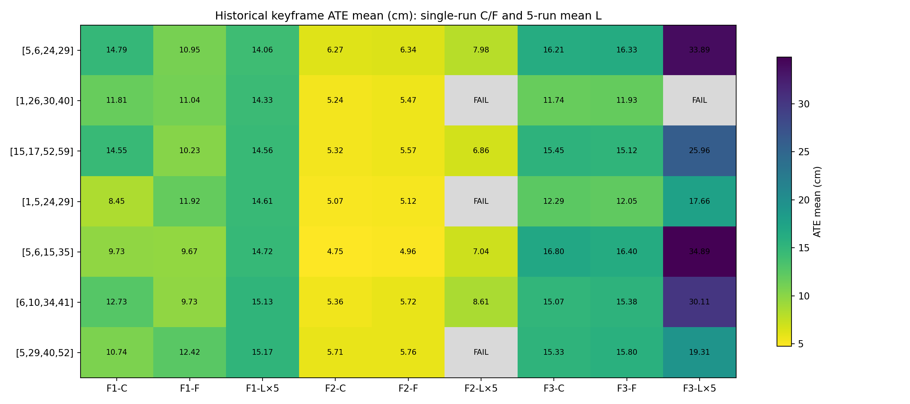
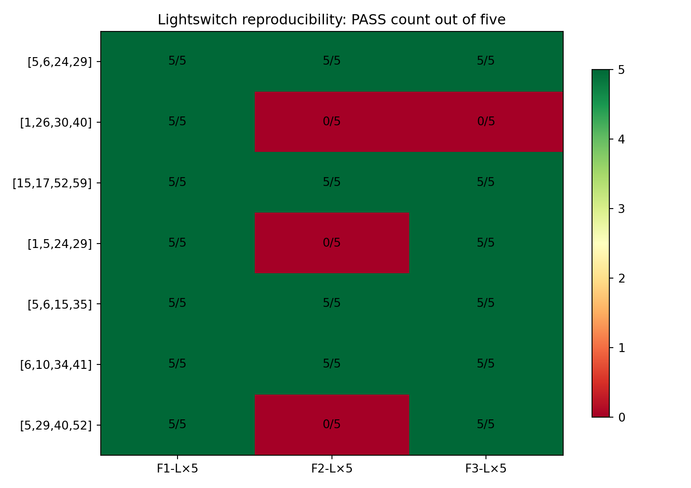

::: {custom-style="Title"}
Top-7通道配置九数据集综合评估
:::

::: {custom-style="Subtitle"}
Clean/Flashlight单次结果与Lightswitch五次重复结果的统一整理  
MSc Project 阶段性汇报材料 · 2026年8月11日
:::

# 执行摘要

本文统一整理7个Conv1四通道配置在9个TUM派生数据集上的表现。fr1/fr2/fr3的clean与flashlight采用较早的Step-F单次完整序列结果；三个lightswitch采用最新的每配置5次独立重复结果。所有结果均以COMO keyframe trajectory上的`evo_ape tum --align --correct_scale` ATE mean为主精度指标。

核心结论如下：

1. 三个lightswitch共105次运行全部完成，其中85次PASS、20次`FAIL_TRACKING_NAN`。5次重复的PASS/FAIL和ATE逐次完全一致，所有可计算ATE的标准差均为0.0000 cm，表明当前固定数据与配置下结果具有确定性。
2. `[15,17,52,59]`、`[6,10,34,41]`、`[5,6,24,29]`和`[5,6,15,35]`在9个数据集的全部21次计划观测中均PASS；其中`[15,17,52,59]`是lightswitch可靠性优先的第一名。
3. `[1,5,24,29]`在所有8个可与baseline比较且自身有ATE的数据集上均优于baseline，baseline-normalized ATE几何均值改善约13.2%，但在fr2 lightswitch中0/5 PASS，因此是精度型而非可靠性型冠军。
4. Baseline `[5,29,40,52]`在fr1与fr3 lightswitch均为5/5 PASS，但在fr2 lightswitch为0/5，并且5次均在frame 1737失败。此前记忆中的成功未在当前固定协议下复现。
5. clean/flashlight的最佳配置随数据集变化：fr1 clean由`[1,5,24,29]`获胜；fr1 flashlight与fr2 clean/flashlight由`[5,6,15,35]`获胜；fr3 clean/flashlight由`[1,26,30,40]`获胜。不存在单一配置在所有场景中同时达到最低ATE。

# 1. 数据来源与统一口径

| 数据组 | 序列 | 统计口径 | 主表显示 |
|---|---|---|---|
| 较早Step-F | fr1 desk clean / flashlight | 每配置1次 | ATE mean + PASS 1/1 |
| 较早Step-F | fr2 desk clean / flashlight | 每配置1次 | ATE mean + PASS 1/1 |
| 较早Step-F | fr3 office clean / flashlight | 每配置1次 | ATE mean + PASS 1/1 |
| 最新重复实验 | fr1 desk lightswitch | 每配置5次 | PASS次数与PASS-run ATE均值±标准差 |
| 最新重复实验 | fr2 desk lightswitch | 每配置5次 | PASS次数与PASS-run ATE均值±标准差 |
| 最新重复实验 | fr3 office lightswitch | 每配置5次 | PASS次数与PASS-run ATE均值±标准差 |

对于lightswitch，平均ATE仅使用PASS运行；PASS次数始终以5次为分母。若0/5 PASS，则不报告ATE。不同序列的绝对ATE不可直接相加，因此跨数据集比较同时报告完成率、dataset coverage及相对同数据集baseline的ATE比值。

# 2. 每个数据集上的最优配置

最佳配置采用可靠性优先规则：先最大化PASS次数，再在相同PASS次数下最小化历史ATE mean。

| 数据集 | 证据 | 最优配置 | ATE mean | PASS | 相对baseline |
|---|---|---|---:|---:|---:|
| fr1 desk clean | 较早单次 | `[1,5,24,29]` | 8.4530 cm | 1/1 | 改善21.30% |
| fr1 desk flashlight | 较早单次 | `[5,6,15,35]` | 9.6747 cm | 1/1 | 改善22.13% |
| fr1 desk lightswitch | 5次均值 | `[5,6,24,29]` | 14.0623 cm | 5/5 | 改善7.29% |
| fr2 desk clean | 较早单次 | `[5,6,15,35]` | 4.7526 cm | 1/1 | 改善16.79% |
| fr2 desk flashlight | 较早单次 | `[5,6,15,35]` | 4.9569 cm | 1/1 | 改善13.92% |
| fr2 desk lightswitch | 5次均值 | `[15,17,52,59]` | 6.8620 cm | 5/5 | baseline 0/5，无ATE |
| fr3 office clean | 较早单次 | `[1,26,30,40]` | 11.7409 cm | 1/1 | 改善23.39% |
| fr3 office flashlight | 较早单次 | `[1,26,30,40]` | 11.9308 cm | 1/1 | 改善24.51% |
| fr3 office lightswitch | 5次均值 | `[1,5,24,29]` | 17.6575 cm | 5/5 | 改善8.57% |

# 3. 七个配置在九个数据集上的表现

表内数字为历史keyframe ATE mean（cm），括号内为PASS次数。L×5列为最新5次平均；C/F列为较早单次结果。粗体表示该数据集按可靠性优先规则选出的最佳配置。

| 配置 | F1-C | F1-F | F1-L×5 | F2-C | F2-F | F2-L×5 | F3-C | F3-F | F3-L×5 |
|---|---:|---:|---:|---:|---:|---:|---:|---:|---:|
| `[5,6,24,29]` | 14.793 (1/1) | 10.951 (1/1) | **14.062 (5/5)** | 6.267 (1/1) | 6.337 (1/1) | 7.976 (5/5) | 16.206 (1/1) | 16.334 (1/1) | 33.894 (5/5) |
| `[1,26,30,40]` | 11.807 (1/1) | 11.036 (1/1) | 14.327 (5/5) | 5.241 (1/1) | 5.473 (1/1) | FAIL (0/5) | **11.741 (1/1)** | **11.931 (1/1)** | FAIL (0/5) |
| `[15,17,52,59]` | 14.553 (1/1) | 10.229 (1/1) | 14.558 (5/5) | 5.322 (1/1) | 5.567 (1/1) | **6.862 (5/5)** | 15.451 (1/1) | 15.122 (1/1) | 25.955 (5/5) |
| `[1,5,24,29]` | **8.453 (1/1)** | 11.921 (1/1) | 14.606 (5/5) | 5.072 (1/1) | 5.124 (1/1) | FAIL (0/5) | 12.289 (1/1) | 12.050 (1/1) | **17.658 (5/5)** |
| `[5,6,15,35]` | 9.728 (1/1) | **9.675 (1/1)** | 14.723 (5/5) | **4.753 (1/1)** | **4.957 (1/1)** | 7.039 (5/5) | 16.803 (1/1) | 16.402 (1/1) | 34.885 (5/5) |
| `[6,10,34,41]` | 12.732 (1/1) | 9.735 (1/1) | 15.129 (5/5) | 5.355 (1/1) | 5.720 (1/1) | 8.611 (5/5) | 15.066 (1/1) | 15.385 (1/1) | 30.106 (5/5) |
| `[5,29,40,52]` | 10.741 (1/1) | 12.424 (1/1) | 15.168 (5/5) | 5.712 (1/1) | 5.758 (1/1) | FAIL (0/5) | 15.326 (1/1) | 15.804 (1/1) | 19.312 (5/5) |

{width=98%}

# 4. Lightswitch五次重复的详细结果

| 数据集 | 配置 | PASS | ATE mean ± std (cm) | RPE RMSE mean (cm) | 重复失败帧 |
|---|---|---:|---:|---:|---|
| fr1 desk lightswitch | `[5,6,24,29]` | 5/5 | 14.0623 ± 0.0000 | 2.0974 | — |
| fr1 desk lightswitch | `[1,26,30,40]` | 5/5 | 14.3273 ± 0.0000 | 1.7786 | — |
| fr1 desk lightswitch | `[15,17,52,59]` | 5/5 | 14.5576 ± 0.0000 | 1.8991 | — |
| fr1 desk lightswitch | `[1,5,24,29]` | 5/5 | 14.6058 ± 0.0000 | 1.9722 | — |
| fr1 desk lightswitch | `[5,6,15,35]` | 5/5 | 14.7234 ± 0.0000 | 2.1701 | — |
| fr1 desk lightswitch | `[6,10,34,41]` | 5/5 | 15.1291 ± 0.0000 | 2.1274 | — |
| fr1 desk lightswitch | `[5,29,40,52]` | 5/5 | 15.1682 ± 0.0000 | 2.3995 | — |
| fr2 desk lightswitch | `[5,6,24,29]` | 5/5 | 7.9762 ± 0.0000 | 10.1115 | — |
| fr2 desk lightswitch | `[1,26,30,40]` | 0/5 | — | — | 1028 × 5 |
| fr2 desk lightswitch | `[15,17,52,59]` | 5/5 | 6.8620 ± 0.0000 | 7.5811 | — |
| fr2 desk lightswitch | `[1,5,24,29]` | 0/5 | — | — | 1027 × 5 |
| fr2 desk lightswitch | `[5,6,15,35]` | 5/5 | 7.0388 ± 0.0000 | 8.5014 | — |
| fr2 desk lightswitch | `[6,10,34,41]` | 5/5 | 8.6115 ± 0.0000 | 7.6981 | — |
| fr2 desk lightswitch | `[5,29,40,52]` | 0/5 | — | — | 1737 × 5 |
| fr3 office lightswitch | `[5,6,24,29]` | 5/5 | 33.8942 ± 0.0000 | 2.0070 | — |
| fr3 office lightswitch | `[1,26,30,40]` | 0/5 | — | — | 1796 × 5 |
| fr3 office lightswitch | `[15,17,52,59]` | 5/5 | 25.9551 ± 0.0000 | 7.9552 | — |
| fr3 office lightswitch | `[1,5,24,29]` | 5/5 | 17.6575 ± 0.0000 | 1.8775 | — |
| fr3 office lightswitch | `[5,6,15,35]` | 5/5 | 34.8852 ± 0.0000 | 2.9436 | — |
| fr3 office lightswitch | `[6,10,34,41]` | 5/5 | 30.1059 ± 0.0000 | 3.5134 | — |
| fr3 office lightswitch | `[5,29,40,52]` | 5/5 | 19.3121 ± 0.0000 | 2.3111 | — |

{width=78%}

## 4.1 重复性与失败机制

- fr1 lightswitch：全部7个配置均5/5 PASS，且每个配置5次ATE完全一致。
- fr2 lightswitch：四个配置均5/5 PASS；`[1,26,30,40]`在frame 1028重复失败5次，`[1,5,24,29]`在frame 1027重复失败5次，baseline在frame 1737重复失败5次。
- fr3 lightswitch：六个配置均5/5 PASS；仅`[1,26,30,40]`在frame 1796重复失败5次。
- 这些结果说明当前COMO执行路径基本确定性；重复实验的主要价值是确认失败是否稳定复现，而不是估计随机方差。

# 5. 配置级跨数据集综合比较

这里将6个单次C/F观测与15个lightswitch重复观测合并，因此每配置共有21次计划运行、最多覆盖9个数据集。ATE比值只在candidate与baseline均有有效ATE的数据集上计算。

| 配置 | PASS/21 | 有PASS的数据集/9 | 可比数据集 | 优于baseline | ATE比值几何均值 | 解释 |
|---|---:|---:|---:|---:|---:|---|
| `[5,6,24,29]` | 21/21 | 9/9 | 8 | 2 | 1.1272 | 全部完成，但跨序列ATE泛化偏弱 |
| `[1,26,30,40]` | 11/21 | 7/9 | 7 | 6 | 0.8964 | C/F精度强；两类lightswitch稳定失败 |
| `[15,17,52,59]` | 21/21 | 9/9 | 8 | 5 | 1.0283 | lightswitch可靠性冠军；fr2-L最优 |
| `[1,5,24,29]` | 16/21 | 8/9 | 8 | 8 | 0.8677 | baseline-relative精度最强；fr2-L脆弱 |
| `[5,6,15,35]` | 21/21 | 9/9 | 8 | 5 | 1.0010 | 全部完成；C/F与总体精度最平衡 |
| `[6,10,34,41]` | 21/21 | 9/9 | 8 | 6 | 1.0321 | 全部完成；精度中等但可靠 |
| `[5,29,40,52]` | 16/21 | 8/9 | 8 | 0 | 1.0000 | 历史baseline；fr2-L稳定失败 |

# 6. 结果解读与推荐

## 6.1 没有单一无条件冠军

若将tracking failure视为硬约束，四个21/21 PASS配置构成可靠集合：`[15,17,52,59]`、`[6,10,34,41]`、`[5,6,24,29]`和`[5,6,15,35]`。其中`[5,6,15,35]`在合并的8个baseline可比较数据集上ATE比值几何均值为1.001，几乎与baseline持平，同时避免了baseline的fr2 lightswitch失败，因此是最平衡的general-purpose候选。

## 6.2 Illumination-switch robustness

`[15,17,52,59]`在三个lightswitch上15/15 PASS，并以6.8620 cm取得fr2 lightswitch最低ATE；它在baseline 0/5的fr2序列上保持稳定。因此若研究问题强调突发光照变化下的生存能力，该配置是最有解释力的主推荐。

## 6.3 Accuracy–reliability trade-off

`[1,5,24,29]`在8个与baseline可比的数据集上全部取得更低ATE，ATE比值几何均值为0.8677，即条件于成功时约改善13.2%。然而它在fr2 lightswitch中0/5 PASS，不能作为单一稳健方案。`[1,26,30,40]`也表现出类似模式：clean/flashlight精度突出，但fr2和fr3 lightswitch均0/5。包含channel 1的两个组合在fr2相邻frame 1027/1028稳定失败，是值得后续消融验证的结构线索，但目前不能直接证明channel 1是因果来源。

## 6.4 Baseline重新评价

Baseline在fr1和fr3 lightswitch各5/5 PASS，但在fr2 lightswitch 0/5，并且全部在frame 1737失败。因此此前观察到的baseline成功不能代表当前固定fr2协议下的稳定行为。最新版重复实验支持将baseline记为“跨数据集8/9有成功、fr2 lightswitch确定性失败”，而不是偶发一次失败。

# 7. 局限性

1. clean与flashlight仍是单次结果，而lightswitch是5次重复；两类证据的统计强度不同。
2. 5次重复使用完全相同的输入、配置与执行路径，结果确定性一致；它验证实现重复性，但不代表跨硬件、随机初始化或不同真实光照事件的方差为零。
3. 同一family的clean/flashlight/lightswitch共享相机运动与ground truth，有利于配对比较，但不能替代更多独立真实序列。
4. fr2 lightswitch中baseline没有有效ATE，因此该序列无法参与baseline-normalized精度比值；必须同时查看PASS次数与绝对ATE。
5. Top-7来自fr1 lightswitch上的前期筛选，仍存在selection bias；多序列结果用于验证而不是重新穷举全部通道组合。

# 8. 建议的最终汇报口径

建议向导师同时报告三种角色，而不是压缩成一个best：

- **突变光照可靠性主候选：** `[15,17,52,59]`（lightswitch 15/15 PASS，fr2-L最低ATE）。
- **跨条件平衡候选：** `[5,6,15,35]`（九数据集21/21 PASS，C/F表现突出，整体ATE与baseline近似持平）。
- **条件成功时的精度候选：** `[1,5,24,29]`（8/8可比数据集ATE均优于baseline，但fr2-L 0/5）。

最终论文表格应将PASS rate放在ATE之前：失败配置不能因为其成功子集ATE较低而被错误排到稳定配置之前。

# 附录：权威结果文件

- 较早单次结果：`channel_selection_results/step_f_multi_dataset_evaluation/dataset_scorecard.csv`
- Lightswitch五次单元统计：`lightswitch_5x_evaluation/per_dataset_candidate_summary.csv`
- Lightswitch综合统计：`lightswitch_5x_evaluation/candidate_overall_summary.csv`
- 105次原始记录：`lightswitch_5x_evaluation/all_runs_raw.csv`
