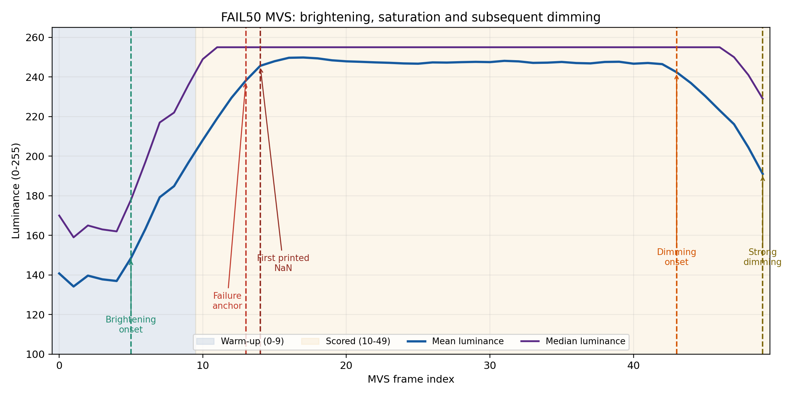
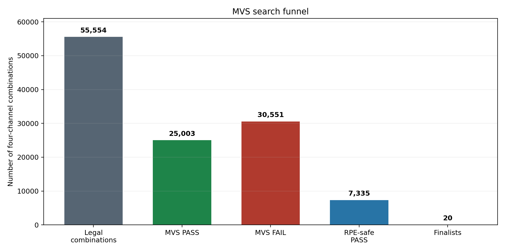
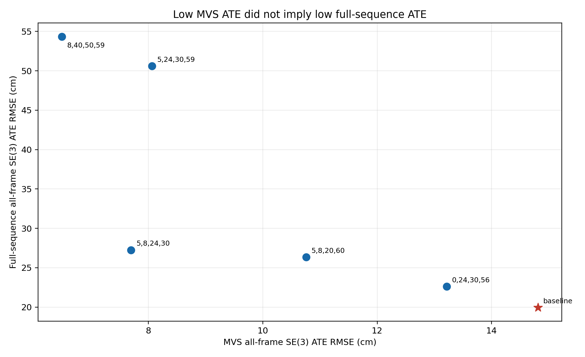

::: {custom-style="Title"}
第一阶段：最小可行序列（MVS）通道组合筛选与全序列回测
:::

::: {custom-style="Subtitle"}
Conv1 四通道组合的失效筛除、局部排序与泛化分析  
MSc Project 阶段性汇报材料 · 2026年8月10日
:::

# 执行摘要

本阶段的目标是在完整 `fr1/desk_lightswitch` 序列上进行昂贵评估之前，构建一个能够稳定复现光照突变失效、同时保留一定运动与时序多样性的 **Minimum Viable Sequence（MVS，最小可行序列）**，并用它对 Conv1 四通道组合进行 fail-fast 筛选。这里的 MVS 指最小可行评估序列，不是 Multi-View Stereo。

最终采用的 FAIL50 MVS 包含完整序列中的连续 50 帧：前 10 帧用于跟踪器 warm-up，后 40 帧用于评分。片段覆盖快速变亮、饱和平台、gray baseline 的硬失效以及随后的明显变暗。基于 r=0.70 correlation clustering 得到的 36 个代表通道，共构造 55,554 个合法四通道组合并完成穷举。

主要结果如下：

- gray baseline 在 MVS 13--14 帧附近稳定复现 non-finite pose/affine 硬失效；已知 CNN baseline `[5,29,40,52]` 能完成全部 50 帧。
- 55,554 个组合中，25,003 个（45.01%）通过，30,551 个（54.99%）出现 tracking NaN；MVS 有效排除了超过一半的不可用组合。
- 仅按 ATE 排名会选出具有明显单步跳变的组合。因此引入 translation/rotation RPE max，并用多指标策略选出 20 个 finalist。
- Top-20 的追加重复结果完全一致；single-channel swap-back 没有改变 Top-20，r=0.80 rescue 找回了一个进入 finalist 的组合 `[5,17,19,59]`。
- 最初 9 项 full-sequence 回测表明：MVS 上最低的局部 ATE 并不能预测完整序列最优。已知 baseline 在 MVS 上只排第 11,985/25,003，但在最初回测中仍是 full-sequence 最优；两个 MVS 候选甚至在完整序列后段失败。

因此，第一阶段最可靠的贡献是 **高效复现光照失效并排除不可运行组合**。MVS ATE 适合作为局部资格门和诊断指标，不应单独承担最终全序列精度排名。

# 1. 背景与目标

完整 `rgbd_dataset_freiburg1_desk_lightswitch` 含 573 个 matched RGB-D timestamp。一次完整序列运行约需 35--60 秒；若直接在大规模候选空间上穷举，计算成本较高，而且大量组合会在光照突变附近直接失败。

第一阶段需要解决三个问题：

1. 找到能够稳定触发 gray tracking failure 的最短连续片段；
2. 片段不能只包含变化最剧烈的两帧，而应保留事件前后、运动视角和变亮/变暗阶段；
3. 建立可解释、可断点续跑的 fail-fast 评估，使失败组合尽早退出，同时对成功组合报告 ATE、RPE及诊断信息。

本阶段搜索对象为 Conv1 的四通道组合。前置 correlation clustering 使用 r=0.70，在 64 个 Conv1 channels 中形成 30 个最终簇和 36 个代表通道；同一最终簇内的代表不允许同时入选一个四通道组合，因此得到 55,554 个合法组合。该约束用于降低相关冗余，不包含最初计划的 functional clustering。

# 2. MVS 的构建

## 2.1 事件定位

首先在完整 lightswitch 序列上运行 gray baseline。完整序列中：

- source index 248：首次推断出现 invalid pose，对应 MVS index 13，timestamp `1305031462.391695`；
- source index 249：首次打印 NaN affine，对应 MVS index 14；
- NaN 随后持续，说明这不是短暂 warning，而是不可恢复的跟踪失败。

事件定位同时参考逐帧 mean luminance、median luminance及相邻帧 log-luminance change。为了满足 diversity 要求，最终没有只截取突变最大的帧对，而是选择一段连续轨迹。

## 2.2 最终 FAIL50 片段

| 项目 | 设置 |
|---|---|
| 来源序列 | `rgbd_dataset_freiburg1_desk_lightswitch` |
| source index 范围 | 235--284，共 50 帧 |
| MVS index 0--9 | warm-up，不参与主评分 |
| MVS index 10--49 | scored window，共 40 帧 |
| 快速变亮开始 | source 240 / MVS 5 |
| gray failure anchor | source 248 / MVS 13 |
| 首次打印 NaN affine | source 249 / MVS 14 |
| 明显变暗开始 | source 278 / MVS 43 |
| 强变暗达到 | source 284 / MVS 49 |
| 输出 | TUM 格式 RGB/depth/GT、frame manifest、metadata及50帧MP4 |

亮度从 source 239 附近的 mean 约 136.95 快速升至 source 248 的 238.19、source 249 的 245.61，并在随后长时间接近饱和；到 source 284 降至 191.03。Median luminance 在饱和阶段达到 255，说明该片段确实覆盖了严重亮度饱和，而非普通曝光波动。

{width=95%}

## 2.3 构建有效性检查

MVS 建成后进行了 regression smoke test：

- gray tracking：在 MVS 13--14 附近复现硬失效，NaN 一直持续到 MVS 49；
- 已知 CNN baseline `[5,29,40,52]`：完成全部 50 帧并输出轨迹。

这证明 FAIL50 至少能区分“光照变化下直接失败”和“能够继续跟踪”的配置。但 completion 只说明存活，不等同于精度最优，因此仍需后续 ATE/RPE评价。

# 3. MVS 评估协议

## 3.1 成功、失败与 fail-fast

每个组合以 Conv1 四通道进行 tracking，mapping 保持 gray。以下情况立即结束当前 run 并记录失败帧：

- non-finite KF affine、pose或关键 tracking diagnostics；
- 已知的 empty-AABB/Open3D runtime failure；
- 超时；
- 轨迹缺失、冻结、覆盖不足或不能关联到完整的40个评分位姿。

单纯的 finite “Crazy affine” warning 不直接判失败，而是作为诊断计数保留。每个 run 独立恢复 COMO 配置；SQLite 使用事务和断点续跑，系统或进程中断后不会丢失已完成组合。

## 3.2 轨迹范围与对齐

- MVS 0--9 只用于 warm-up；
- 只对 MVS 10--49 的40个 all-frame tracking poses评分；
- 必须有40个评分位姿成功关联到 ground truth；
- 因为输入为 RGB-D，主 translation ATE 使用 metric-scale SE(3) alignment，不拟合自由尺度；
- 历史 keyframe trajectory 的 Sim(3) ATE仍保存，但不参与MVS主排名。

## 3.3 指标定义与作用

| 指标 | 作用 | 本阶段用途 |
|---|---|---|
| SE(3) translation ATE RMSE | 衡量评分窗口内的整体平移轨迹误差 | MVS主排名 |
| ATE mean/median/max | 补充误差分布与极值 | 诊断 |
| Translation RPE RMSE/max | 衡量相邻位姿的局部平移误差；max揭示单步jump | finalist安全性 |
| Rotation RPE RMSE/max | 衡量相邻位姿的局部旋转误差 | finalist安全性 |
| Rotation APE | 全局旋转误差 | 仅诊断；短轨迹全局方向约束较弱 |
| Keyframe Sim(3) ATE | 与早期full-sequence历史结果兼容 | 不参与MVS主排名 |
| Photo MSE、valid ratio、Hessian condition | 反映优化数值状态 | 辅助诊断，不直接排名 |

经验性 RPE safety 标记为：translation RPE max 不超过 6 cm，且 rotation RPE max 不超过 5°。这两个数值是 pilot 后用于识别明显jump的工程门槛，并非由 baseline 按固定比例严格推导。被标记的组合仍保留在完整排名中，但不能作为 swap-back、rescue和最终重复的seed。

## 3.4 多指标 finalist 选择

仅按 ATE RMSE 最低选组合会偏向具有局部jump的轨迹。因此 Top-20 采用 diversity-aware multi-metric selection：

- 约50%名额来自 RPE-safe ATE前列；
- 约25%来自 ATE、translation RPE、rotation RPE 的 Pareto候选；
- 其余名额覆盖低translation RPE或低rotation RPE组合；
- 未用名额再按safe ATE顺序补足。

# 4. MVS 搜索结果

## 4.1 总体搜索漏斗

| 阶段 | 数量 | 比例/说明 |
|---|---:|---|
| 合法四通道组合 | 55,554 | r=0.70代表通道，禁止同簇共选 |
| MVS PASS | 25,003 | 45.01% |
| MVS FAIL_TRACKING_NAN | 30,551 | 54.99% |
| PASS中同时满足RPE safety | 7,335 | 占PASS的29.34% |
| 最终多指标finalists | 20 | 用于重复、swap-back和rescue context |

Brute-force累计运行时间约134.36小时，平均8.71秒/组合。fail-fast显著降低了大量失败组合的运行成本。

{width=90%}

## 4.2 为什么不能直接取raw ATE Top

Raw ATE前5名全部违反6 cm/5°的RPE safety门：

| Raw rank | Channels | MVS ATE RMSE (cm) | Trans. RPE max (cm) | Rot. RPE max (°) | RPE-safe |
|---:|---|---:|---:|---:|---|
| 1 | `[5,14,17,26]` | 4.399 | 14.166 | 9.192 | 否 |
| 2 | `[14,56,60,63]` | 4.520 | 21.505 | 13.125 | 否 |
| 3 | `[14,23,24,60]` | 4.618 | 11.732 | 6.656 | 否 |
| 4 | `[5,26,30,60]` | 4.855 | 16.581 | 13.940 | 否 |
| 5 | `[5,8,14,30]` | 5.048 | 10.007 | 6.151 | 否 |

这解释了为什么主排序保留完整ATE榜单用于审计，但最终候选必须同时考虑局部jump。

## 4.3 多指标 Top-10

| Selection | Channels | 选择原因 | MVS ATE RMSE (cm) | Trans. RPE max (cm) | Rot. RPE max (°) |
|---:|---|---|---:|---:|---:|
| 1 | `[8,40,50,59]` | top ATE + Pareto | 6.486 | 5.549 | 3.801 |
| 2 | `[5,8,24,30]` | top ATE | 7.697 | 4.958 | 4.096 |
| 3 | `[5,24,30,59]` | top ATE | 8.062 | 4.741 | 2.993 |
| 4 | `[5,26,59,60]` | top ATE | 8.117 | 5.496 | 4.481 |
| 5 | `[5,17,24,59]` | top ATE | 8.703 | 5.950 | 3.879 |
| 6 | `[5,30,50,59]` | top ATE | 8.903 | 5.971 | 4.124 |
| 7 | `[14,24,30,59]` | top ATE + Pareto | 9.412 | 4.772 | 3.993 |
| 8 | `[5,17,19,59]` | r=0.80 rescue + Pareto | 9.789 | 5.993 | 3.221 |
| 9 | `[8,14,24,30]` | top ATE + Pareto | 9.862 | 5.707 | 2.982 |
| 10 | `[5,40,59,60]` | top ATE | 10.039 | 5.778 | 4.279 |

用于补充多样性的控制候选包括 `[0,24,30,56]`（MVS RMSE 13.218 cm，translation RPE max 2.087 cm）和 `[6,17,18,43]`（MVS RMSE 15.016 cm，rotation RPE max 1.722°）。它们不是ATE最优，但用于检验“低jump是否更能泛化”。

## 4.4 已知baseline在MVS中的位置

已知 CNN baseline `[5,29,40,52]` 的 MVS指标为：

- SE(3) ATE RMSE：14.8128 cm；
- SE(3) ATE mean：13.6422 cm；
- translation RPE max：4.205 cm；
- rotation RPE max：4.082°；
- 在25,003个PASS组合中，RMSE排名第11,985，mean排名第13,437。

因此 baseline 在这个局部挑战片段上只处于中间位置，并不是MVS局部最优。

## 4.5 重复、swap-back与rescue

| 检查 | 新运行数 | 结果 | 解释 |
|---|---:|---|---|
| Top-20追加重复 | 40 | 20组均达到3次观测且全部PASS；主要指标标准差为0 | 当前pipeline在相同输入下表现为确定性 |
| single-channel swap-back | 46 | 24 PASS、22 FAIL | 没有组合改变最终Top-20 |
| r=0.80 rescue | 559 | 326 PASS、233 FAIL | `[5,17,19,59]`进入最终Top-20 |

swap-back只能检验单通道替换，不能穷尽需要同时替换两个或更多通道才能出现的组合；r=0.80 rescue只对较保守聚类中被r=0.70合并掉的代表进行有限补救。

# 5. Back to full sequence：最初9项回测

## 5.1 口径说明

完整序列最终需要与早期 `run_random_channel_search.sh` 结果可比。因此 full-sequence 主指标采用：

`evo_ape tum groundtruth.txt data_tum.txt --align --correct_scale`

并读取 keyframe trajectory 的 ATE mean。表中同时保留 all-frame metric-scale SE(3) ATE RMSE，以诊断累计漂移和与MVS同类指标的变化。两个指标的轨迹采样和alignment不同，绝对值不应直接混为同一个量。

## 5.2 初始回测结果

| 配置 | Channels | Full状态 | Historical ATE mean (cm) | All-frame SE(3) RMSE (cm) | Trans. RPE max (cm) | Rot. RPE max (°) |
|---|---|---|---:|---:|---:|---:|
| Gray control | gray | FAIL，frame 249 | — | — | — | — |
| Known CNN baseline | `[5,29,40,52]` | PASS | **15.1682** | **19.9359** | 13.557 | 8.468 |
| MVS best ATE | `[8,40,50,59]` | PASS | 45.4173 | 54.3518 | 11.249 | 12.412 |
| MVS second ATE | `[5,8,24,30]` | PASS | 24.7481 | 27.2427 | 15.314 | 10.275 |
| MVS balanced | `[5,24,30,59]` | PASS | 43.4886 | 50.5913 | 22.717 | 16.672 |
| r=0.80 rescue | `[5,17,19,59]` | FAIL，frame 547 | — | — | — | — |
| Mid/low jump | `[5,8,20,60]` | PASS | 25.5467 | 26.3488 | 10.649 | 8.538 |
| Low translation jump | `[0,24,30,56]` | PASS | 19.8333 | 22.6063 | 7.290 | 10.276 |
| Low rotation jump | `[6,17,18,43]` | FAIL，frame 472 | — | — | — | — |

在这组初始样本中，known baseline仍是full-sequence最佳。MVS最低RMSE组合 `[8,40,50,59]` 在MVS scored window内为6.486 cm，但full-sequence all-frame RMSE上升到54.352 cm。相反，MVS RMSE较高的baseline在完整序列上表现最好。

{width=90%}

进一步按完整轨迹分段检查可见，`[8,40,50,59]` 在原挑战窗口内仍保持约6.40 cm的良好误差，但在窗口外明显恶化。这说明评估程序并非计算不一致，而是候选对单一局部事件发生了过拟合。

# 6. 主要发现

1. **FAIL50成功复现主要故障机制。** Gray control在MVS和full sequence的同一光照区域失效；CNN候选之间也能被快速区分。
2. **第一阶段最有效的功能是fail-fast筛除。** 30,551/55,554组合直接失败，使后续完整序列不必在这些组合上浪费计算。
3. **ATE必须和RPE联合解释。** Raw ATE前列存在明显translation/rotation jump，只看全局ATE会错误地把局部不稳定轨迹当作最优。
4. **局部MVS精度不是全局精度的可靠代理。** 初始full-sequence回测出现明显排序反转，且两个MVS成功组合在完整序列后段失败。
5. **低jump候选相对更有泛化希望，但仍不能替代full evaluation。** `[0,24,30,56]` 是初始新候选中full表现最好的一组，但仍未超过已知baseline。
6. **后搜索审计有价值但补救范围有限。** r=0.80 rescue找回一个候选；single-channel swap-back没有改写Top-20，说明局部替换不足以保证发现全局最优。

# 7. 局限性

1. **单一连续窗口。** FAIL50只有约1.6秒，尽管包含运动、变亮、饱和和变暗，但场景视角仍局限在完整序列的一小部分。
2. **事件分布偏置。** 片段刻意围绕最严重光照失败构建，适合鲁棒性筛选，却会偏向专门适应该事件的通道。
3. **MVS与full metric口径不同。** MVS主排名为all-frame metric-scale SE(3) ATE RMSE；历史full主指标为keyframe Sim(3) ATE mean。可通过并列报告缓解，但不能把绝对值直接等同。
4. **RPE safety是经验门槛。** 6 cm/5°并非统计学习得到，也不是baseline的严格倍数；它更适合作为风险标记而非理论硬界。
5. **重复运行不提供随机不确定性。** 相同配置的三次MVS结果完全一致，说明当前实现基本确定性；这不能替代跨序列、跨事件验证。
6. **搜索空间受clustering约束。** r=0.70同簇禁选减少了成本，也可能遗漏依赖簇内两个通道共同出现的组合。r=0.80 rescue只部分缓解该风险。
7. **只研究Conv1四通道。** 当前结论不能直接推广到其他layer、不同通道数量或其他数据集。
8. **初始full回测样本较小。** 9项回测足以暴露泛化问题，但不足以从25,003个MVS PASS中直接确定全局最优。

# 8. 第一阶段结论与第二阶段设计依据

MVS没有完成“直接给出最终最优组合”这一更强目标，但它成功完成了更可靠也更重要的任务：复现失败、排除不可用组合、暴露局部jump，并把完整搜索缩小到可管理的候选集合。

基于第一阶段结果，第二阶段不再把MVS ATE作为精细排名。合理策略是：

- MVS必须PASS并具有完整40个评分位姿；
- 以baseline MVS RMSE为宽松资格线，并保留少量容差；
- RPE用于优先级与风险控制；
- 对通过资格门的候选直接运行full sequence；
- 最终严格使用与历史脚本一致的full-sequence `evo_ape` ATE mean排名，同时报告all-frame SE(3)和RPE。

该设计把 MVS 定位为 **高效的失效筛选器**，把 full-sequence evaluation 定位为 **最终精度裁决器**，从方法上回应了第一阶段观察到的局部过拟合问题。

# 附录A：多指标Finalists 11--20

| Selection | Channels | 原因 | MVS RMSE (cm) | Trans. max (cm) | Rot. max (°) |
|---:|---|---|---:|---:|---:|
| 11 | `[18,25,39,59]` | Pareto | 10.282 | 5.874 | 3.467 |
| 12 | `[6,17,25,32]` | Pareto | 10.397 | 5.920 | 3.094 |
| 13 | `[6,17,25,33]` | Pareto | 10.714 | 5.932 | 2.717 |
| 14 | `[5,8,20,60]` | Pareto | 10.757 | 4.222 | 2.705 |
| 15 | `[8,14,52,56]` | Pareto | 11.067 | 4.216 | 2.874 |
| 16 | `[30,39,41,56]` | low translation RPE | 13.921 | 2.190 | 2.229 |
| 17 | `[30,39,56,63]` | low translation RPE | 13.739 | 2.082 | 2.212 |
| 18 | `[0,24,30,56]` | low translation RPE | 13.218 | 2.087 | 2.212 |
| 19 | `[6,18,39,63]` | low rotation RPE | 15.619 | 3.889 | 2.309 |
| 20 | `[6,17,18,43]` | low rotation RPE | 15.016 | 2.314 | 1.722 |

# 附录B：可审计输出

- MVS metadata：`...mvs_failure_anchor_idx248_brighten_dim_50f/mvs_metadata.json`
- MVS frame manifest：同目录 `frame_manifest.csv`
- MVS preview：同目录50帧MP4
- 搜索数据库：`channel_selection_results/step_d_fail_fast_evaluation/r070_bruteforce_v2/evaluations.sqlite3`
- MVS完整排名：同目录 `search_ranking.csv`
- 多指标Top-20：同目录 `multimetric_top20.csv`
- 重复汇总：同目录 `final_repeat_summary.csv`
- 初始full回测：`channel_selection_results/step_e_full_sequence_evaluation/fr1_desk_lightswitch/`
