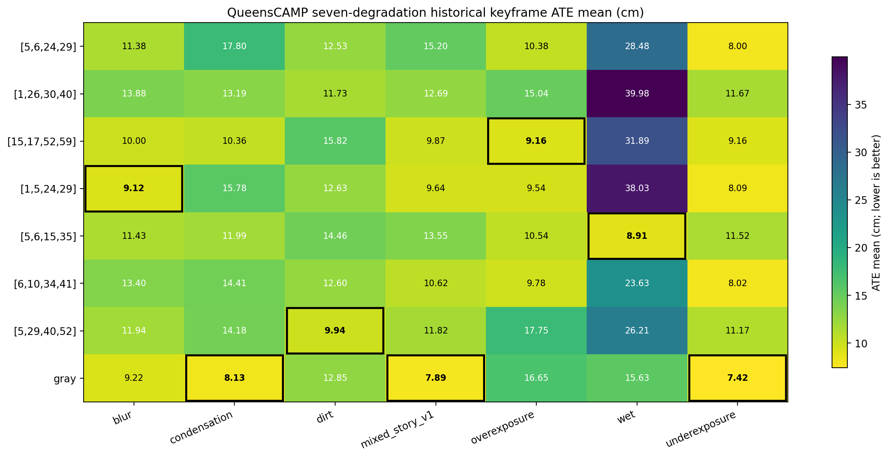
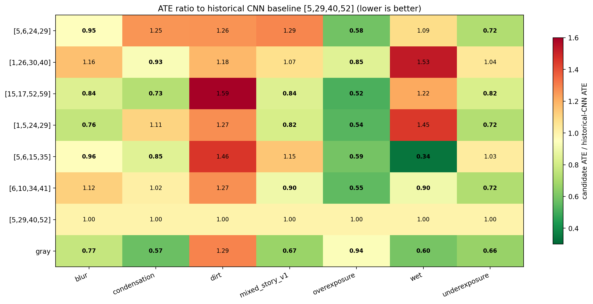

# QueensCAMP七种退化下的Top-7与Gray Baseline鲁棒性评估

*7种退化 × 8个配置 × 3次重复（168次完整运行）*  
MSc Project 阶段性汇报材料 · 2026年8月12日

# 执行摘要

本实验将fr1/desk的同一运动轨迹构造成7种QueensCAMP风格图像退化，并评估前期筛选出的6个通道组合、历史四通道CNN baseline `[5,29,40,52]`，以及gray photometric control。每个数据集/配置运行3次，共168次。Mapping端保持gray并使用配对的RGB-D sensor depth；ground-truth pose仅在运行后用于轨迹指标计算。主精度指标为与历史脚本一致的keyframe `evo_ape tum --align --correct_scale` ATE mean。

核心结果如下：

1. 168/168次运行均PASS，所有56个数据集×配置单元均为3/3 PASS。因此，本批退化均未触发跟踪崩溃，可靠性只能作为共同前提，无法用于区分配置。
2. 三次重复在每个单元的主ATE完全相同（ATE std = 0.0000 cm）。这说明当前固定输入、软件与硬件路径下执行是确定性的；重复确认了结果可复现，而非估计真实随机方差。
3. gray control在7种退化上有6种优于历史CNN baseline，baseline-normalized ATE几何均值为 0.7566。但它是对照而非通道选择方案，不能据此直接宣称gray普遍优于CNN。
4. 仅比较CNN配置时，`[5,6,15,35]`的跨退化ATE比值几何均值最低（0.8342），是本批次最平衡的CNN候选；`[15,17,52,59]`次之（0.8830）。
5. 最优CNN随退化类型变化：blur为`[1,5,24,29]`，overexposure为`[15,17,52,59]`，wet为`[5,6,15,35]`，而dirt仍由历史CNN baseline获胜。因此没有单一CNN组合在7种退化上均为最低ATE。

# 1. 实验目的与设置

## 1.1 目的

检验从fr1/desk_lightswitch筛选出的通道组合，是否能在不同类型的图像退化下维持轨迹精度；同时以gray和历史四通道CNN baseline作为两个不同性质的对照。

## 1.2 运行协议

| 项目 | 设置 |
| --- | --- |
| 基础序列 | TUM fr1/desk；七个QueensCAMP风格退化版本共享同一相机运动与ground truth |
| 退化 | blur、condensation、dirt、mixed_story_v1、overexposure、wet、underexposure |
| 配置 | 6个Top-7候选 + 历史CNN baseline `[5,29,40,52]` + gray control，共8个 |
| 重复 | 每个数据集/配置3次；7 × 8 × 3 = 168次 |
| Mapping | 固定为gray；`use_sensor_depth=true`，使用matched sensor-depth；不使用ground-truth pose建图 |
| Tracking | gray control或Conv1四通道CNN；其余COMO配置固定 |
| 主指标 | keyframe `evo_ape --align --correct_scale` ATE mean（cm，越低越好） |
| 诊断指标 | 历史keyframe RPE、全帧SE(3) ATE/RPE、coverage、运行时间 |
| 完成门槛 | coverage ≥90%，末帧时间间隔≤0.10 s；timeout=500 s |

不同退化的绝对ATE尺度不应直接求平均；跨退化汇总因此以每个数据集内相对于历史CNN baseline的ATE比值几何均值表示。比值小于1表示相对baseline更低的ATE。

# 2. 每种退化上的最佳配置

最优规则为：先比较PASS次数，再在同一PASS次数下比较ATE mean。本批所有单元均3/3 PASS，因此由ATE mean决定。

| 退化 | 最优配置 | ATE mean/cm | 相对历史CNN | 历史RPE RMSE/cm | Trans RPE max/cm | Rot RPE max/deg |
| --- | --- | ---: | --- | ---: | ---: | ---: |
| blur | `[1,5,24,29]` | 9.123 | 改善23.6% | 1.209 | 13.612 | 2.029 |
| condensation | `gray` | 8.130 | 改善42.7% | 0.999 | 3.679 | 1.981 |
| dirt | `[5,29,40,52]` | 9.935 | 改善0.0% | 1.149 | 9.786 | 6.456 |
| mixed_story_v1 | `gray` | 7.890 | 改善33.2% | 1.008 | 3.838 | 2.022 |
| overexposure | `[15,17,52,59]` | 9.162 | 改善48.4% | 1.486 | 21.572 | 3.507 |
| wet | `[5,6,15,35]` | 8.907 | 改善66.0% | 1.212 | 13.145 | 2.298 |
| underexposure | `gray` | 7.417 | 改善33.6% | 0.976 | 3.645 | 1.989 |

注意：ATE经全局Sim(3) alignment与scale correction后计算；较低ATE不保证没有局部跳变。因此表中同时保留RPE诊断。例如overexposure的最优`[15,17,52,59]`有最低ATE，但Trans RPE max为21.57 cm，说明局部不连续仍应在轨迹可视化中复核。

# 3. 各配置在七种退化下的表现

下表为每个单元的3次PASS-run ATE均值（cm）。本批每个单元均为3/3 PASS，且3次ATE相同，所以表中不再重复写`3/3`；粗体表示该退化下的最低ATE。

| 配置 | blur | condensation | dirt | mixed_story_v1 | overexposure | wet | underexposure |
| --- | ---: | ---: | ---: | ---: | ---: | ---: | ---: |
| `[5,6,24,29]` | 11.385 | 17.800 | 12.532 | 15.202 | 10.383 | 28.478 | 8.004 |
| `[1,26,30,40]` | 13.881 | 13.194 | 11.730 | 12.692 | 15.036 | 39.985 | 11.668 |
| `[15,17,52,59]` | 9.998 | 10.362 | 15.819 | 9.867 | **9.162** | 31.887 | 9.156 |
| `[1,5,24,29]` | **9.123** | 15.777 | 12.629 | 9.638 | 9.540 | 38.035 | 8.090 |
| `[5,6,15,35]` | 11.435 | 11.993 | 14.463 | 13.547 | 10.540 | **8.907** | 11.517 |
| `[6,10,34,41]` | 13.400 | 14.408 | 12.598 | 10.624 | 9.780 | 23.625 | 8.018 |
| `[5,29,40,52]` | 11.942 | 14.184 | **9.935** | 11.816 | 17.751 | 26.207 | 11.169 |
| `gray` | 9.215 | **8.130** | 12.851 | **7.890** | 16.651 | 15.632 | **7.417** |

{width=97%}

{width=97%}

# 4. 配置级综合结果

| 综合rank | 配置 | PASS/21 | 3/3数据集 | 优于历史CNN/7 | ATE比值几何均值 | 平均数据集rank |
| ---: | --- | ---: | ---: | ---: | ---: | ---: |
| 1 | `gray` | 21/21 | 7/7 | 6/7 | 0.7566 | 2.86 |
| 2 | `[5,6,15,35]` | 21/21 | 7/7 | 4/7 | 0.8342 | 5.00 |
| 3 | `[15,17,52,59]` | 21/21 | 7/7 | 5/7 | 0.8830 | 4.00 |
| 4 | `[6,10,34,41]` | 21/21 | 7/7 | 4/7 | 0.8959 | 4.29 |
| 5 | `[1,5,24,29]` | 21/21 | 7/7 | 4/7 | 0.9051 | 4.00 |
| 6 | `[5,6,24,29]` | 21/21 | 7/7 | 3/7 | 0.9826 | 4.86 |
| 7 | `[5,29,40,52]` | 21/21 | 7/7 | 0/7 | 1.0000 | 5.00 |
| 8 | `[1,26,30,40]` | 21/21 | 7/7 | 2/7 | 1.0920 | 6.00 |

# 5. 结果解读与insights

## 5.1 所有配置均完成：本批不能用failure rate区分鲁棒性

在这些七种退化强度和当前的RGB-D decoupled mapping设置下，gray和所有CNN配置均完成21/21次运行。与此前lightswitch实验不同，本批没有跟踪NaN或coverage failure。因此这里的‘鲁棒性’应理解为**在全部完成的前提下维持较低误差**，而不是failure-avoidance能力。

## 5.2 gray control表现强，但不应替代通道选择结论

gray在condensation（8.130 cm，相对历史CNN 改善42.7%）、mixed_story_v1（7.890 cm）和underexposure（7.417 cm，相对历史CNN 改善33.6%）取得全体最佳，并在6/7种退化上优于历史CNN。它说明当前固定映射/深度条件下，某些合成外观变化并不必然使gray tracking失效。它不是channel selection候选，且结果只来自同一基础运动轨迹的合成版本，不能外推为“gray通常优于CNN”。

## 5.3 CNN之间存在明确的退化类型偏好

- **Blur：** `[1,5,24,29]`为最佳（9.123 cm），比历史CNN低23.6%；gray非常接近（9.215 cm）。
- **Overexposure：** `[15,17,52,59]`为最佳（9.162 cm），比历史CNN低48.4%。这与其前期呈现的高通道多样性相容，但仍只是相关性证据。
- **Wet：** `[5,6,15,35]`为最佳（8.907 cm），相对历史CNN 改善66.0%，是最强的CNN特异性收益。
- **Dirt：** 历史CNN baseline自身为最佳（9.935 cm）；所有替代配置均更高。这是当前Top-7对该类局部遮挡/污染迁移不足的直接反例。

## 5.4 推荐不应压缩成单一‘全局最佳’CNN

如果需要一个仅由CNN构成的通用候选，`[5,6,15,35]`最合适：7种退化均3/3 PASS，跨退化ATE比值几何均值为0.8342，并在wet中显著领先。若研究问题强调过曝/illumination sensitivity，则`[15,17,52,59]`是更有针对性的候选（几何均值0.8830、5/7优于历史CNN）。

# 6. 局限性与下一步

1. 七个数据集是同一fr1/desk轨迹的退化版本，而不是七条独立真实轨迹；因此它们适合做配对外观退化比较，但不能代表跨场景泛化。
2. 三次运行的ATE完全相同，表明当前流程确定性很高；它不提供硬件、随机性或新场景下的置信区间。
3. 主ATE采用Sim(3) alignment与scale correction。论文级结论还应同时检查全帧SE(3)指标、RPE和轨迹图，尤其是出现低ATE但高Trans-RPE-max的案例。
4. Mapping固定使用sensor depth，且映射端优化被decouple；结论聚焦于tracking的图像输入/通道选择，不应外推到自由深度优化或纯单目设置。
5. Top-7来源于早期fr1 lightswitch筛选，存在selection bias。QueensCAMP结果是外部验证，而不是对全部64通道组合的重新搜索。

# 附录：权威数据与可审计文件

- 56个数据集×配置汇总：`channel_selection_results/step_h_queenscamp_degradation_evaluation/three_repeats/per_dataset_configuration_summary.csv`
- 8个配置综合排序：`channel_selection_results/step_h_queenscamp_degradation_evaluation/three_repeats/configuration_overall_summary.csv`
- 168次原始记录：`channel_selection_results/step_h_queenscamp_degradation_evaluation/three_repeats/all_runs_raw.csv`
- 每个数据集的SQLite记录与trajectory artifacts：`channel_selection_results/step_h_queenscamp_degradation_evaluation/three_repeats/per_dataset/`
