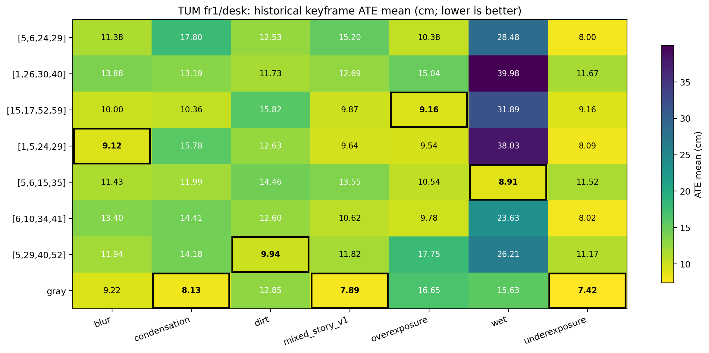
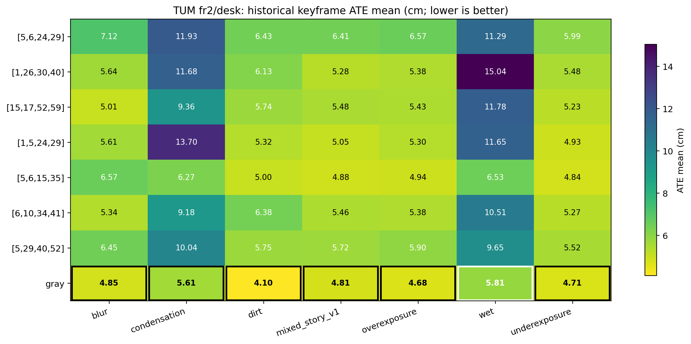
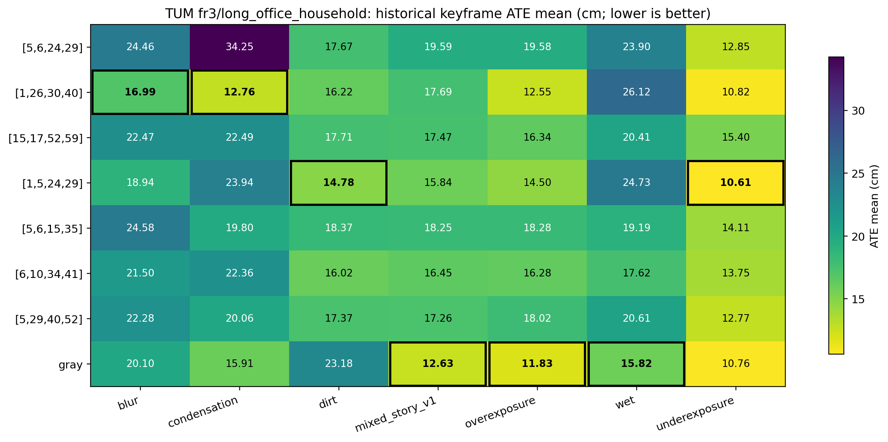

# QueensCAMP三序列七种退化下的Top-7与Gray鲁棒性评估

*21个退化数据集 × 8个配置 × 3次重复（504次完整运行）*  
MSc Project 阶段性汇报材料 · 2026年8月13日

# 执行摘要

本报告合并昨日完成的fr1/desk七种QueensCAMP退化实验，与今日完成的fr2/desk、fr3/long_office_household实验。评估对象为前期fr1 lightswitch筛选出的七个CNN配置（其中`[5,29,40,52]`为历史四通道CNN baseline）以及gray photometric control。三条基础序列各有七种退化；每个数据集/配置独立重复三次，共504次。

1. **所有504/504次均PASS。** 21个“数据集×配置”单元均为3/3 PASS；161/168个单元三次主ATE完全相同，另7个单元有很小的波动（最大std = 0.085 cm）。本批没有观察到可用failure-rate区分的鲁棒性差异。
2. **gray control在21个退化数据集中的13个取得最低ATE，19/21优于历史CNN baseline，跨21数据集ATE比值几何均值为0.7715。** 这是一项重要对照发现，但gray并非待选的CNN通道组合；不能把它直接转译为‘不需要CNN’的结论。
3. **仅看CNN时，`[5,6,15,35]`的综合相对误差最低**（几何均值比值0.8885，12/21优于历史CNN）。但最优CNN依赖基础序列和退化类型，未出现一个CNN在21种条件下都最优。
4. **跨序列迁移是非均匀的。** `[5,6,15,35]`在fr1/fr2表现强（比值0.8342/0.8127），在fr3则略劣于baseline（1.0347）；`[1,26,30,40]`则相反，在fr3最强CNN（0.8596）。
5. 因为三条基础序列的轨迹长度、场景和绝对ATE尺度不同，跨序列结论只使用每个数据集内相对历史CNN baseline的ATE比值，不直接平均原始ATE。

# 1. 实验目的与设置

## 1.1 目的

检验lightswitch搜索阶段保留下来的CNN通道组合，在不同基础场景和多种合成图像退化下是否能保持精度；并以历史CNN和gray两类对照辨析收益来自于通道组合还是当前固定RGB-D tracking/mapping设置。

## 1.2 实验协议

| 项目 | 设置 |
| --- | --- |
| 基础序列 | TUM fr1/desk、fr2/desk、fr3/long_office_household；每条各有7个退化版本 |
| 退化类型 | blur、condensation、dirt、mixed_story_v1、overexposure、wet、underexposure；同一基础序列内保持RGB/depth/GT与时间索引可用 |
| 数据集规模 | fr1: 573 matched RGB帧；fr2: 2893；fr3: 2488（索引条目数） |
| 配置 | 6个搜索产生的Top候选 + 历史CNN `[5,29,40,52]` + gray control，共8个 |
| 重复/规模 | 每个数据集×配置3次；21 × 8 × 3 = 504次 |
| Tracking / Mapping | tracking使用gray或指定Conv1四通道CNN；mapping固定gray；使用配对sensor depth，ground-truth仅用于运行后评估 |
| 主指标 | 历史可比的keyframe `evo_ape tum --align --correct_scale` ATE mean（cm，越低越好） |
| 诊断 | keyframe RPE、全帧metric-scale SE(3) ATE/RPE、coverage、轨迹与运行日志 |
| 完成门槛 | coverage ≥ 90%、末位姿距序列末帧≤0.10 s、单次timeout = 500 s |

ATE经过全局Sim(3) alignment和scale correction，适于沿用既有full-sequence历史口径。它不等价于局部轨迹完全平滑，故RPE作为诊断指标保留。

# 2. 数据完成度与重复性

| 基础序列 | 退化数 | 配置数 | 重复 | 计划运行 | PASS | 3/3单元 |
| --- | ---: | ---: | ---: | ---: | ---: | ---: |
| fr1/desk | 7 | 8 | 3 | 168 | 168 | 56/56 |
| fr2/desk | 7 | 8 | 3 | 168 | 168 | 56/56 |
| fr3/long_office_household | 7 | 8 | 3 | 168 | 168 | 56/56 |
| 合计 | 21 | 8 | 3 | 504 | 504 | 168/168 |

161/168个单元的三次主ATE标准差为0.0000 cm；其余7个单元均来自fr2/fr3，最大std仅0.085 cm。因而结果高度可复现，三次重复确认了流程没有隐藏的随机失败；但它们仍不能估计换机器、换场景时的不确定性。

# 3. 每个退化数据集的最优配置

最优规则先比较PASS次数，再比较主ATE。由于所有单元均为3/3 PASS，以下结果由ATE mean决定；‘相对历史CNN’小于1表示改善。

| 基础序列 | 退化 | 最优配置 | 最优ATE/cm | 历史CNN ATE/cm | 相对历史CNN | Trans RPE max/cm | Rot RPE max/deg |
| --- | --- | --- | ---: | ---: | --- | ---: | ---: |
| TUM fr1/desk | 模糊 | `[1,5,24,29]` | 9.123 | 11.942 | 改善23.6% | 13.612 | 2.029 |
| TUM fr1/desk | 冷凝 | `gray` | 8.130 | 14.184 | 改善42.7% | 3.679 | 1.981 |
| TUM fr1/desk | 污渍 | `[5,29,40,52]` | 9.935 | 9.935 | 改善0.0% | 9.786 | 6.456 |
| TUM fr1/desk | 混合叙事 | `gray` | 7.890 | 11.816 | 改善33.2% | 3.838 | 2.022 |
| TUM fr1/desk | 过曝 | `[15,17,52,59]` | 9.162 | 17.751 | 改善48.4% | 21.572 | 3.507 |
| TUM fr1/desk | 湿润 | `[5,6,15,35]` | 8.907 | 26.207 | 改善66.0% | 13.145 | 2.298 |
| TUM fr1/desk | 欠曝 | `gray` | 7.417 | 11.169 | 改善33.6% | 3.645 | 1.989 |
| TUM fr2/desk | 模糊 | `gray` | 4.846 | 6.450 | 改善24.9% | 16.829 | 4.479 |
| TUM fr2/desk | 冷凝 | `gray` | 5.612 | 10.043 | 改善44.1% | 10.754 | 5.083 |
| TUM fr2/desk | 污渍 | `gray` | 4.096 | 5.754 | 改善28.8% | 10.576 | 3.261 |
| TUM fr2/desk | 混合叙事 | `gray` | 4.810 | 5.718 | 改善15.9% | 12.699 | 2.620 |
| TUM fr2/desk | 过曝 | `gray` | 4.677 | 5.903 | 改善20.8% | 6.915 | 2.271 |
| TUM fr2/desk | 湿润 | `gray` | 5.811 | 9.646 | 改善39.8% | 8.895 | 3.923 |
| TUM fr2/desk | 欠曝 | `gray` | 4.713 | 5.523 | 改善14.7% | 11.614 | 3.648 |
| TUM fr3/long_office_household | 模糊 | `[1,26,30,40]` | 16.995 | 22.279 | 改善23.7% | 3.593 | 0.951 |
| TUM fr3/long_office_household | 冷凝 | `[1,26,30,40]` | 12.756 | 20.064 | 改善36.4% | 4.731 | 1.825 |
| TUM fr3/long_office_household | 污渍 | `[1,5,24,29]` | 14.778 | 17.374 | 改善14.9% | 2.294 | 1.009 |
| TUM fr3/long_office_household | 混合叙事 | `gray` | 12.633 | 17.265 | 改善26.8% | 2.507 | 0.997 |
| TUM fr3/long_office_household | 过曝 | `gray` | 11.829 | 18.023 | 改善34.4% | 2.383 | 0.963 |
| TUM fr3/long_office_household | 湿润 | `gray` | 15.822 | 20.610 | 改善23.2% | 2.453 | 0.949 |
| TUM fr3/long_office_household | 欠曝 | `[1,5,24,29]` | 10.607 | 12.771 | 改善17.0% | 2.637 | 0.962 |

# 4. 各配置在不同退化下的表现

以下三张大表均为主ATE mean（cm）；每格是3次PASS运行的均值，全部单元均为3/3 PASS。161/168个单元的三次结果相同，剩余7个单元的主ATE std均不超过0.085 cm；完整mean/std/min/max在原始汇总CSV中。**粗体**为同一基础序列、同一退化下最低ATE。不同基础序列的原始ATE不能直接横向平均。

## 4.1 TUM fr1/desk

| 配置 | 模糊 | 冷凝 | 污渍 | 混合叙事 | 过曝 | 湿润 | 欠曝 |
| --- | ---: | ---: | ---: | ---: | ---: | ---: | ---: |
| `[5,6,24,29]` | 11.385 | 17.800 | 12.532 | 15.202 | 10.383 | 28.478 | 8.004 |
| `[1,26,30,40]` | 13.881 | 13.194 | 11.730 | 12.692 | 15.036 | 39.985 | 11.668 |
| `[15,17,52,59]` | 9.998 | 10.362 | 15.819 | 9.867 | **9.162** | 31.887 | 9.156 |
| `[1,5,24,29]` | **9.123** | 15.777 | 12.629 | 9.638 | 9.540 | 38.035 | 8.090 |
| `[5,6,15,35]` | 11.435 | 11.993 | 14.463 | 13.547 | 10.540 | **8.907** | 11.517 |
| `[6,10,34,41]` | 13.400 | 14.408 | 12.598 | 10.624 | 9.780 | 23.625 | 8.018 |
| `[5,29,40,52]` | 11.942 | 14.184 | **9.935** | 11.816 | 17.751 | 26.207 | 11.169 |
| `gray` | 9.215 | **8.130** | 12.851 | **7.890** | 16.651 | 15.632 | **7.417** |

{width=96%}

## 4.2 TUM fr2/desk

| 配置 | 模糊 | 冷凝 | 污渍 | 混合叙事 | 过曝 | 湿润 | 欠曝 |
| --- | ---: | ---: | ---: | ---: | ---: | ---: | ---: |
| `[5,6,24,29]` | 7.120 | 11.926 | 6.426 | 6.409 | 6.565 | 11.294 | 5.991 |
| `[1,26,30,40]` | 5.639 | 11.682 | 6.127 | 5.284 | 5.384 | 15.041 | 5.476 |
| `[15,17,52,59]` | 5.010 | 9.359 | 5.737 | 5.480 | 5.429 | 11.781 | 5.233 |
| `[1,5,24,29]` | 5.615 | 13.701 | 5.322 | 5.047 | 5.301 | 11.653 | 4.926 |
| `[5,6,15,35]` | 6.571 | 6.273 | 4.998 | 4.881 | 4.938 | 6.532 | 4.839 |
| `[6,10,34,41]` | 5.345 | 9.185 | 6.377 | 5.460 | 5.383 | 10.505 | 5.267 |
| `[5,29,40,52]` | 6.450 | 10.043 | 5.754 | 5.718 | 5.903 | 9.646 | 5.523 |
| `gray` | **4.846** | **5.612** | **4.096** | **4.810** | **4.677** | **5.811** | **4.713** |

{width=96%}

## 4.3 TUM fr3/long_office_household

| 配置 | 模糊 | 冷凝 | 污渍 | 混合叙事 | 过曝 | 湿润 | 欠曝 |
| --- | ---: | ---: | ---: | ---: | ---: | ---: | ---: |
| `[5,6,24,29]` | 24.456 | 34.248 | 17.669 | 19.592 | 19.583 | 23.904 | 12.853 |
| `[1,26,30,40]` | **16.995** | **12.756** | 16.218 | 17.690 | 12.548 | 26.124 | 10.822 |
| `[15,17,52,59]` | 22.467 | 22.489 | 17.706 | 17.469 | 16.337 | 20.415 | 15.400 |
| `[1,5,24,29]` | 18.937 | 23.939 | **14.778** | 15.844 | 14.499 | 24.730 | **10.607** |
| `[5,6,15,35]` | 24.577 | 19.799 | 18.373 | 18.253 | 18.278 | 19.188 | 14.115 |
| `[6,10,34,41]` | 21.505 | 22.356 | 16.017 | 16.454 | 16.284 | 17.620 | 13.755 |
| `[5,29,40,52]` | 22.279 | 20.064 | 17.374 | 17.265 | 18.023 | 20.610 | 12.771 |
| `gray` | 20.102 | 15.911 | 23.177 | **12.633** | **11.829** | **15.822** | 10.764 |

{width=96%}

# 5. 配置级跨序列汇总

该表以每个数据集内的`candidate ATE / historical CNN ATE`计算几何均值。0.90表示相对于历史CNN平均低约10%；不对21条数据集的原始ATE求平均。

| 综合rank | 配置 | 优于历史CNN | 夺得数据集最优 | 21数据集比值几何均值 | fr1比值 | fr2比值 | fr3比值 |
| ---: | --- | ---: | ---: | ---: | ---: | ---: | ---: |
| 1 | `gray` | 19/21 | 13/21 | 0.7715 | 0.7566 | 0.7221 | 0.8406 |
| 2 | `[5,6,15,35]` | 12/21 | 1/21 | 0.8885 | 0.8342 | 0.8127 | 1.0347 |
| 3 | `[6,10,34,41]` | 14/21 | 0/21 | 0.9406 | 0.8959 | 0.9615 | 0.9662 |
| 4 | `[1,5,24,29]` | 14/21 | 3/21 | 0.9437 | 0.9051 | 0.9909 | 0.9371 |
| 5 | `[15,17,52,59]` | 13/21 | 1/21 | 0.9560 | 0.8830 | 0.9572 | 1.0338 |
| 6 | `[1,26,30,40]` | 11/21 | 2/21 | 0.9953 | 1.0920 | 1.0504 | 0.8596 |
| 7 | `[5,29,40,52]` | 0/21 | 1/21 | 1.0000 | 1.0000 | 1.0000 | 1.0000 |
| 8 | `[5,6,24,29]` | 3/21 | 0/21 | 1.0857 | 0.9826 | 1.1276 | 1.1550 |

# 6. 结果解读与重要insights

## 6.1 gray control是强对照，但不是通道选择的替代结论

gray在fr2的七种退化全部最低ATE，并在fr1的三种、fr3的三种退化中最低，合计13/21。它的三条基础序列比值分别为0.7566、0.7221、0.8406。这说明在当前固定gray mapping、sensor-depth与这些合成外观变换下，加入CNN feature并不自动带来更低ATE。灰度结果应被看作一个必要的负/简化对照：它并未经过与Top-7相同的通道搜索，不能回答‘CNN通道是否仍在真实动态光照下必要’。

## 6.2 最强CNN是稳健候选，而不是全条件冠军

`[5,6,15,35]`是21个数据集上综合比值最低的CNN（0.8885），并在fr1/wet取得CNN及全体最优；其在fr1、fr2明显改善，但在fr3为1.0347，略劣于历史CNN。这支持将它列为**跨外观退化的首要CNN候选**，但不支持声称为所有场景的全局最优。

## 6.3 场景依赖的配置偏好清晰

`[1,26,30,40]`在fr3的blur与condensation获胜，且fr3比值0.8596，为该序列最强CNN；但在fr1/fr2分别为1.0920/1.0504。`[1,5,24,29]`在21个数据集的14个优于历史CNN并获胜3次，是相对平衡的备选。`[6,10,34,41]`没有单项冠军，但综合比值0.9406、14/21优于baseline，表现出稳定但不尖峰的折衷。

## 6.4 不是所有lightswitch优胜者都能迁移

`[5,6,24,29]`在早期fr1 lightswitch中排名靠前，但此处21数据集综合比值为1.0857，仅3/21优于历史CNN且未取得任何数据集冠军。这是明确的selection-bias/任务依赖信号：小MVS和lightswitch的候选排序不能直接外推到跨序列、跨退化鲁棒性。

## 6.5 指标解读需同时看RPE

ATE采用全局Sim(3)对齐，仍可能掩盖局部跳变。报告中的每个最优单元同时列出Trans RPE max和Rot RPE max；后续若选择少量候选进入定性展示，应优先复核‘低ATE但高RPE max’的轨迹和feature maps，而不是仅按ATE挑选。

# 7. 局限性与建议下一步

1. QueensCAMP版本是同一基础轨迹上的外观退化，提供严格配对比较，但不是21条独立真实轨迹。跨序列泛化结论应理解为三个场景的外部验证，而非总体分布估计。
2. 退化是合成的、逐帧确定性的；不覆盖真实相机曝光控制、运动模糊、动态遮挡或深度失配的所有形式。
3. 当前mapping固定为gray且使用sensor depth，ground-truth只用于评估；结论专门针对decoupled RGB-D tracking设置，不能直接外推到联合mapping优化或纯单目系统。
4. 建议后续将`[5,6,15,35]`、`[1,5,24,29]`、`[1,26,30,40]`及历史CNN作为主要CNN对照，结合gray，对低ATE/high-RPE案例做轨迹与feature-map定性分析；并补充真实光照变化或未参与筛选的场景。

# 附录：权威数据位置

- fr1汇总：`channel_selection_results/step_h_queenscamp_degradation_evaluation/three_repeats/per_dataset_configuration_summary.csv`
- fr2/fr3汇总：`channel_selection_results/step_i_queenscamp_fr2_fr3_evaluation/three_repeats/per_dataset_configuration_summary.csv`
- fr1原始运行：`channel_selection_results/step_h_queenscamp_degradation_evaluation/three_repeats/all_runs_raw.csv`
- fr2/fr3原始运行：`channel_selection_results/step_i_queenscamp_fr2_fr3_evaluation/three_repeats/all_runs_raw.csv`
- 每个数据集的SQLite、trajectory与日志保存在以上目录的`per_dataset/`。
