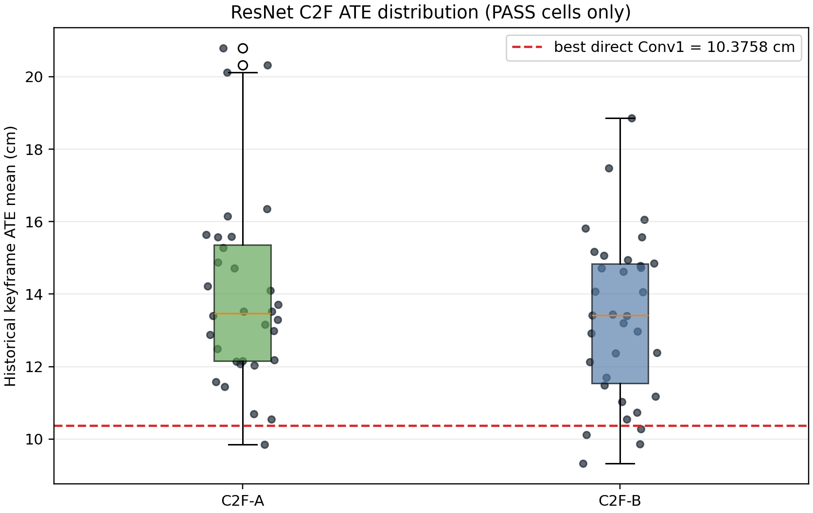
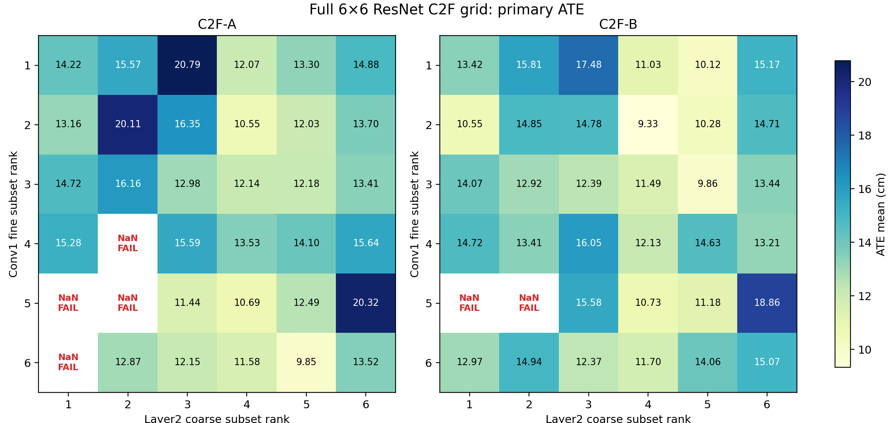
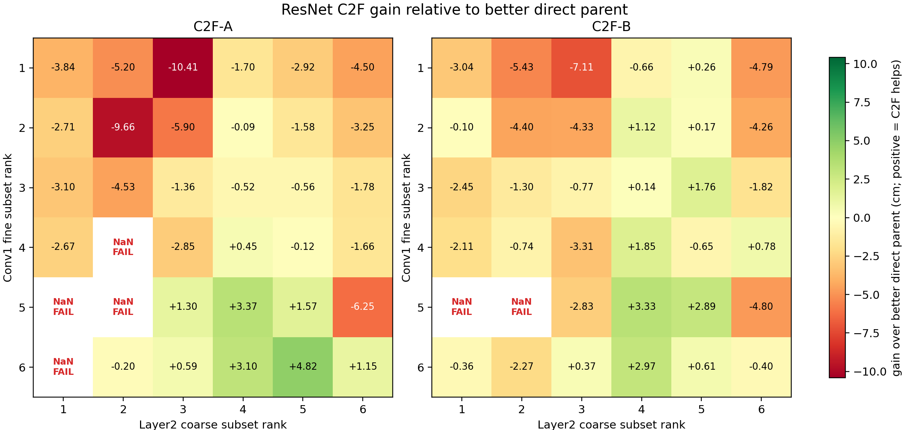
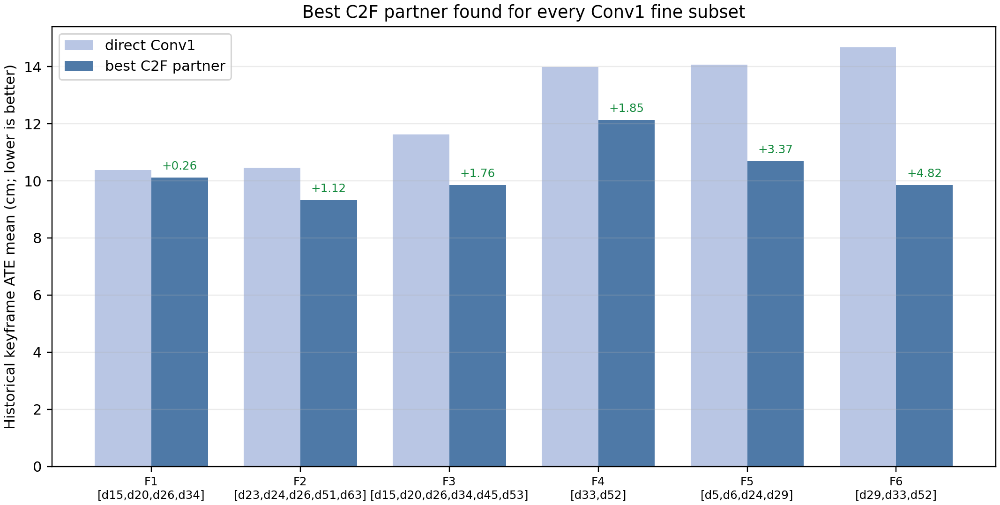

# ResNet Conv1/Layer2 C2F：fr1/desk_lightswitch 全序列验证

## 1. 结论摘要

ResNet C2F 的效果比 U-Net 更明显，但不是无条件稳健：72 个 cells 中 **66 PASS、6 个 `FAIL_TRACKING_NAN`**。在通过的 C2F pair 中，有 **20 个** 同时优于其 Conv1 fine 与 Layer2 coarse direct parent；按全部 72 个预注册 cells 计为 **20/72 = 27.8%**，明显高于 U-Net 的 5/72。

最优主指标配置为 **C2F-B / Fine rank 2 `[d23,d24,d26,d51,d63]` / Coarse rank 4 `[d67,d108,d121]`**：ATE mean = **9.3293 cm**。这比自身 fine direct parent `10.4535 cm` 低 **1.1242 cm (10.75%)**；也比现有 direct Conv1 全局最优 `[d15,d20,d26,d34]` 的 **10.3758 cm** 低 **1.0465 cm (10.09%)**。

与 Fine rank 2 direct parent 相比，C2F-best 的 secondary diagnostics 也一致改善：historical RPE **1.1472 vs 1.3227 cm**，all-frame metric-scale SE(3) RMSE **14.4515 vs 14.5216 cm**。相对 direct Conv1 global best，C2F-best 的 historical RPE 也略低（1.1472 vs 1.1819 cm），all-frame SE(3) RMSE 亦较低（14.4515 vs 14.9177 cm）。因此这不是只靠一个 ATE 数字得到的优势。

最大的 pair-level gain 则来自 **C2F-A / Fine rank 6 `[d29,d33,d52]` + Coarse rank 5 `[d108,d121]`**：从较强 parent 的 14.6721 cm 降至 9.8490 cm，改善 **4.8231 cm / 32.9%**。这说明 C2F 的主要贡献是将部分中等强度 fine subset 与合适的 coarse initializer 配对，而不是简单为原本最好的 Conv1 set 增加 Layer2。

## 2. 实验设置与可比性

- 数据：TUM `fr1/desk_lightswitch`，573 个 matched RGB-D timestamps。
- Tracking：`cnn_c2f`。Conv1 作 fine branch（64-channel universe）；Layer2 作 coarse branch（128-channel universe）。
- Mapping：固定 gray，固定 sensor/ground-truth depth；只改变 tracking feature allocation。
- C2F-A：L0/L1 coarse + L2 fine；C2F-B：L0 coarse + L1/L2 fine。
- Candidate grid：Conv1 与 Layer2 各取完成 direct greedy 中 ATE 最低的 6 个 repeated-PASS subset，执行完整 `2 × 6 × 6 = 72` pairing；每个 cell 一次。
- 主指标：historical keyframe `evo_ape tum --align --correct_scale` translation ATE mean，与前序 full-sequence greedy 一致。保留 historical RPE、all-frame metric-scale SE(3) ATE/RPE、coverage、NaN fail detection 和原始 log。
- 本次通过的 run 都达到 571/573 poses，coverage = 99.65%。与原 direct parents 相比，C2F grid 是单次运行；因此最好的候选仍需重复和跨序列确认。

## 3. 完成度、variant 分布与稳定性

| Variant | PASS | ATE mean | ATE median | Best | Worst | beat better parent |
|---|---|---|---|---|---|---|
| C2F-A | 32/36 | 13.9807 | 13.4633 | 9.8490 | 20.7859 | 8/32 |
| C2F-B | 34/36 | 13.3323 | 13.4119 | 9.3293 | 18.8598 | 12/34 |

**B 整体略优于 A。** 在两个 variant 都成功的 32 个 matched pairs 中，B 的 ATE 更低 **19/32** 次，A 更低 13/32 次；`B − A` 的均值为 **-0.6393 cm**、中位数为 **-0.6543 cm**，均偏向 B。A 的成功率较低（32/36），B 为 34/36。

## 4. C2F 在多少、哪种配置上确实提升？

这里的“提升”采用严格定义：C2F ATE 必须同时低于同一 cell 所含 Conv1 fine 和 Layer2 coarse 两个 direct parent。这样不会把“仅好于较弱的 Layer2 branch”误计为互补。

- **20/72（27.8%）** cells 达到严格改善；若只看完成的轨迹则为 20/66（30.3%）。
- C2F-B 有 12 个严格改善，C2F-A 有 8 个；但最大绝对提升来自 A。
- 相对 fine parent 有 23/66 次改善，相对 coarse parent 有 41/66 次改善。C2F 对 Layer2 的精细化帮助很常见，但真正同时超过强 fine parent 的情况仍只有约三成。

| Var. | Fine rank | Fine subset | Coarse rank | Coarse subset | C2F ATE | better parent | gain | relative |
|---|---|---|---|---|---|---|---|---|
| B | 2 | [d23,d24,d26,d51,d63] | 4 | [d67,d108,d121] | 9.3293 | 10.4535 | +1.1242 | 10.8% |
| A | 6 | [d29,d33,d52] | 5 | [d108,d121] | 9.8490 | 14.6721 | +4.8231 | 32.9% |
| B | 3 | [d15,d20,d26,d34,d45,d53] | 5 | [d108,d121] | 9.8569 | 11.6218 | +1.7649 | 15.2% |
| B | 1 | [d15,d20,d26,d34] | 5 | [d108,d121] | 10.1203 | 10.3758 | +0.2555 | 2.5% |
| B | 2 | [d23,d24,d26,d51,d63] | 5 | [d108,d121] | 10.2787 | 10.4535 | +0.1748 | 1.7% |
| A | 5 | [d5,d6,d24,d29] | 4 | [d67,d108,d121] | 10.6933 | 14.0623 | +3.3690 | 24.0% |
| B | 5 | [d5,d6,d24,d29] | 4 | [d67,d108,d121] | 10.7274 | 14.0623 | +3.3349 | 23.7% |
| B | 5 | [d5,d6,d24,d29] | 5 | [d108,d121] | 11.1759 | 14.0623 | +2.8864 | 20.5% |
| A | 5 | [d5,d6,d24,d29] | 3 | [d41,d60,d67,d95,d108,d121] | 11.4420 | 12.7413 | +1.2993 | 10.2% |
| B | 3 | [d15,d20,d26,d34,d45,d53] | 4 | [d67,d108,d121] | 11.4852 | 11.6218 | +0.1366 | 1.2% |
| A | 6 | [d29,d33,d52] | 4 | [d67,d108,d121] | 11.5763 | 14.6721 | +3.0958 | 21.1% |
| B | 6 | [d29,d33,d52] | 4 | [d67,d108,d121] | 11.7041 | 14.6721 | +2.9680 | 20.2% |
| B | 4 | [d33,d52] | 4 | [d67,d108,d121] | 12.1327 | 13.9810 | +1.8483 | 13.2% |
| A | 6 | [d29,d33,d52] | 3 | [d41,d60,d67,d95,d108,d121] | 12.1517 | 12.7413 | +0.5896 | 4.6% |
| B | 6 | [d29,d33,d52] | 3 | [d41,d60,d67,d95,d108,d121] | 12.3707 | 12.7413 | +0.3706 | 2.9% |
| A | 5 | [d5,d6,d24,d29] | 5 | [d108,d121] | 12.4945 | 14.0623 | +1.5678 | 11.1% |
| B | 4 | [d33,d52] | 6 | [d37,d74,d119,d121] | 13.2059 | 13.9810 | +0.7751 | 5.5% |
| A | 6 | [d29,d33,d52] | 6 | [d37,d74,d119,d121] | 13.5216 | 14.6721 | +1.1505 | 7.8% |
| A | 4 | [d33,d52] | 4 | [d67,d108,d121] | 13.5264 | 13.9810 | +0.4546 | 3.3% |
| B | 6 | [d29,d33,d52] | 5 | [d108,d121] | 14.0583 | 14.6721 | +0.6138 | 4.2% |

## 5. 有效 pairing 的结构规律

### 5.1 Coarse rank 4/5 是最有价值的切换端 representation

Coarse rank 4 `[d67,d108,d121]` 与 rank 5 `[d108,d121]` 都产生 **12/12 PASS**，且分别在 **12/12** 个 paired cells 中优于它们较弱的 coarse direct baseline。它们没有 Layer2 direct ATE 的前两名那么好，却成为最有效的 C2F initializer：全局最优使用 rank 4，而最大的 32.9% gain 使用 rank 5。相反，Layer2 rank 1/2 虽然 single-layer ATE 最低，却是全部 NaN interaction failures 的唯一 coarse members。

### 5.2 C2F 对中等 fine subset 的增益最大

| Fine rank | Conv1 subset | direct ATE | best C2F | Var. | coarse rank | gain vs fine | PASS cells |
|---|---|---|---|---|---|---|---|
| 1 | [d15,d20,d26,d34] | 10.3758 | 10.1203 | B | 5 | +0.2555 | 12/12 |
| 2 | [d23,d24,d26,d51,d63] | 10.4535 | 9.3293 | B | 4 | +1.1242 | 12/12 |
| 3 | [d15,d20,d26,d34,d45,d53] | 11.6218 | 9.8569 | B | 5 | +1.7649 | 12/12 |
| 4 | [d33,d52] | 13.9810 | 12.1327 | B | 4 | +1.8483 | 11/12 |
| 5 | [d5,d6,d24,d29] | 14.0623 | 10.6933 | A | 4 | +3.3690 | 8/12 |
| 6 | [d29,d33,d52] | 14.6721 | 9.8490 | A | 5 | +4.8231 | 11/12 |

Fine rank 6 `[d29,d33,d52]`、rank 5 `[d5,d6,d24,d29]` 和 rank 4 `[d33,d52]` 可获得很大的 C2F improvement；反之 Direct Conv1 global best rank 1 只获得 0.2555 cm 的小幅改善。C2F 的益处因此更像“basin/initialisation rescue”，不是所有 fine feature 的普遍 refinement。

## 6. 失败模式与局部稳定性提醒

6 个失败均为 tracker non-finite diagnostics，而非 timeout 或缺轨迹；它们集中在 **Layer2 coarse rank 1/2 + Fine rank 4/5/6** 的组合。所有 rank 3--6 coarse subsets 均完成。这是 pair interaction，而不是某一个 parent 本身失败：这些 source subsets 均来自 direct greedy 的 repeated PASS results。

| Var. | Fine rank | Fine subset | Coarse rank | Coarse subset | runtime (s) |
|---|---|---|---|---|---|
| A | 4 | [d33,d52] | 2 | [d60,d67,d108,d121] | 43.6 |
| A | 5 | [d5,d6,d24,d29] | 1 | [d41,d60,d67,d108,d121] | 44.4 |
| A | 5 | [d5,d6,d24,d29] | 2 | [d60,d67,d108,d121] | 44.3 |
| A | 6 | [d29,d33,d52] | 1 | [d41,d60,d67,d108,d121] | 43.9 |
| B | 5 | [d5,d6,d24,d29] | 1 | [d41,d60,d67,d108,d121] | 42.4 |
| B | 5 | [d5,d6,d24,d29] | 2 | [d60,d67,d108,d121] | 42.0 |

此外，如果机械地把早期 **40-frame MVS** 的 `translation RPE max ≤ 6 cm` 与 `rotation RPE max ≤ 5°` 门槛套到这个 573-frame C2F full-sequence run，只有 2/66 PASS cells 会同时满足。该门槛从未被定义为 full-sequence C2F 的硬筛选规则，因此不应据此推翻 primary ranking；但它提醒我们，best primary ATE candidates 的局部 maximum RPE 仍需在 trajectory visualization 与重复运行中复核。

## 7. 前十 primary ATE 与诊断

| Rank | Var. | Fine | Coarse | ATE mean | hist RPE | all-frame SE3 | T-RPE max | R-RPE max | gain |
|---|---|---|---|---|---|---|---|---|---|
| 1 | B | 2 | 4 | 9.3293 | 1.1472 | 14.4515 | 7.10 | 5.44 | +1.1242 |
| 2 | A | 6 | 5 | 9.8490 | 1.3358 | 15.2391 | 11.23 | 2.56 | +4.8231 |
| 3 | B | 3 | 5 | 9.8569 | 1.1880 | 14.6652 | 4.41 | 5.80 | +1.7649 |
| 4 | B | 1 | 5 | 10.1203 | 1.1841 | 14.5374 | 5.17 | 5.81 | +0.2555 |
| 5 | B | 2 | 5 | 10.2787 | 1.1952 | 14.6096 | 4.86 | 6.36 | +0.1748 |
| 6 | A | 2 | 4 | 10.5465 | 1.1950 | 15.6958 | 7.73 | 5.30 | -0.0930 |
| 7 | B | 2 | 1 | 10.5499 | 4.0017 | 19.3376 | 67.96 | 56.47 | -0.0964 |
| 8 | A | 5 | 4 | 10.6933 | 1.1938 | 16.1038 | 8.82 | 4.81 | +3.3690 |
| 9 | B | 5 | 4 | 10.7274 | 1.1613 | 15.2854 | 8.22 | 4.45 | +3.3349 |
| 10 | B | 1 | 4 | 11.0315 | 1.1463 | 15.4344 | 7.70 | 4.82 | -0.6557 |

## 8. 建议

1. **ResNet C2F 值得继续。** 与 U-Net C2F 的小幅、稀疏收益不同，ResNet 给出了 10.1% 的新 global best，以及 20 个严格 parent-level improvements。
2. **主候选**：C2F-B Fine rank 2 `[d23,d24,d26,d51,d63]` + Coarse rank 4 `[d67,d108,d121]`。它相对自身 parent、direct Conv1 global best、historical RPE 和 all-frame SE(3) RMSE 都更好。
3. **机制候选**：C2F-A Fine rank 6 `[d29,d33,d52]` + Coarse rank 5 `[d108,d121]`。它不是最优 ATE，但 32.9% 改善最能证明 C2F 能帮助较弱 fine subset 进入更好 basin；应与主候选一并保留。
4. **避免区域**：Layer2 coarse rank 1/2 配 Fine rank 4--6。它们产生了所有 NaN failures，不能因 parent 分别优秀而假定可安全结合。
5. **确认实验**：先对主候选、机制候选、direct Conv1 G4 各至少重复 3 次，并保留 full trajectory/RPE visualization；再进入其他 lighting sequences，不能仅用这一条 sequence 宣称普遍优势。

## 9. 可审计文件

- SQLite：`channel_selection_results/step_p_c2f_best_channels_evaluation/resnet_fr1_desk_lightswitch/evaluations.sqlite3`
- Console：`.../resnet_fr1_desk_lightswitch/console.log`
- 全部 rows：`.../resnet_fr1_desk_lightswitch/all_evaluations.csv`
- 排名：`.../resnet_fr1_desk_lightswitch/pass_ranking.csv`
- 冻结 grid：`channel_selection_pipeline/scripts/step_p_c2f_best_channels_evaluation/resnet_c2f_candidate_plan.json`
- Direct sources：`step_n_resnet_conv1_direct_fullseq_greedy/recommendation.json` 与 `step_o_resnet_layer2_direct_fullseq_greedy/recommendation.json`
