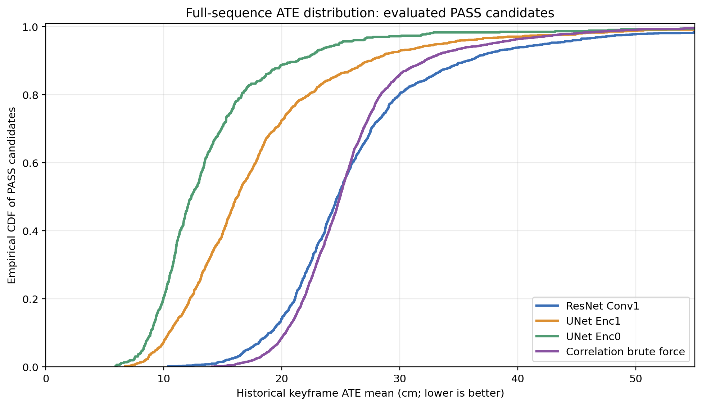
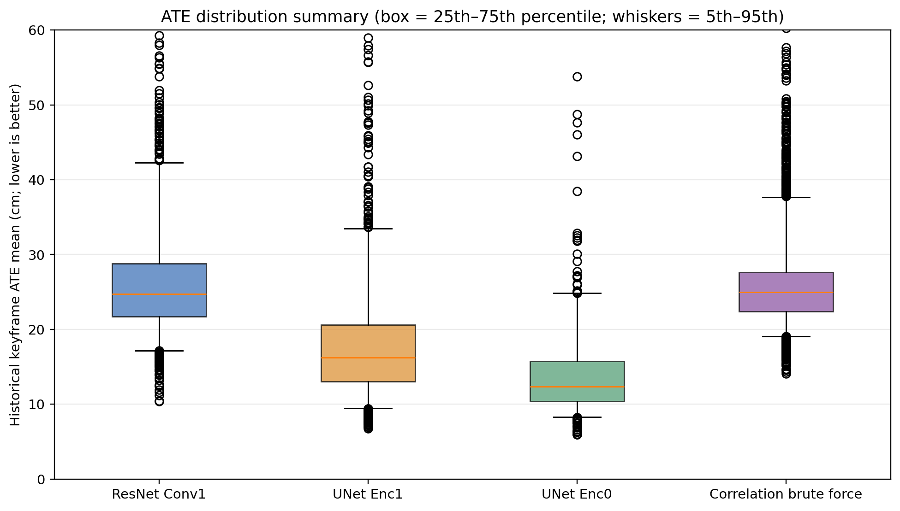
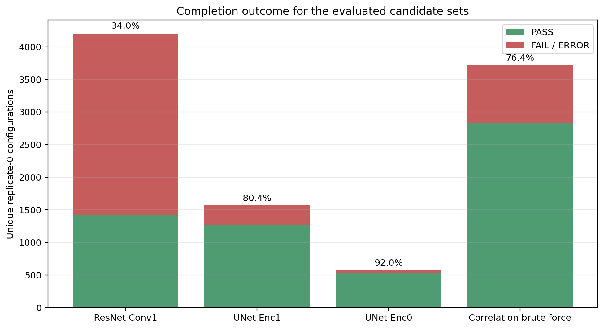
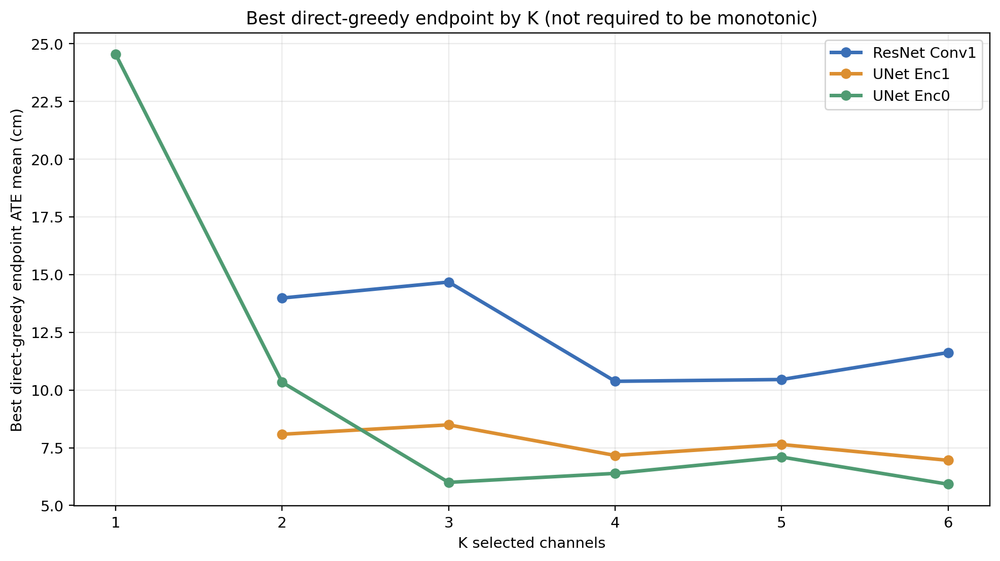
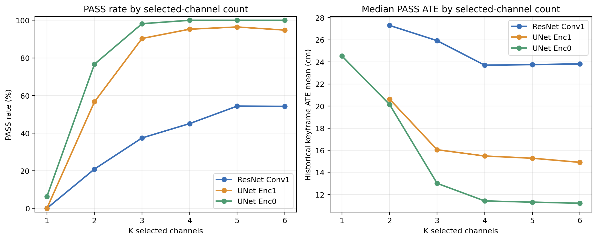

# ResNet Conv1 直接全序列 Greedy 搜索：与 U-Net Greedy 及 Correlation-Brute-Force 的比较

*fr1/desk_lightswitch，573 个 matched timestamps；报告日期：2026-08-19*

# 执行摘要

本次将 ResNet 最浅层 Conv1（项目内早期常称 conv0）的 64 个 **post-ReLU** channels，按与 U-Net Enc1 相同的 direct full-sequence multi-start greedy 协议重新搜索。最终 **ResNet Conv1 G4 = [d15,d20,d26,d34]，ATE mean = 10.3758 cm，3/3 PASS**。它比此前 correlation-clustering based four-channel brute-force 的最佳 `[d5,d6,d24,d29]`（14.0623 cm）低 **26.2%**，也比历史 CNN baseline `[d5,d29,d40,d52]`（15.1682 cm）低 **31.6%**。

但同一序列上，U-Net 直接 greedy 的最佳尾部仍更低：Enc0 `[d2,d3,d7,d12,d13,d14]` 为 5.9208 cm，Enc1 one-swap 最优 `[d5,d6,d17,d18,d28,d30]` 为 6.7335 cm，分别比 ResNet greedy 最优低 **42.9%** 与 **35.1%**。这是单一 lightswitch 序列上的条件性排序；它支持后续把这些候选并列带入多序列验证，而不是宣称某一架构已经全局胜出。

导师所需的分布证据也已保留：本报告直接从三套 greedy SQLite 的 replicate-0 唯一候选记录生成 ATE ECDF、箱线图、PASS/FAIL 统计、按 K 的成功率/ATE曲线和 greedy path 图。完整 console logs 与逐步路径 CSV 仍在原结果目录，可审计每一次 seed、扩展、swap 和最终重复。

# 1. 实验设置与可比性边界

| 项目 | 共同设置 / 说明 |
| --- | --- |
| 序列 | 完整 `rgbd_dataset_freiburg1_desk_lightswitch`；573 个 matched RGB-D timestamps |
| Mapping | 固定 gray，使用 matched sensor depth；ground truth 仅在运行后计算轨迹指标 |
| 主排名指标 | keyframe `evo_ape tum --align --correct_scale` translation ATE mean（cm，越低越好） |
| Failure / timeout | NaN/Inf tracking diagnostics 立即失败；单次上限 300 s；coverage 门槛 90% |
| ATE 分布取样 | 每个 candidate 只取 replicate 0；仅 PASS 的 ATE 进入分布。最终 repeat 不重复计入分布 |
| 重复 | 最终保留候选均补足 3 次；数值标准差为 0，说明固定输入/软件路径下可复现，不等价于独立随机样本的置信区间 |

三个 direct greedy 搜索在**主数据、映射、主 ATE 口径和 failure rules**上可直接比较。不同架构的 channel index 不具有语义对应关系，`d15` 等只在其网络层内部有意义。

Correlation-brute-force 是重要的历史对照，但其 full-sequence 表不是无筛选的候选分布：它先从 r=0.70 correlation clustering 的 36 个 representative channels 组成四通道候选，经 MVS PASS、baseline+2% MVS ATE 与 RPE safety gate 后，才将 3,713 个配置送入完整序列。因此其 PASS rate 不能被解释为该方法天生更鲁棒；该分布只适合与新 ResNet greedy 比较**已评估的 full-sequence ATE尾部与最佳值**。

# 2. 搜索规模、失败结构与ATE分布

| 搜索 | feature space | unique replicate-0 configs | PASS | FAIL/ERROR | PASS rate | ATE P5 / median / P95 (cm) | best (cm) |
| --- | --- | ---: | ---: | ---: | ---: | --- | ---: |
| ResNet Conv1 | 64 channels, K=1–6 | 4198 | 1426 | 2772 | 34.0% | 17.15 / 24.74 / 42.50 | 10.3758 |
| UNet Enc1 | 32 channels, K=1–6 | 1572 | 1264 | 308 | 80.4% | 9.42 / 16.24 / 33.64 | 6.7335 |
| UNet Enc0 | 16 channels, K=1–6 | 577 | 531 | 46 | 92.0% | 8.26 / 12.34 / 24.86 | 5.9208 |
| Correlation brute force | 36 r=0.70 representatives, K=4 only | 3713 | 2835 | 878 | 76.4% | 19.05 / 24.95 / 37.71 | 14.0623 |

{width=94%}

{width=94%}

{width=94%}

**分布解读。** ResNet greedy 的 PASS 分布中位数为 24.74 cm，与 correlation-brute-force 的 24.95 cm 接近；但其低误差尾部更强：21 个 PASS 配置低于 15 cm，而 correlation-brute-force 只有 5 个。它说明直接搜索并非简单把整体分布全部左移，而是发现了一个此前 clustering-representative 限制下没有出现的低误差 basin。U-Net Enc0/Enc1 的整体 PASS 分布均明显左移（中位数分别为 12.34/16.24 cm），但候选空间大小、网络架构和采样路径不同，因此这里是表现描述，不是显著性检验。

# 3. ResNet Conv1 direct greedy 的结果

## 3.1 关键搜索路径

64/64 个 ResNet Conv1 singleton 全部失败，因此算法自动触发全部 C(64,2)=2,016 个 pair rescue sweep；其中 421/2,016 个 pair PASS。四个 pair seed 为 `[d33,d52]`、`[d26,d51]`、`[d23,d59]`、`[d20,d26]`。这不是 algorithm failure，而是直接证据：在该层与该 illumination challenge 下，可靠 tracking 信号依赖 channel pair 的互补，而非单个通道。

| K | best direct-greedy endpoint | ATE mean (cm) | 该K已评估 / PASS | PASS ATE median (cm) |
| ---: | --- | ---: | --- | ---: |
| 1 | — | — | 64 / 0 | — |
| 2 | [d33,d52] | 13.9810 | 2016 / 421 | 27.2992 |
| 3 | [d29,d33,d52] | 14.6721 | 494 / 185 | 25.9202 |
| 4 | [d15,d20,d26,d34] | 10.3758 | 670 / 302 | 23.6983 |
| 5 | [d23,d24,d26,d51,d63] | 10.4535 | 480 / 261 | 23.7529 |
| 6 | [d15,d20,d26,d34,d45,d53] | 11.6218 | 472 / 256 | 23.8201 |

最强路径由 pair `[d20,d26]` 起步：K=2 为 15.5393 cm，K=3 加 d34 后暂时到 15.7185 cm，K=4 加 d15 后骤降至 **10.3758 cm**；继续加 d45 / d53 并没有维持改善（K=5 11.9254 cm，K=6 11.6218 cm）。因此 K=4 不是任意固定预算，而是由完整 path 中的非单调响应所支持的 optimum；one-channel swap audit 的 240 个邻居也未超过它。

| ResNet Conv1 参考 / 结果 | configuration | K | ATE mean (cm) | 相对 ResNet greedy G4 |
| --- | --- | ---: | ---: | --- |
| Direct greedy G4 / Lstar | [d15,d20,d26,d34] | 4 | **10.3758** | reference |
| Direct greedy G5 | [d23,d24,d26,d51,d63] | 5 | 10.4535 | +0.7% |
| Direct greedy G6 | [d15,d20,d26,d34,d45,d53] | 6 | 11.6218 | +12.0% |
| Historical correlation search | [d5,d6,d24,d29] | 4 | 14.0623 | higher 26.2% |
| Historical CNN baseline | [d5,d29,d40,d52] | 4 | 15.1682 | higher 31.6% |
| Unselected Conv1 | all64 | 64 | 28.3611 | higher 63.4% |

## 3.2 与 correlation-based brute force 的含义

此前 r=0.70 correlation pipeline 的完整序列最优 `[d5,d6,d24,d29]` 在本次也被作为 historical anchor 重新运行，并得到同一 14.0623 cm。因而比较不依赖于不同脚本的度量漂移：新的 direct greedy G4 的 10.3758 cm 是相同数据、相同 ATE 口径下 **26.2% 的降低**。这表明 correlation clustering 对大规模四通道空间的去冗余/压缩有用，但它不应被视为全局最优组合的充分搜索方法；它可能排除了只有在跨cluster/非代表成员组合中才显现的互补。

与此同时，不能把这项结果误读为 correlation clustering ‘无效’：它在第一阶段将原始四通道组合空间压缩为可计算的候选，并通过MVS/全序列流程给出一个稳定、可重复的 14.0623 cm reference。新 direct greedy 的作用是以更少的结构先验、允许 K=1–6 和 pair rescue 的方式补充该搜索，而不是取代先前的 failure filtering evidence。

# 4. 与 U-Net greedy 的路径与分布对比

{width=94%}

{width=97%}

| Layer / search | singleton outcome | pair rescue PASS | best fixed K=4 | best final configuration | final ATE (cm) |
| --- | --- | --- | --- | --- | ---: |
| ResNet Conv1 | 0/64 PASS | 421/2,016 | [d15,d20,d26,d34] = 10.3758 | [d15,d20,d26,d34] | 10.3758 |
| UNet Enc1 | 0/32 PASS | 281/496 | [d0,d5,d18,d30] = 7.1673 | [d5,d6,d17,d18,d28,d30] (swap) | 6.7335 |
| UNet Enc0 | 1/16 PASS: d3 | 92/120 | [d2,d3,d12,d14] = 6.3905 | [d2,d3,d7,d12,d13,d14] | 5.9208 |

**共同机制证据。** ResNet Conv1 与 UNet Enc1 的所有 singleton 均失败，但很多 pair 成功；这跨越两种架构支持‘有效 tracking cue 是互补集合’而非‘单一万能 channel’的解释。UNet Enc0 有唯一可行 singleton d3，但它的 24.5318 cm 仍很弱，加入 d7/d12 后才达到 6.0004 cm。故 Enc0 的例子同样不支持把单通道可行性当作最优性的证据。

**架构差异的条件性描述。** 在本序列的已评估 PASS 集合中，Enc0/Enc1 的分布更靠低ATE端，且最佳值分别较 ResNet G4 低 42.9% 与 35.1%。这可能来自特征层级、预训练表示、COMO输入接口或当前任务的共同作用；目前实验并未控制这些因素，不能归因到某一个网络设计细节。后续多序列验证才是检验这一排序能否保持的必要步骤。

# 5. U-Net 的可审计日志（导师查阅入口）

| 实验 | SQLite / distribution source | 逐步 greedy path | 完整 console 日记 |
| --- | --- | --- | --- |
| UNet Enc1 | `channel_selection_results/step_j_unet_direct_fullseq_greedy/evaluations.sqlite3`（1,596 saved rows） | `.../direct_greedy_path.csv` | `.../console.log`；2026-08-14 14:55 至 2026-08-15 13:38 |
| UNet Enc0 | `channel_selection_results/step_k_unet_enc0_direct_fullseq_greedy/evaluations.sqlite3`（601 saved rows） | `.../direct_greedy_path.csv` | `.../console.log`；2026-08-15 15:31 至 23:00 |
| ResNet Conv1 | `channel_selection_results/step_n_resnet_conv1_direct_fullseq_greedy/evaluations.sqlite3`（4,218 saved rows） | `.../direct_greedy_path.csv` | `.../console.log`；2026-08-17 17:52 至 2026-08-19 02:01 |

每份 console 逐行记录了 config hash、每次运行的PASS/FAIL、ATE、pair fallback、seed、每一步 greedy choice、swap plan 和最终导出。报告图中的分布数据来自上述 SQLite，而不是从 console 文本二次推断；因此即使日志被截断，数据库仍是权威记录。

# 6. 结论与后续建议

1. **ResNet Conv1 direct greedy 已完成且有效。** 它在完整 lightswitch 序列上给出 `[d15,d20,d26,d34]` = 10.3758 cm，并严格优于 correlation-brute-force 历史最优 14.0623 cm。因而 ResNet 与 U-Net 现在都拥有同类 full-sequence greedy 证据。
2. **ResNet 最优仍是四通道。** 本次的 K=5/K=6 并未超过G4；因此后续跨序列池应至少保留 ResNet G4，同时可带 G5 作为接近的不同组成对照，而非默认使用最多六通道。
3. **U-Net 目前有更低的单序列结果，但结论尚未跨序列。** 推荐保留 Enc0 K=3/K=4/K=6，Enc1 K=4 与 swap-K=6，和 ResNet G4 / correlation best / historical baseline 组成后续多序列验证池。
4. **方法学含义。** correlation clustering 适合做去冗余与大空间的计算压缩；direct greedy（含 pair fallback、multi-start 和 swap）更适合在不预先限定代表通道时寻找低误差互补组合。二者可视为互补的筛选层，而非只能二选一。
5. **局限性。** 所有本报告的精度比较均来自同一条 573-frame lightswitch trajectory，且最终重复为确定性复现。它们不能代替不同场景、不同照明叙事和真实退化下的外部验证。

# 附录：生成本报告的原始数据

- ResNet greedy：`channel_selection_results/step_n_resnet_conv1_direct_fullseq_greedy/`
- UNet Enc1 greedy：`channel_selection_results/step_j_unet_direct_fullseq_greedy/`
- UNet Enc0 greedy：`channel_selection_results/step_k_unet_enc0_direct_fullseq_greedy/`
- Correlation-brute-force full-sequence round：`channel_selection_results/step_e_full_sequence_evaluation/second_round_baseline_plus2_rpe_safe/all_evaluations.csv`
- 本报告的图表输入摘要：`search_distribution_summary.json`（仅从上述权威记录派生）。
