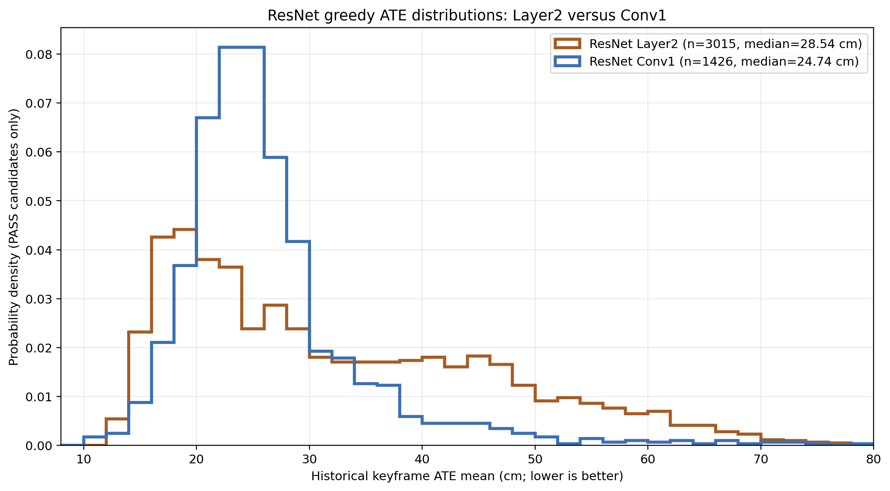
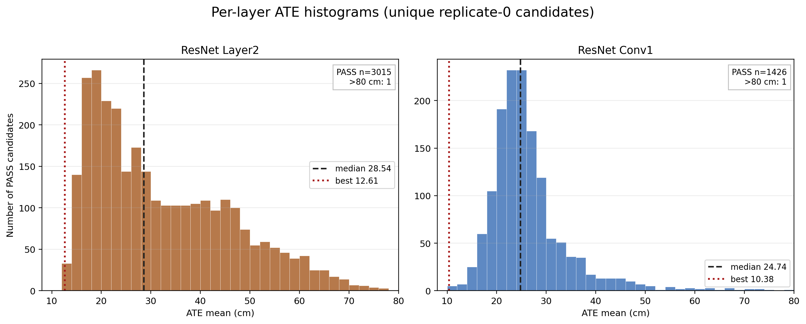
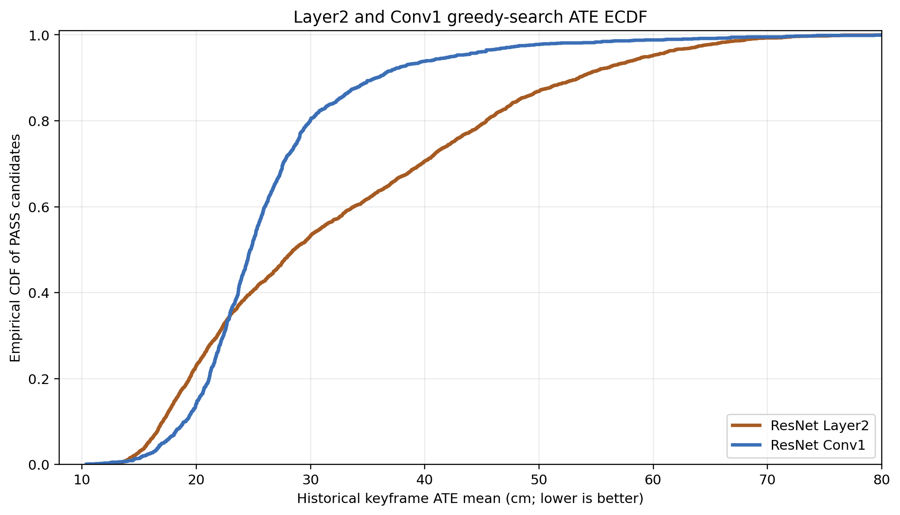
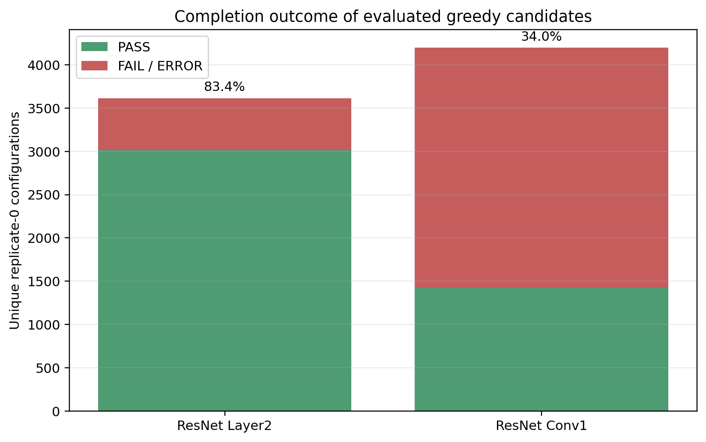
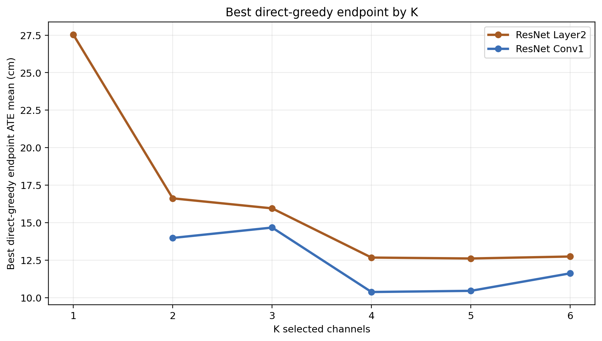
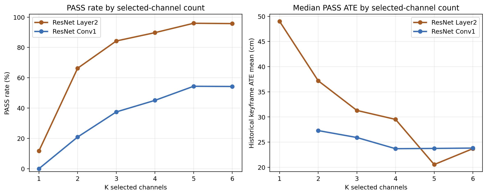

# ResNet Layer2 直接全序列 Greedy 搜索结果：与 Conv1 Greedy 的比较

*完整 fr1/desk_lightswitch（573 matched timestamps）；报告日期：2026-08-21*

# 执行摘要

本次将 ResNet-18 **Layer2 的 128 个 post-ReLU channels** 按与 Conv1/UNet 相同的 direct full-sequence greedy 协议搜索。最终主指标最优为 **G5 `[d41,d60,d67,d108,d121]` = 12.6100 cm，3/3 PASS**。固定四通道 G4 `[d60,d67,d108,d121]` 为 12.6714 cm，仅比 G5 高 0.49%，但全帧 SE(3) ATE RMSE（21.03 vs 21.90 cm）和历史 RPE RMSE（1.6107 vs 1.6522 cm）均更低。因此 G5 是按既定 primary metric 的 accuracy-first 选择，G4 是几乎无主指标损失且 secondary diagnostics 更好的 compact/balanced 选择。

与已完成的 Conv1 greedy 相比，Layer2 的最佳主 ATE 高 21.5%（12.6100 vs 10.3758 cm）；Conv1 仍是这个 lightswitch 序列上的 ResNet accuracy-first 层级。Layer2 的失败结构却更友好：15/128 个 singleton 可完成、整体已评估组合 PASS 率为 83.4%，而 Conv1 singleton 为 0/64、整体 PASS 率为 34.0%。这说明‘更容易保持 tracking’与‘最终 ATE 更低’并不是同一性质。

报告包含基于 replicate-0 唯一候选的 ATE 直方图、归一化分布图、ECDF、PASS/FAIL 图、按 K 的剖面和 greedy path。完整 console、SQLite 和 direct path CSV 仍被索引，满足导师对分布而非仅最佳值的审计需求。

# 1. 共同协议与可比性

| 项目 | 设置 |
| --- | --- |
| 序列 | 完整 `rgbd_dataset_freiburg1_desk_lightswitch`，573 个 matched RGB-D timestamps |
| Tracking feature | ResNet-18 Conv1（64）或 Layer2（128）指定 post-ReLU channels；`cnn_only` |
| Layer2 resolution | 原生 H/8 × W/8；按 COMO 既有 Layer2 extractor 进行 x8 tracking upsample |
| Mapping | 固定 gray + matched sensor depth；GT pose 仅用于运行后轨迹指标 |
| 主排名 | keyframe `evo_ape --align --correct_scale` translation ATE mean（cm，越低越好） |
| 终止规则 | NaN/Inf tracking diagnostics 立即 failure；timeout 300 s；coverage ≥90% |
| 分布统计 | 仅 replicate 0、仅 PASS；最终 3 次 repeat 不重复计入候选分布 |

这两个 ResNet 层使用相同数据、映射、训练权重、COMO运行框架和主评分，故 Layer2/Conv1 的**同序列数值比较有效**。它不能单独分离层深、特征分辨率、通道数量与上采样方式的因果作用；通道 index 也不能跨 layer 解释为同一语义。

# 2. 搜索完成情况与 ATE 分布

| 搜索 | 可用 channels | unique replicate-0 | PASS | FAIL | PASS rate | P5 / median / P95 (cm) | best (cm) |
| --- | ---: | ---: | ---: | ---: | ---: | --- | ---: |
| ResNet Layer2 | 128 | 3614 | 3015 | 599 | 83.4% | 15.77 / 28.54 / 59.68 | 12.6100 |
| ResNet Conv1 | 64 | 4198 | 1426 | 2772 | 34.0% | 17.15 / 24.74 / 42.50 | 10.3758 |

{width=94%}

{width=97%}

{width=94%}

{width=88%}

**分布解读。** Layer2 的整体 PASS rate 高（83.4% vs Conv1 的 34.0%），但其 PASS-ATE 中位数更高（28.54 vs 24.74 cm），且 P95 更高（59.68 vs 42.50 cm）。相反，Conv1 的低误差端更强，最佳值为 10.3758 cm。由此，Layer2 在本序列上提供较宽的可完成区域，Conv1 则提供更强但较稀疏的低误差 tail；这是对已运行候选的描述，不是对两个无限组合空间的统计显著性结论。

# 3. Layer2 greedy 搜索路径与通道数行为

Layer2 all-128 anchor PASS（40.8481 cm），gray control 失败。anchor t50=60.7 s，故 auto rule 选择 3 starts。128 个 singleton 中有 15 个 PASS，选取 `[d121]`、`[d67]`、`[d96]` 作为 seed；因此没有触发 C(128,2)=8,128 的 pair rescue。前两个 seed 在 K=3 收敛到相同 backbone `[d67,d108,d121]`，说明这三个 channel 的协同在多条搜索路径中重复出现。

| K | Layer2 best direct endpoint | ATE mean (cm) | evaluated / PASS | PASS ATE median (cm) |
| ---: | --- | ---: | --- | ---: |
| 1 | [d121] | 27.5292 | 128 / 15 | 49.0176 |
| 2 | [d108,d121] | 16.6202 | 756 / 501 | 37.1975 |
| 3 | [d67,d108,d121] | 15.9524 | 750 / 632 | 31.3032 |
| 4 | [d60,d67,d108,d121] | 12.6714 | 498 / 447 | 29.5203 |
| 5 | [d41,d60,d67,d108,d121] | 12.6100 | 988 / 948 | 20.5501 |
| 6 | [d41,d60,d67,d95,d108,d121] | 12.7413 | 492 / 471 | 23.7096 |

{width=92%}

{width=97%}

Layer2 最强路径从 `[d121]` 的 27.5292 cm 出发，+d108 至16.6202，+d67 至15.9524，+d60 至12.6714，+d41 至 **12.6100**；第六个 d95 使主ATE反升至12.7413。其主要收益发生在 K=1→4，K=4→5 的绝对改善仅0.0614 cm。因此不能以‘最多六通道’替代实际的 K 选择。

# 4. Layer2 与 Conv1 的结果对比

| 层 / 候选 | configuration | K | historical ATE mean/cm | all-frame SE(3) RMSE/cm | historical RPE RMSE/cm | 说明 |
| --- | --- | ---: | ---: | ---: | ---: | --- |
| Layer2 G5 / Lstar | [d41,d60,d67,d108,d121] | 5 | **12.6100** | 21.90 | 1.6522 | primary-metric best |
| Layer2 G4 | [d60,d67,d108,d121] | 4 | 12.6714 | **21.03** | **1.6107** | compact / secondary-balanced |
| Layer2 G6 | [d41,d60,d67,d95,d108,d121] | 6 | 12.7413 | 22.41 | 1.5744 | more channels did not improve primary ATE |
| Conv1 G4 / Lstar | [d15,d20,d26,d34] | 4 | 10.3758 | 14.92 | 1.1819 | current ResNet accuracy-first |

Conv1 G4 is lower than Layer2 G5 by 21.5% on the primary ATE, and also lower on the two listed diagnostic metrics. On this sequence, therefore, **Conv1 remains the preferred ResNet candidate for accuracy-first evaluation**. Layer2 G4 should nevertheless be retained in a later multi-sequence pool because its compact four-channel backbone `[d60,d67,d108,d121]` is independently derived, has 3/3 deterministic PASS, and may respond differently to new appearance changes.

Both layers benefit greatly from selection: Layer2 G5 reduces ATE relative to all128 by 69.1% (40.8481→12.6100 cm); Conv1 G4 reduces its all64 control by 63.4% (28.3611→10.3758 cm). The numerical reduction should not be compared as a clean architectural effect because the all-channel controls have different channel count/resolution.

# 5. 可审计日志与搜索日记

| 实验 | 权威 SQLite | 逐步路径 | 完整 console 日记 | 运行窗口 |
| --- | --- | --- | --- | --- |
| Layer2 greedy | `channel_selection_results/step_o_resnet_layer2_direct_fullseq_greedy/evaluations.sqlite3`（3,632 saved rows） | `.../direct_greedy_path.csv` | `.../console.log` | 2026-08-19 14:17 至 2026-08-21 10:26 |
| Conv1 greedy | `channel_selection_results/step_n_resnet_conv1_direct_fullseq_greedy/evaluations.sqlite3`（4,218 saved rows） | `.../direct_greedy_path.csv` | `.../console.log` | 2026-08-17 17:52 至 2026-08-19 02:01 |

Layer2 console 中保存了自动启动数的依据、15个成功 singleton 的排序、每次 forward choice、缓存复用、random control、615个 K=5 one-swap neighbours，以及最终 repeat。本文所有分布图直接由 SQLite 的 replicate-0 原始记录生成，避免从文本日志重新解析数值；SQLite 是权威结果，console 是人类可读的搜索日记。

# 6. 结论与建议

1. **Layer2 greedy 成功完成。** 它不需要 pair rescue，发现以 d67/d108/d121 为核心的稳定 backbone，并给出 G5 12.6100 cm / G4 12.6714 cm 的紧凑候选。
2. **当前 ResNet 层级排序：Conv1 优先。** Conv1 G4 = 10.3758 cm 优于 Layer2 G5 = 12.6100 cm，且 secondary diagnostics 同样较低；应作为下一步 accuracy-first 的主要 ResNet 配置。
3. **Layer2 G4 值得保留而非仅保存 G5。** 它只损失0.0614 cm primary ATE，却在全帧SE(3) ATE和历史RPE上更好，且少一个 channel。后续多序列可以同时测 G4 与 G5，而不是假设单一 global optimum 可泛化。
4. **机制上：Layer2 的可行区域更宽，但低误差尾部不如 Conv1。** 这支持把 failure-avoidance、ATE accuracy 和跨序列鲁棒性分开报告。
5. **局限性：**所有结论来自同一条 lightswitch trajectory；3次重复均为确定性复现，不能替代跨数据集与真实外观变化下的外部验证。

# 附录：本报告图表的数据来源

- Layer2：`channel_selection_results/step_o_resnet_layer2_direct_fullseq_greedy/`
- Conv1：`channel_selection_results/step_n_resnet_conv1_direct_fullseq_greedy/`
- 派生的图表摘要：`layer2_conv1_distribution_summary.json`。
