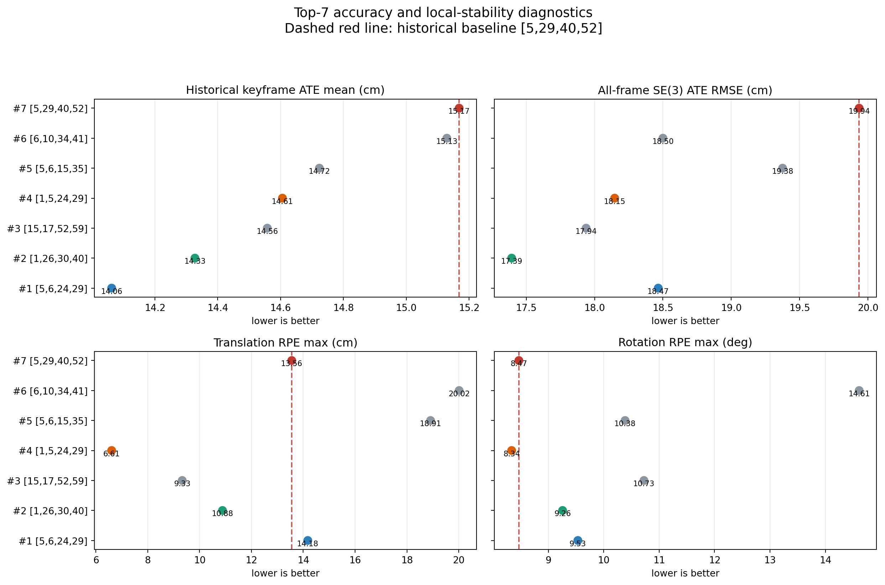
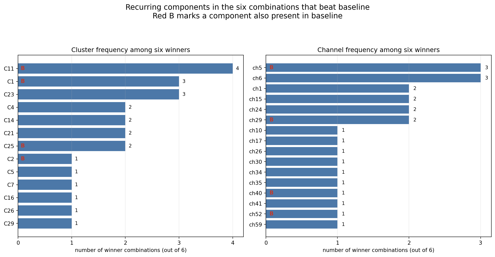
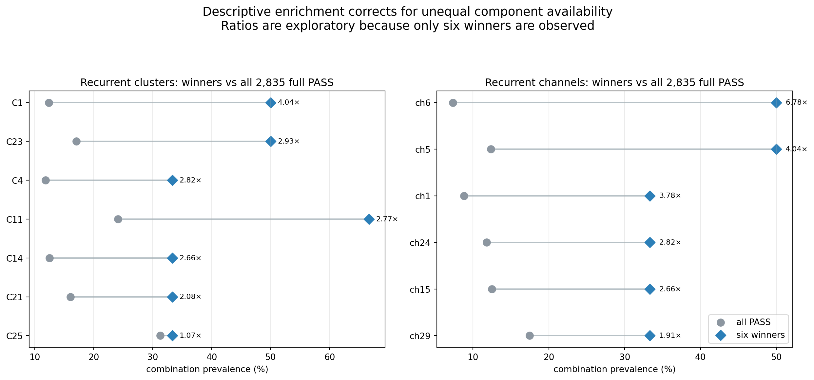
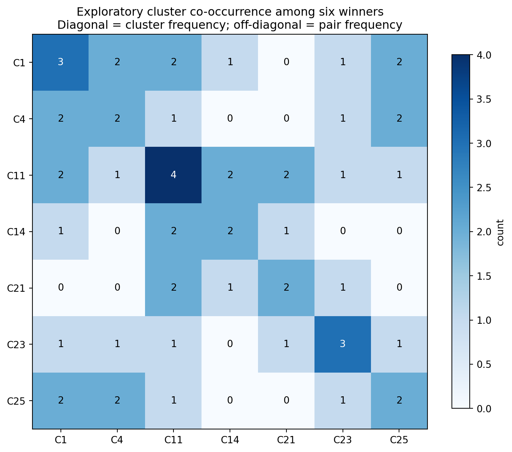

::: {custom-style="Title"}
Top-7通道组合验证：重复性、Feature Map与Cluster规律
:::

::: {custom-style="Subtitle"}
第二阶段优胜组合的结果解读、共性分析与后续建议  
MSc Project 阶段性汇报材料 · 2026年8月10日
:::

# 执行摘要

本次实验对第二阶段完整序列排名中优于baseline的6个四通道组合，以及baseline `[5,29,40,52]`，各重新运行一次完整 `fr1/desk_lightswitch`。七组均再次PASS，coverage均为571/573（99.65%）。历史口径keyframe `evo_ape --align --correct_scale` ATE mean与第一次运行逐位完全一致，七组排名也完全不变。

最重要的结论如下：

1. **结果具有实现层面的确定性可复现性，但这不是独立统计重复。** 完全相同的输入、配置和执行路径产生完全相同的轨迹指标，说明配置切换、轨迹保存和ATE评估稳定；同时也意味着第二次运行没有提供随机方差估计。
2. **若只按历史主ATE选择，最优仍为 `[5,6,24,29]`。** ATE mean为14.0623 cm，比baseline改善7.29%。但其translation/rotation RPE max均略差于baseline。
3. **若兼顾累计误差和局部jump，`[1,5,24,29]` 仍是最平衡推荐。** 它比baseline改善3.71%的主ATE，同时all-frame SE(3) RMSE、translation RPE max和rotation RPE max也全部更低；其中translation RPE max仅6.607 cm，为Top-7最低。
4. **`[1,26,30,40]` 是一个重要的独立备选机制。** 它不依赖最常见的 `C1+C4+C25` 骨架，却取得第二低主ATE和Top-7最低all-frame SE(3) RMSE（17.393 cm）。这说明不存在唯一有效的cluster模板。
5. **六个优胜组合中最常见的cluster是C11（4/6），其次是C1和C23（各3/6）；最常见channel是ch5和ch6（各3/6）。** 相对2,835个full PASS背景，ch6富集6.78×、ch5富集4.04×；C1、C23、C4和C11分别富集4.04×、2.93×、2.82×和2.77×。这些比单纯计数更值得关注。
6. **最强的组合级线索是 `C1+C4+C25` 三簇骨架。** 排名第1和第4共享完全相同的ch5、ch24、ch29，只替换第四个channel：ch6/C11带来最低主ATE，ch1/C23带来更低all-frame误差和显著更小的局部jump。这是当前最清晰的单通道替换证据。
7. **不能把高illumination NCC当作越高越好的硬目标。** 排名第2与第6的平均NCC都约为0.939，但性能差异明显；排名第3包含NCC仅0.533的ch17/C21仍取得第三名。有效组合更像是在稳定边缘、稀疏选择性响应和低频区域响应之间取得互补，而不是简单选择四个最稳定channel。

# 1. 实验范围与指标

## 1.1 验证对象

固定验证以下七组：

| 原full rank | Channels | r=0.70 cluster pattern | 角色 |
|---:|---|---|---|
| 1 | `[5,6,24,29]` | C1 + C11 + C4 + C25 | 主ATE冠军 |
| 2 | `[1,26,30,40]` | C23 + C5 + C16 + C2 | 独立高稳定性方案 |
| 3 | `[15,17,52,59]` | C14 + C21 + C11 + C7 | 含低NCC/低频响应的多样性方案 |
| 4 | `[1,5,24,29]` | C23 + C1 + C4 + C25 | 综合平衡方案 |
| 5 | `[5,6,15,35]` | C1 + C11 + C14 + C29 | 主ATE较好但局部jump较大 |
| 6 | `[6,10,34,41]` | C11 + C23 + C21 + C26 | 仅轻微优于baseline |
| 7 | `[5,29,40,52]` | C1 + C25 + C2 + C11 | 历史baseline |

所有组合均遵守第一阶段的合法组合约束：四个channel来自四个不同的最终r=0.70稳定化簇。因此本文的共现分析用于判断“哪些不同簇的组合反复出现”，不能评价同簇channel共同使用的效果。

## 1.2 评价口径

- 数据：完整573-frame `rgbd_dataset_freiburg1_desk_lightswitch`。
- 主排名：COMO keyframe trajectory上的 `evo_ape --align --correct_scale` translation ATE mean，与历史 `run_random_channel_search.sh` 完全一致。
- 辅助指标：all-frame metric-scale SE(3) ATE RMSE、translation RPE max、rotation RPE max。
- Feature maps：既有ResNet-18 Conv1 post-ReLU、native resolution特征。
- 可视化帧：原始索引246、250、254，分别对应主要turn-on事件的before、peak、after。
- 聚类归属：最终搜索采用的全局Conv1 correlation clustering，阈值r=0.70并经过bootstrap稳定化处理。

{width=95%}

# 2. 重复运行结果

## 2.1 完整性与可复现性

| 项目 | 结果 |
|---|---:|
| 计划运行 | 7 |
| PASS | 7（100%） |
| 失败/timeout/error | 0 |
| 每组关联位姿 | 571/573（99.65%） |
| 单组运行时间 | 43.1–50.2秒 |
| 原ATE与重复ATE最大绝对差 | 0.0000 cm |
| 原排名与重复排名Spearman ρ | 1.000 |

七组的第一次与第二次ATE完全相同。这支持以下判断：

- 同一数据、同一模型和同一配置下，当前COMO运行及历史ATE计算是确定性的；
- 脚本的配置恢复、channel写入、轨迹保存和evo调用没有引入可见漂移；
- 但是，两次相同结果不能被解释为“方差为零”或“已经完成统计重复”。若要估计泛化误差，需要改变序列、起始帧、光照事件或其他具有实际意义的实验条件。

## 2.2 Top-7定量结果

| Rank | Channels | Historical ATE mean / cm | 相对baseline | All-frame SE(3) RMSE / cm | Trans. RPE max / cm | Rot. RPE max / ° |
|---:|---|---:|---:|---:|---:|---:|
| 1 | `[5,6,24,29]` | **14.0623** | **−7.29%** | 18.4657 | 14.1750 | 9.532 |
| 2 | `[1,26,30,40]` | **14.3273** | **−5.54%** | **17.3931** | 10.8843 | 9.256 |
| 3 | `[15,17,52,59]` | 14.5576 | −4.03% | 17.9380 | 9.3306 | 10.725 |
| 4 | `[1,5,24,29]` | **14.6058** | **−3.71%** | 18.1468 | **6.6069** | **8.337** |
| 5 | `[5,6,15,35]` | 14.7234 | −2.93% | 19.3756 | 18.9125 | 10.385 |
| 6 | `[6,10,34,41]` | 15.1291 | −0.26% | 18.5001 | 20.0158 | 14.609 |
| 7 | baseline `[5,29,40,52]` | 15.1682 | reference | 19.9359 | 13.5567 | 8.468 |

## 2.3 如何选择“最好”

**主ATE冠军：`[5,6,24,29]`。** 它相对baseline降低1.1059 cm，改善7.29%；all-frame SE(3) RMSE也降低1.4701 cm。但translation RPE max比baseline高0.6183 cm，rotation RPE max高1.0646°。因此它是“全局keyframe轨迹拟合最好”，而不是所有稳定性指标都最好。

**综合推荐：`[1,5,24,29]`。** 它相对baseline：

- 主ATE mean降低0.5624 cm；
- all-frame SE(3) RMSE降低1.7891 cm；
- translation RPE max降低6.9498 cm；
- rotation RPE max降低0.1303°。

它是Top-7中唯一同时在这四项上优于baseline的组合，也是局部jump最小的组合。

**独立备选：`[1,26,30,40]`。** 它的主ATE仅次于冠军，all-frame SE(3) RMSE则为全组最低。它的四个channel全部是各自cluster medoid，并且没有使用C1、C4、C11或C25这一常见骨架，适合作为后续跨数据集验证中的“不同机制”对照。

# 3. Channel与Cluster共性

## 3.1 六个优胜组合中的直接频率

为避免baseline本身抬高旧组件的计数，本节“优胜频率”只统计6个优于baseline的组合。

| Cluster | 优胜组合出现次数 | 对应本次channel | 是否也在baseline |
|---|---:|---|---|
| C11 | **4/6** | ch6或ch52 | 是 |
| C1 | **3/6** | ch5 | 是 |
| C23 | **3/6** | ch1或ch10 | 否 |
| C4 | 2/6 | ch24 | 否 |
| C14 | 2/6 | ch15 | 否 |
| C21 | 2/6 | ch17或ch34 | 否 |
| C25 | 2/6 | ch29 | 是 |

| Channel | Cluster | 优胜组合出现次数 | Representative角色 |
|---|---|---:|---|
| ch5 | C1 | **3/6** | medoid |
| ch6 | C11 | **3/6** | medoid |
| ch1 | C23 | 2/6 | medoid |
| ch15 | C14 | 2/6 | medoid |
| ch24 | C4 | 2/6 | medoid |
| ch29 | C25 | 2/6 | second representative |

24个优胜channel位置中，19个（79.2%）使用cluster medoid，5个使用second representative。这个比例说明最终优胜组主要由典型代表构成；但由于第一阶段候选池本身已经经过representative筛选，不能将其单独解释为medoid具有因果优势。

{width=95%}

## 3.2 相对2,835个full PASS的背景富集

单纯出现次数会受候选池中各channel可用频率影响。因此，以第二阶段全部2,835个full-sequence PASS作为背景，计算“优胜组出现比例 / 背景出现比例”：

| 组件 | 六个优胜组 | 2,835个PASS背景 | 描述性富集 |
|---|---:|---:|---:|
| ch6 / C11 medoid | 50.0% | 7.4% | **6.78×** |
| ch5 / C1 | 50.0% | 12.4% | **4.04×** |
| ch1 / C23 medoid | 33.3% | 8.8% | **3.78×** |
| ch24 / C4 | 33.3% | 11.8% | **2.82×** |
| ch15 / C14 | 33.3% | 12.5% | **2.66×** |
| ch29 / C25 | 33.3% | 17.5% | 1.91× |

Cluster级别，C1、C23、C4、C11分别富集4.04×、2.93×、2.82×、2.77×。C25虽然在排名第1和第4中属于共享骨架，但其cluster在背景中本来就很常见，cluster级富集仅1.07×。因此：

- **ch6、ch5是最值得优先保留并继续验证的具体channel线索；**
- **C23与C4是baseline没有、但在优胜组中反复富集的cluster线索；**
- **C11很常见且富集，但baseline也包含C11，所以它更像有用的“基础组件”，不是充分条件；**
- **C25适合作为与C1/C4共同出现的交互线索，不宜仅凭自身频率称为关键cluster。**

{width=95%}

这里的富集是探索性描述：优胜组只有6个，而且是在同一序列上按ATE选出的极端样本；没有进行多重比较校正，不能把富集倍数直接解释为统计显著或因果效应。

# 4. 哪些Cluster结合可能有帮助

## 4.1 最清晰骨架：C1 + C4 + C25

排名第1 `[5,6,24,29]` 与排名第4 `[1,5,24,29]` 共享三个完全相同的channel：

- ch5 → C1；
- ch24 → C4；
- ch29 → C25。

它们只进行一次channel替换：ch6/C11与ch1/C23互换。这是当前最可解释的局部对照：

| 共享骨架 | 第四组件 | Historical ATE mean | All-frame SE(3) RMSE | Trans. RPE max | Rot. RPE max |
|---|---|---:|---:|---:|---:|
| ch5 + ch24 + ch29 | ch6 / C11 | **14.0623** | 18.4657 | 14.1750 | 9.532° |
| ch5 + ch24 + ch29 | ch1 / C23 | 14.6058 | **18.1468** | **6.6069** | **8.337°** |

在这个固定骨架内：

- **C11/ch6偏向更低的历史keyframe ATE；**
- **C23/ch1偏向更平滑、更低jump的完整轨迹。**

因此，`C1+C4+C25` 可以视为当前最有证据的共同骨架，而C11与C23承担不同的第四组件角色。这个结论来自真实的一通道替换，比跨多个channel的频率比较更可靠，但仍只限于当前序列。

## 4.2 C11的两类有益搭配

在六个优胜组合中，重复出现两次以上的cluster pair包括：

- C1 + C11：2次；
- C11 + C14：2次；
- C11 + C21：2次；
- C1 + C4、C1 + C25、C4 + C25：各2次，均来自上述共享骨架。

C11分别与：

- C1的纹理/边缘响应；
- C14的强细节梯度响应；
- C21的低梯度、区域型或不同光照响应；

共同出现在优胜组中。这提示C11可能不是单独提供全部信息，而是适合与不同结构尺度的channel配合。

{width=78%}

由于只有6个优胜组合，所有pair最高仅出现2次。这里应使用“候选交互关系”而不是“已确认最佳pair”的措辞。

## 4.3 Baseline与冠军的替换关系：存在交互，不是单channel加成

Baseline `[5,29,40,52]` 与冠军 `[5,6,24,29]` 共享ch5/C1与ch29/C25，同时发生：

1. C11内部代表从ch52替换为ch6；
2. ch40/C2替换为ch24/C4。

冠军主ATE改善1.1059 cm。但第二阶段另有组合 `[5,6,29,40]`，它只完成第1项替换、仍保留ch40/C2，其full-sequence ATE mean为17.1681 cm，反而明显差于baseline。这意味着：

- ch6并不是脱离上下文即可产生改善的“万能channel”；
- 冠军优势更可能来自ch6/C11与ch24/C4的联合替换，或C4与C1/C25骨架的交互；
- 当前缺少 `[5,24,29,52]` 的full-sequence结果，仍不能完全分离“C4效应”和“C11代表选择效应”。

这是本次最重要的方法论insight之一：**应分析channel combination interaction，而不是把Top组合拆成四个独立channel后按出现次数直接排序。**

## 4.4 第二类机制：C23 + C5 + C16 + C2

排名第2 `[1,26,30,40]` 的cluster pattern与冠军骨架几乎完全不同，并且四个channel都是medoid。它取得：

- 第二低historical ATE mean：14.3273 cm；
- Top-7最低all-frame SE(3) RMSE：17.3931 cm；
- 中等translation/rotation RPE max。

Feature maps显示ch1、ch26、ch30、ch40都保留边缘结构，但响应极性、强度分布和细节尺度不同。该组合表明，多种彼此不冗余且较高illumination NCC的结构channel，也能形成有效方案。它应作为与 `C1+C4+C25` 家族不同的泛化候选保留。

# 5. Feature Map解读

## 5.1 可视化场景

{width=78%}

三帧覆盖同一次主要turn-on事件。所有overview对每个channel固定使用跨三帧一致的0–99.5 percentile色阶，因此同一channel的时间变化可以比较；不同channel各自缩放，颜色强度不能跨channel直接作绝对数值比较。

## 5.2 冠军与平衡方案：相同三通道骨架

![图6　冠军 `[5,6,24,29]` 的lightswitch Conv1 feature maps。](feature_maps/lightswitch_overviews/rank_01_ch_5_6_24_29.png){width=95%}

![图7　平衡方案 `[1,5,24,29]` 的lightswitch Conv1 feature maps。](feature_maps/lightswitch_overviews/rank_04_ch_1_5_24_29.png){width=95%}

共享channel体现出明显互补：

- **ch5/C1**：对物体轮廓、桌面纹理和局部高频变化均有响应，是反复出现的通用边缘组件；
- **ch24/C4**：更偏细边缘与方向性结构，在peak处大面积背景响应下降后仍保留部分关键轮廓；
- **ch29/C25**：响应非常稀疏和选择性强，peak时几乎关闭、after时对线缆轮廓重新激活，可能提供与持续高响应channel不同的相位信息；
- **ch6/C11与ch1/C23**：都含结构响应，但ch1呈现更强的轮廓与方向性选择；这与ch1版本更低RPE、ch6版本更低主ATE的定量取舍一致。

这些图支持“组合依赖互补响应”的解释：同一时刻并非四个channel都必须保持高激活，而是需要保留足够多、类型不同的几何线索。

## 5.3 独立高稳定性方案

![图8　排名第2 `[1,26,30,40]` 的feature maps。四个medoid提供不同尺度与极性的结构响应。](feature_maps/lightswitch_overviews/rank_02_ch_1_26_30_40.png){width=95%}

该组平均cross-light NCC为0.939，四个channel最低NCC仍为0.889；平均robust gradient energy也是Top-7最高。这与其最低all-frame SE(3) RMSE一致，但不能证明两者存在因果关系。更稳妥的解释是：该组合在光照变化下保留了多种边缘表示，形成了不同于冠军骨架的有效信息覆盖。

## 5.4 低NCC channel并非自动无效

![图9　排名第3 `[15,17,52,59]` 的feature maps。ch17/C21呈现与边缘channel不同的宽区域响应。](feature_maps/lightswitch_overviews/rank_03_ch_15_17_52_59.png){width=95%}

ch17/C21的30-frame cross-light NCC仅0.533，robust gradient energy也很低，但其feature map并非confirmed-dead，而是呈现大面积、低频、区域型响应。它与ch15、ch52、ch59的边缘响应组合后仍取得第三名。相反，排名第6的四个channel平均NCC约0.939、最低NCC约0.901，却只有0.26%的主ATE改善并出现最大的RPE jump。

因此：

- NCC适合识别稳定冗余与极端不稳定channel；
- 不能只按NCC从高到低选择四个channel；
- 少量illumination-sensitive或低频channel可能增加互补信息，但必须通过完整tracking结果验证。

# 6. 综合结论

## 6.1 当前推荐

1. **Accuracy-first：`[5,6,24,29]`。** 当前完整序列主ATE最低，适合论文中报告“最优历史口径ATE”。
2. **Balanced final candidate：`[1,5,24,29]`。** 四项关键指标均优于baseline，且局部jump最小，适合作为更稳健的最终推荐。
3. **Alternative/generalisation candidate：`[1,26,30,40]`。** cluster构成与前两者显著不同，all-frame SE(3) RMSE最好，适合检验结论是否只对某一feature family成立。
4. **Control：baseline `[5,29,40,52]`。** 后续所有跨序列实验继续保留。

## 6.2 关于“有帮助的cluster组合”的最稳妥表述

现有证据支持以下层级：

- **较强证据：** `C1+C4+C25` 是排名第1和第4共享的三簇骨架；第四簇C11/C23控制主ATE与局部稳定性的取舍。
- **中等线索：** C11与C1、C14或C21的配对各在两个优胜组合中出现，可能适合连接不同结构尺度。
- **独立机制：** `C23+C5+C16+C2` 不依赖主骨架仍取得第二名，说明搜索不应只围绕一个模板展开。
- **不足以单独成立：** C25本身背景频率高；C11和C1也存在于baseline。任何单个cluster都不是性能保证。

# 7. 局限性

1. 只有一个TUM lightswitch序列；结论尚未证明跨场景、跨运动或跨退化类型泛化。
2. 六个“优胜组合”是根据同一数据的ATE选择出来的极端样本，频率与富集存在selection bias。
3. 完全相同的重复运行是确定性复现，不提供随机方差或置信区间。
4. Feature map只展示一个主要turn-on事件的三帧；视觉解释不能替代全序列定量结果。
5. r=0.70 cluster是经验冗余分组，不等同于可解释的语义功能类别。
6. 第一阶段禁止同簇channel共选，因此无法从Top-7推断同簇组合是否一定无效。
7. 观察到的cluster pair最多只出现两次；目前只能作为后续ablation的优先级。

# 8. 建议的下一步

1. 在其他完整序列或人工退化序列上优先比较冠军、平衡方案、独立方案和baseline四组。
2. 围绕固定骨架 `[5,24,29]` 做受控one-channel replacement，重点比较C11、C23、C14、C2等第四组件。
3. 补测能分离baseline到冠军两项替换的中间组合，特别是 `[5,24,29,52]`；它没有进入当前第二阶段，需要单独记录其MVS/full-sequence生存情况。
4. 对跨序列结果使用平均ATE、失败率和RPE共同排名，不再只依赖单序列Top-1。
5. 若要报告统计不确定性，应改变输入条件或使用多个序列；重复完全相同的确定性运行不会增加有效样本量。

# 9. 可审计来源

- Top-7权威重复数据库：`channel_selection_results/step_e_full_sequence_evaluation/top7_repeat_feature_cluster_analysis/evaluations.sqlite3`
- 两次结果对比：`repeat_comparison.csv`
- Channel归属：`cluster_membership.csv`
- Channel频率：`channel_frequency.csv`
- Combination cluster pattern：`combination_cluster_patterns.csv`
- Feature map：`feature_maps/`
- 第二阶段背景数据库：`second_round_baseline_plus2_rpe_safe/evaluations.sqlite3`
- r=0.70 clusters：`step_b_correlation_clustering/threshold_r070/clusters/clusters_conv1.json`

