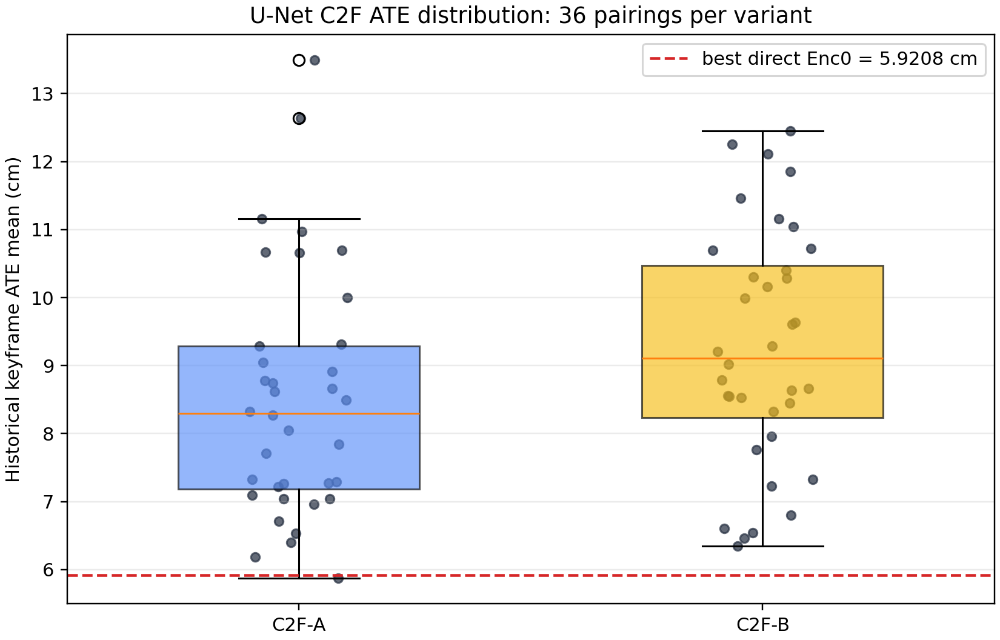
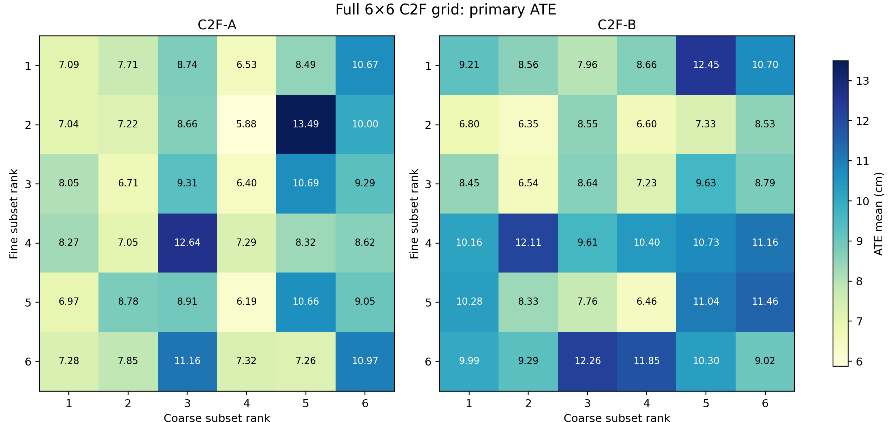
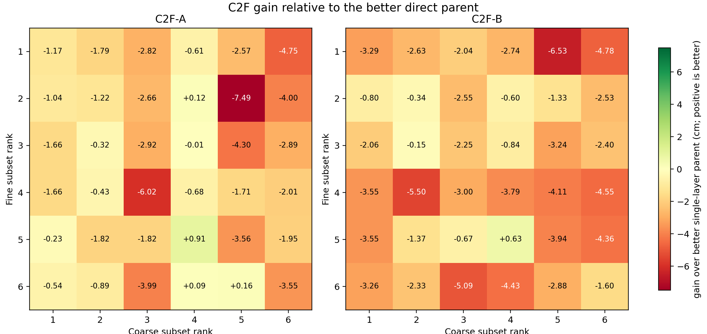
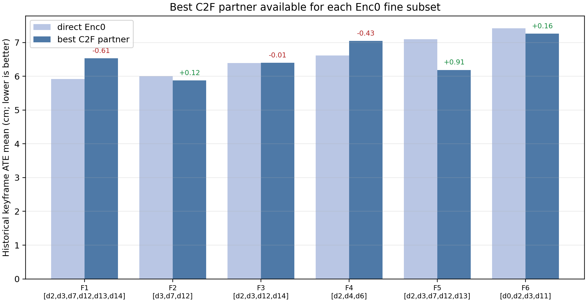

# U-Net Enc0/Enc1 C2F：fr1/desk_lightswitch 全序列验证

## 1. 结论摘要

本次 72 个 U-Net C2F cells 全部通过轨迹完整性门槛（**72/72 PASS**，每次均为 571/573 tracking poses，coverage = 99.65%）。因此 C2F 的价值不在于把原先失败的 U-Net 配置救活，而在于检验 Enc1 coarse 表征是否能给 Enc0 fine 表征带来额外精度。

最优 C2F 为 **C2F-A / Fine rank 2 `[d3,d7,d12]` / Coarse rank 4 `[d0,d5,d6,d18,d30]`**，primary ATE mean = **5.8765 cm**。它比自身 fine parent `6.0004 cm` 低 **0.1239 cm (2.06%)**，也比所有 direct Enc0 结果的全局最优 `5.9208 cm` 低 **0.0443 cm (0.75%)**。

但这个全局最优改善很小，且 C2F-best 的 all-frame metric-scale SE(3) RMSE = **10.0835 cm**，高于 direct `[d3,d7,d12]` 的 **9.3266 cm**；它的 historical RPE 则较低（1.3099 vs 1.4870 cm）。因此它是主指标上的轻微胜出，而不是在所有指标上无条件支配 direct Enc0。

真正较明确的互补收益出现在非全局最优的 fine subset：Fine rank 5 `[d2,d3,d7,d12,d13]` 与 Coarse rank 4 的 C2F-A 从 **7.0959 cm** 降至 **6.1874 cm**，改善 **0.9085 cm / 12.8%**。这说明 coarse branch 更像有选择地帮助“尚未完全优化的”细粒度表征，而不会自动提升已经很强的 Enc0 G6。

## 2. 实验设置与可比性

- 数据：TUM `fr1/desk_lightswitch`，573 个 matched RGB-D timestamps。
- Tracking：新的 `unet_c2f`；对每帧共享一次 U-Net encoder forward，Enc1 作 coarse（H/2，32-channel universe），Enc0 作 fine（full resolution，16-channel universe）。
- Mapping：始终 gray，并保持 sensor/ground-truth depth；没有重新启用 mapping optimisation。因此此实验只改变 tracking feature allocation。
- Variant A：L0/L1 coarse + L2 fine；Variant B：L0 coarse + L1/L2 fine。
- Candidate grid：每个分支取已完成 direct greedy 中 6 个 repeated-PASS promising subsets，做完整 `2 × 6 × 6 = 72` cross-product；每 cell 一次运行。
- 主排序：historical keyframe `evo_ape tum --align --correct_scale` translation ATE mean，与原 full-sequence greedy 完全一致。保留 historical RPE、all-frame metric-scale SE(3) ATE/RPE、coverage 和 log 作为诊断。
- 注意：direct parent 的引用值为先前各 3 次重复的确定性结果；本次 C2F grid 为每 cell 一次。因此 <0.1 cm 的差异应被视为候选信号，后续应对 top C2F 和 top direct 做重复/跨序列确认。

## 3. 完成度与 variant 总览

| Variant | PASS | ATE mean | ATE median | Best | Worst | beat better parent |
|---|---|---|---|---|---|---|
| C2F-A | 36 | 8.5149 | 8.2973 | 5.8765 | 13.4914 | 4/36 |
| C2F-B | 36 | 9.2549 | 9.1128 | 6.3454 | 12.4520 | 1/36 |

**C2F-A 整体更合适。** 在相同的 36 个 fine/coarse pair 中，A 的 ATE 更低 **22/36** 次；B 更低 14/36 次。`B − A` 的平均差为 **0.7400 cm**、中位数 **0.5630 cm**，均偏向 A。A 的均值/中位数也低于 B（8.5149/8.2973 vs 9.2549/9.1128 cm）。

## 4. C2F 在多少配置上带来真实提升？

为避免把“比很弱的另一分支好”误当作互补，我把每个 C2F cell 与其两个 direct parent 中 ATE 更低的那个比较。只有 C2F 的 ATE 同时低于 fine 和 coarse parent，才算真实的 pair-level improvement。

- **5/72（6.9%）** cells 超过其更强 direct parent；C2F-A 有 4 个，C2F-B 只有 1 个。
- C2F 相对 fine parent 有 **7/72** 次改善；相对 coarse parent 有 **14/72** 次改善。这再次说明 Enc1 coarse 本身通常较弱，而 C2F 并不会普遍改善当前最强 Enc0 subset。
- 其余 **67/72** cells 都不如其较强 direct parent：C2F-A 的中位数损失为 **1.7519 cm**，C2F-B 为 **2.6869 cm**。

| Var. | Fine rank | Fine subset | Coarse rank | Coarse subset | C2F ATE | better parent | gain | relative |
|---|---|---|---|---|---|---|---|---|
| A | 2 | [d3,d7,d12] | 4 | [d0,d5,d6,d18,d30] | 5.8765 | 6.0004 | +0.1239 | 2.1% |
| A | 5 | [d2,d3,d7,d12,d13] | 4 | [d0,d5,d6,d18,d30] | 6.1874 | 7.0959 | +0.9085 | 12.8% |
| B | 5 | [d2,d3,d7,d12,d13] | 4 | [d0,d5,d6,d18,d30] | 6.4618 | 7.0959 | +0.6341 | 8.9% |
| A | 6 | [d0,d2,d3,d11] | 5 | [d0,d5] | 7.2618 | 7.4177 | +0.1559 | 2.1% |
| A | 6 | [d0,d2,d3,d11] | 4 | [d0,d5,d6,d18,d30] | 7.3243 | 7.4177 | +0.0934 | 1.3% |

## 5. 哪些组合类型有效？

### 5.1 Coarse rank 4 是最稳定的互补 coarse branch

Coarse rank 4 = `[d0,d5,d6,d18,d30]`（单层 Enc1 ATE 7.6408 cm）出现在全局前十中的 **6/10**，并产生 5 个真正 pair-level improvements 中的 **4 个**。它不像 Enc1 rank 1/2 那样单层 ATE 最低，却最适合在 C2F 中提供 early-level guidance；这说明“单层最好”与“最适合作为 coarse initialiser”不是同一准则。

### 5.2 Fine rank 2 与 rank 5 最值得继续保留

Fine rank 2 `[d3,d7,d12]` 配 coarse rank 4 给出全局最佳 5.8765 cm。Fine rank 5 `[d2,d3,d7,d12,d13]` 的 direct ATE 原本较高，但与同一 coarse rank 4 配合后达到 6.1874 cm，是最大的绝对/相对互补收益。反过来，direct 全局最佳 Fine rank 1 `[d2,d3,d7,d12,d13,d14]` 的所有 12 个 C2F pairing 都变差，最佳仅为 6.5324 cm（比 direct 差 0.6116 cm）。

### 5.3 C2F-A 优先，但不应将 B 完全丢弃

A 使用两个 coarse levels，整体和多数 matched pair 均优于 B。B 的最佳是 Fine rank 2 + Coarse rank 2，ATE 6.3454 cm；仍落后于 A-best 0.4689 cm。B 在少数 pair 上明显更好（例如 Fine rank 2 + Coarse rank 5），说明 switching point 与具体通道组合存在交互，而不是一个 universal rule；在下一阶段只需保留 A-best 为主、B-best 作为结构性对照。

## 6. 前十 C2F cells 与诊断

| Rank | Var. | Fine | Coarse | ATE mean | ATE RMSE | hist RPE | all-frame SE3 RMSE | gain vs parent |
|---|---|---|---|---|---|---|---|---|
| 1 | A | 2 | 4 | 5.8765 | 6.4309 | 1.3099 | 10.0835 | +0.1239 |
| 2 | A | 5 | 4 | 6.1874 | 6.8056 | 1.2523 | 10.1612 | +0.9085 |
| 3 | B | 2 | 2 | 6.3454 | 6.8473 | 1.4006 | 9.7307 | -0.3450 |
| 4 | A | 3 | 4 | 6.3974 | 7.1600 | 1.3155 | 10.7256 | -0.0069 |
| 5 | B | 5 | 4 | 6.4618 | 6.9384 | 1.2831 | 10.5193 | +0.6341 |
| 6 | A | 1 | 4 | 6.5324 | 7.0697 | 1.2727 | 10.4362 | -0.6116 |
| 7 | B | 3 | 2 | 6.5437 | 7.1482 | 1.3016 | 10.4314 | -0.1532 |
| 8 | B | 2 | 4 | 6.6030 | 7.1437 | 1.5563 | 10.3180 | -0.6026 |
| 9 | A | 3 | 2 | 6.7074 | 7.3553 | 1.4414 | 10.6298 | -0.3169 |
| 10 | B | 2 | 1 | 6.7999 | 7.5475 | 1.4868 | 10.2869 | -0.7995 |

## 7. 建议与限制

1. **推荐的下一步候选**：优先保留 C2F-A Fine rank 2 + Coarse rank 4；同时保留 C2F-A Fine rank 5 + Coarse rank 4，因为它提供最清晰的互补机制证据。B 的 Fine rank 2 + Coarse rank 2 可作切换策略对照。
2. **不要宣称 C2F 已全面优于 U-Net direct tracking。** 最优主 ATE 的提升只有 0.75%，且 best C2F 并未在 all-frame SE(3) RMSE 上超过 direct Fine rank 2；72-cell grid 的大多数成员更差。
3. **最有价值的发现是结构选择性。** C2F 的 effect 依赖于 subset pairing：coarse rank 4 更适合 early-level initialization，而已有最优的 fine G6 反而不宜加入 coarse stages。这比“深层越多越好”更具体，也更可解释。
4. **确认实验**：在把结果推广到其他 sequence 前，应对上述三项候选至少各重复 3 次，并在 clean/flashlight/其他 lightswitch sequence 上比较；同一 full sequence 的确定性单次网格不构成泛化证据。

## 8. 可审计文件

- 本次 SQLite（权威记录）：`channel_selection_results/step_p_c2f_best_channels_evaluation/unet_fr1_desk_lightswitch/evaluations.sqlite3`
- 本次 console log：`.../unet_fr1_desk_lightswitch/console.log`
- 本次所有 rows：`.../unet_fr1_desk_lightswitch/all_evaluations.csv`
- 本次排名：`.../unet_fr1_desk_lightswitch/pass_ranking.csv`
- 冻结 grid：`channel_selection_pipeline/scripts/step_p_c2f_best_channels_evaluation/unet_c2f_candidate_plan.json`
- Direct Enc0/Enc1 source recommendations：`step_k_unet_enc0_direct_fullseq_greedy/recommendation.json` 与 `step_j_unet_direct_fullseq_greedy/recommendation.json`
