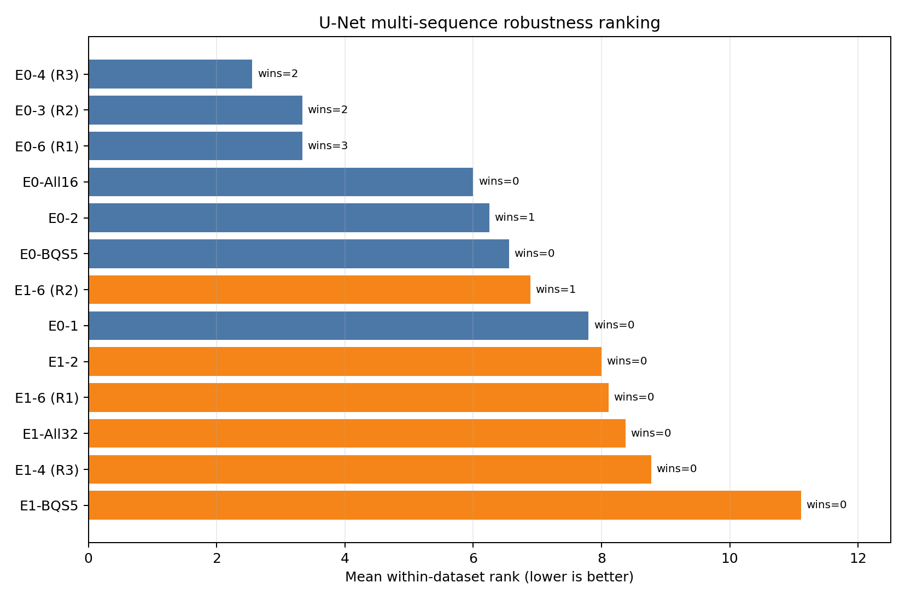
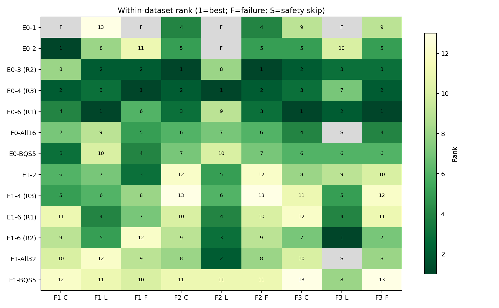

# U-Net Enc0/Enc1 三数据集 × 三光照条件验证结果

## 1. 实验目的

本实验检验基于 fr1/desk lightswitch 直接 greedy 搜索得到的 U-Net Enc0 与 Enc1 通道组合，是否能在不同场景长度、环境与光照条件下保持有效。跨序列比较采用序列内排名与成功率；不同序列之间的原始 ATE 不直接平均。

## 2. 实验设置与完成情况

- 数据：fr1/desk、fr2/desk、fr3/long_office_household，各自包含 clean、lightswitch、flashlight，共 9 个全序列。
- 配置：13 个 U-Net 通道配置（Enc0 7 个、Enc1 6 个），每个 active cell 运行 1 次。
- Tracking：所选 Enc0/Enc1 post-LeakyReLU activation channels；Mapping：gray + sensor depth，保持不变。
- 主指标：historical keyframe `evo_ape --align --correct_scale` translation ATE mean（cm）。同时保留 RPE、全帧 metric-scale SE(3) ATE/RPE、coverage 与数值诊断。
- 单次 timeout：500 s；完成性阈值：coverage ≥ 90%。
- 安全调整：fr3 lightswitch 的 Enc0-all16 启动后发生 NVIDIA Xid 79 / PCIe receiver error。因此仅在该条件跳过 Enc0-all16 与 Enc1-all32；其他 8 个条件仍已评估。安全跳过不计为算法失败。
- 完成统计：**110 PASS / 115 active cells（95.7%）**，5 个 `FAIL_TRACKING_NAN`，2 个 `SKIPPED_BY_SAFETY`。

## 3. 被评估配置

| 简称 | 层 | 通道 | 在 fr1 lightswitch 搜索中的角色 |
|---|---|---|---|
| E0-1 | Enc0 | [3] | Enc0 best/only viable singleton control |
| E0-2 | Enc0 | [2, 14] | Enc0 best two-channel configuration |
| E0-3 (R2) | Enc0 | [3, 7, 12] | Enc0 global rank 2; best three-channel configuration |
| E0-4 (R3) | Enc0 | [2, 3, 12, 14] | Enc0 global rank 3; best fixed four-channel configuration |
| E0-6 (R1) | Enc0 | [2, 3, 7, 12, 13, 14] | Enc0 global rank 1 / accuracy-first configuration |
| E0-All16 | Enc0 | [0, 1, 2, 3, 4, 5, 6, 7, 8, 9, 10, 11, 12, 13, 14, 15] | Enc0 all-channel control |
| E0-BQS5 | Enc0 | [0, 3, 10, 14, 15] | Enc0 historical BQS-selected top-5 control, re-evaluated by direct full sequence |
| E1-2 | Enc1 | [0, 5] | Enc1 minimum viable two-channel configuration |
| E1-4 (R3) | Enc1 | [0, 5, 18, 30] | Enc1 global rank 3; best fixed four-channel configuration |
| E1-6 (R1) | Enc1 | [5, 6, 17, 18, 28, 30] | Enc1 global rank 1 / accuracy-first configuration |
| E1-6 (R2) | Enc1 | [0, 5, 6, 17, 18, 30] | Enc1 global rank 2; direct greedy six-channel endpoint |
| E1-All32 | Enc1 | [0, 1, 2, 3, 4, 5, 6, 7, 8, 9, 10, 11, 12, 13, 14, 15, 16, 17, 18, 19, 20, 21, 22, 23, 24, 25, 26, 27, 28, 29, 30, 31] | Enc1 all-channel control |
| E1-BQS5 | Enc1 | [4, 9, 10, 15, 30] | Enc1 historical BQS-selected top-5 control, re-evaluated by direct full sequence |

R1/R2/R3 指同层 direct greedy 最终重复评估的第 1/2/3 名；All 与 BQS 是对照。

## 4. 各数据集最优配置

| 数据集 | 条件 | 最优配置 | 通道 | ATE mean (cm) |
|---|---|---|---|---|
| fr1_desk_clean | clean | E0-2 | [2, 14] | 5.27 |
| fr1_desk_lightswitch | lightswitch | E0-6 (R1) | [2, 3, 7, 12, 13, 14] | 5.92 |
| fr1_desk_flashlight | flashlight | E0-4 (R3) | [2, 3, 12, 14] | 5.98 |
| fr2_desk_clean | clean | E0-3 (R2) | [3, 7, 12] | 3.03 |
| fr2_desk_lightswitch | lightswitch | E0-4 (R3) | [2, 3, 12, 14] | 5.14 |
| fr2_desk_flashlight | flashlight | E0-3 (R2) | [3, 7, 12] | 3.07 |
| fr3_long_office_household_clean | clean | E0-6 (R1) | [2, 3, 7, 12, 13, 14] | 10.28 |
| fr3_long_office_household_lightswitch | lightswitch | E1-6 (R2) | [0, 5, 6, 17, 18, 30] | 11.30 |
| fr3_long_office_household_flashlight | flashlight | E0-6 (R1) | [2, 3, 7, 12, 13, 14] | 10.04 |

Enc0 配置赢得 9 个数据集中的 8 个。唯一例外是 fr3 lightswitch：Enc1 的 E1-6 (R2) 获胜，说明深一层特征对长序列光照切换具有互补价值。

## 5. 完整 ATE 结果

单位：cm；数值为 historical keyframe evo ATE mean，越低越好。`FAIL (NaN)` 为非有限 affine/pose diagnostics；`安全跳过` 是前述 Xid 79 相关的明确安全排除。

### fr1_desk

| 配置 | 通道 | Clean | Lightswitch | Flashlight |
|---|---|---|---|---|
| E0-1 | [3] | FAIL (NaN) | 24.53 | FAIL (NaN) |
| E0-2 | [2, 14] | 5.27 | 10.33 | 17.57 |
| E0-3 (R2) | [3, 7, 12] | 11.43 | 6.00 | 8.15 |
| E0-4 (R3) | [2, 3, 12, 14] | 6.81 | 6.39 | 5.98 |
| E0-6 (R1) | [2, 3, 7, 12, 13, 14] | 9.85 | 5.92 | 9.79 |
| E0-All16 | [0, 1, 2, 3, 4, 5, 6, 7, 8, 9, 10, 11, 12, 13, 14, 15] | 11.34 | 12.95 | 9.26 |
| E0-BQS5 | [0, 3, 10, 14, 15] | 7.65 | 13.72 | 9.19 |
| E1-2 | [0, 5] | 10.94 | 8.08 | 8.81 |
| E1-4 (R3) | [0, 5, 18, 30] | 10.86 | 7.17 | 13.99 |
| E1-6 (R1) | [5, 6, 17, 18, 28, 30] | 15.13 | 6.73 | 10.06 |
| E1-6 (R2) | [0, 5, 6, 17, 18, 30] | 13.69 | 6.96 | 17.62 |
| E1-All32 | [0, 1, 2, 3, 4, 5, 6, 7, 8, 9, 10, 11, 12, 13, 14, 15, 16, 17, 18, 19, 20, 21, 22, 23, 24, 25, 26, 27, 28, 29, 30, 31] | 14.68 | 18.93 | 14.73 |
| E1-BQS5 | [4, 9, 10, 15, 30] | 15.43 | 18.49 | 16.34 |

### fr2_desk

| 配置 | 通道 | Clean | Lightswitch | Flashlight |
|---|---|---|---|---|
| E0-1 | [3] | 3.63 | FAIL (NaN) | 3.79 |
| E0-2 | [2, 14] | 3.71 | FAIL (NaN) | 3.98 |
| E0-3 (R2) | [3, 7, 12] | 3.03 | 6.85 | 3.07 |
| E0-4 (R3) | [2, 3, 12, 14] | 3.42 | 5.14 | 3.55 |
| E0-6 (R1) | [2, 3, 7, 12, 13, 14] | 3.50 | 7.06 | 3.56 |
| E0-All16 | [0, 1, 2, 3, 4, 5, 6, 7, 8, 9, 10, 11, 12, 13, 14, 15] | 4.21 | 6.70 | 4.20 |
| E0-BQS5 | [0, 3, 10, 14, 15] | 4.25 | 7.15 | 4.33 |
| E1-2 | [0, 5] | 5.70 | 6.08 | 6.07 |
| E1-4 (R3) | [0, 5, 18, 30] | 6.02 | 6.33 | 6.44 |
| E1-6 (R1) | [5, 6, 17, 18, 28, 30] | 4.80 | 6.02 | 4.97 |
| E1-6 (R2) | [0, 5, 6, 17, 18, 30] | 4.63 | 5.34 | 4.90 |
| E1-All32 | [0, 1, 2, 3, 4, 5, 6, 7, 8, 9, 10, 11, 12, 13, 14, 15, 16, 17, 18, 19, 20, 21, 22, 23, 24, 25, 26, 27, 28, 29, 30, 31] | 4.44 | 5.24 | 4.58 |
| E1-BQS5 | [4, 9, 10, 15, 30] | 5.65 | 10.05 | 5.83 |

### fr3_long_office_household

| 配置 | 通道 | Clean | Lightswitch | Flashlight |
|---|---|---|---|---|
| E0-1 | [3] | 14.23 | FAIL (NaN) | 14.40 |
| E0-2 | [2, 14] | 11.41 | 35.10 | 11.98 |
| E0-3 (R2) | [3, 7, 12] | 10.40 | 13.84 | 10.47 |
| E0-4 (R3) | [2, 3, 12, 14] | 10.78 | 24.15 | 10.15 |
| E0-6 (R1) | [2, 3, 7, 12, 13, 14] | 10.28 | 12.95 | 10.04 |
| E0-All16 | [0, 1, 2, 3, 4, 5, 6, 7, 8, 9, 10, 11, 12, 13, 14, 15] | 10.81 | 安全跳过 | 10.52 |
| E0-BQS5 | [0, 3, 10, 14, 15] | 12.69 | 17.92 | 12.67 |
| E1-2 | [0, 5] | 13.87 | 29.53 | 14.45 |
| E1-4 (R3) | [0, 5, 18, 30] | 15.13 | 17.15 | 15.58 |
| E1-6 (R1) | [5, 6, 17, 18, 28, 30] | 15.15 | 15.45 | 14.96 |
| E1-6 (R2) | [0, 5, 6, 17, 18, 30] | 12.72 | 11.30 | 12.98 |
| E1-All32 | [0, 1, 2, 3, 4, 5, 6, 7, 8, 9, 10, 11, 12, 13, 14, 15, 16, 17, 18, 19, 20, 21, 22, 23, 24, 25, 26, 27, 28, 29, 30, 31] | 14.43 | 安全跳过 | 14.05 |
| E1-BQS5 | [4, 9, 10, 15, 30] | 17.45 | 26.63 | 17.66 |

## 6. 跨序列稳健性：序列内排名

下图及表格将每个数据集内的 ATE 排名作为单位（1 = 最优），然后对成功的序列取平均。该处理避免了不同场景尺度和轨迹长度使绝对 ATE 不可直接比较的问题。

| 配置 | 通道 | PASS | 安全跳过 | 平均 rank | 获胜数 |
|---|---|---|---|---|---|
| E0-4 (R3) | [2, 3, 12, 14] | 9/9 | 0 | 2.56 | 2 |
| E0-3 (R2) | [3, 7, 12] | 9/9 | 0 | 3.33 | 2 |
| E0-6 (R1) | [2, 3, 7, 12, 13, 14] | 9/9 | 0 | 3.33 | 3 |
| E0-BQS5 | [0, 3, 10, 14, 15] | 9/9 | 0 | 6.56 | 0 |
| E1-6 (R2) | [0, 5, 6, 17, 18, 30] | 9/9 | 0 | 6.89 | 1 |
| E1-2 | [0, 5] | 9/9 | 0 | 8.00 | 0 |
| E1-6 (R1) | [5, 6, 17, 18, 28, 30] | 9/9 | 0 | 8.11 | 0 |
| E1-4 (R3) | [0, 5, 18, 30] | 9/9 | 0 | 8.78 | 0 |
| E1-BQS5 | [4, 9, 10, 15, 30] | 9/9 | 0 | 11.11 | 0 |
| E0-All16 | [0, 1, 2, 3, 4, 5, 6, 7, 8, 9, 10, 11, 12, 13, 14, 15] | 8/9 | 1 | 6.00 | 0 |
| E0-2 | [2, 14] | 8/9 | 0 | 6.25 | 1 |
| E1-All32 | [0, 1, 2, 3, 4, 5, 6, 7, 8, 9, 10, 11, 12, 13, 14, 15, 16, 17, 18, 19, 20, 21, 22, 23, 24, 25, 26, 27, 28, 29, 30, 31] | 8/9 | 1 | 8.38 | 0 |
| E0-1 | [3] | 5/9 | 0 | 7.80 | 0 |

## 7. 失败与最小可行配置

| 数据集 | 配置 | 通道 | 原因 |
|---|---|---|---|
| fr1_desk_clean | E0-1 | [3] | 非有限 affine/pose diagnostics |
| fr1_desk_flashlight | E0-1 | [3] | 非有限 affine/pose diagnostics |
| fr2_desk_lightswitch | E0-1 | [3] | 非有限 affine/pose diagnostics |
| fr2_desk_lightswitch | E0-2 | [2, 14] | 非有限 affine/pose diagnostics |
| fr3_long_office_household_lightswitch | E0-1 | [3] | 非有限 affine/pose diagnostics |

E0-1 `[3]` 仅 5/9 通过，因此单通道配置不具跨光照鲁棒性。E0-2 `[2,14]` 虽在 fr1 clean 获胜（5.27 cm），但在 fr2 lightswitch 失效。相对地，E1-2 `[0,5]` 以仅两个通道实现 9/9 通过，是最小但稳定的 Enc1 参考点；其精度仍低于最佳组合。

## 8. 主要结论与解读

1. **E0-4 (R3) `[2,3,12,14]` 是最稳健的总体选择。** 它 9/9 通过，平均 rank **2.56**（所有配置最低），并在 fr1 flashlight、fr2 lightswitch 获胜。它比 E0-6 (R1) 更紧凑，且跨条件波动更小。
2. **E0-6 (R1) `[2,3,7,12,13,14]` 是 accuracy-first 的强候选。** 它赢得 fr1 lightswitch、fr3 clean 和 fr3 flashlight 共 3 个数据集，平均 rank 为 3.33；但并非所有条件最优。
3. **E0-3 (R2) `[3,7,12]` 在 fr2 上尤其有效。** 它在 fr2 clean 与 flashlight 获胜（3.03、3.07 cm），表明三通道已可覆盖部分场景的有效信息；但 fr1 clean 的表现较弱，泛化不如 E0-4。
4. **Enc1 的跨序列最佳并非原始搜索的 R1，而是 R2。** E1-6 (R2) `[0,5,6,17,18,30]` 的平均 rank **6.89**，优于 Enc1 R1 的 8.11，且在 fr3 lightswitch 获胜（11.30 cm）。这显示 Enc1 更受序列分布影响。
5. **全通道与 BQS 对照均不占优。** E0-All16 的平均 rank 为 6.00（8 个可比较条件），E1-All32 为 8.38；两层 BQS5 分别为 6.56 与 11.11。直接 greedy 选择显著优于“更多通道”或历史 BQS 选择。
6. **建议。** 以 E0-4 作为通用、紧凑的主推荐；E0-6 (R1) 作为 accuracy-first 备选；E1-6 (R2) 作为长序列 lightswitch 的互补配置。

## 9. 局限性

- 每格只运行 1 次；本实验依赖先前观察到的运行稳定性，不能量化 run-to-run 方差。
- 主指标使用 `--align --correct_scale` 的 historical keyframe ATE，以保持与既有实验一致；它不能替代未对齐或 metric-scale 的绝对部署误差。
- fr3 lightswitch 的两个 all-channel controls 因 GPU/PCIe Xid 79 关联事件安全跳过，故其 8/9 覆盖不应与完整 9/9 的配置作严格同等比较。
- 本实验只覆盖三类 TUM 场景族与三种光照条件；结论支持这些已评估条件下的稳健性，不足以证明对所有退化或新场景的普遍最优性。
